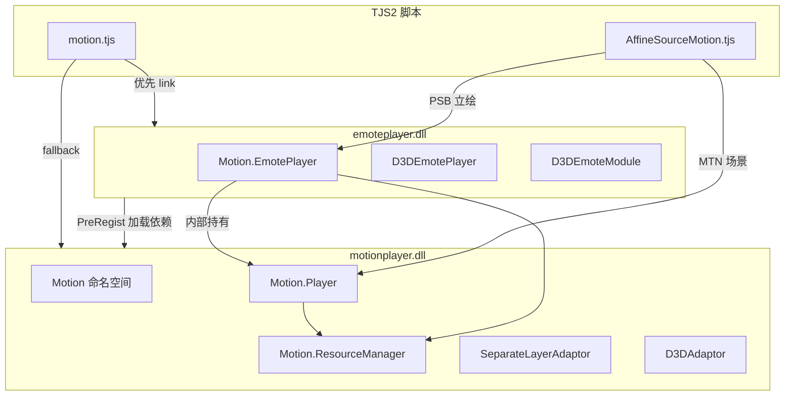

# MotionPlayer / EmotePlayer API 与使用指南

> **文档索引：** [`README.md`](README.md)  
> **文档版本：** 2026-06-08  
> **适用范围：** KrKr2 静态插件 `cpp/plugins/motionplayer/`（替代原版 `motionplayer.dll` + `emoteplayer.dll`）  
> **脚本对照：** 仓库 `data/system/`（与 NEKOPARA 同系 KiriKiri 脚本）  
> **官方伪代码手册：** [`../manual.tjs`](../manual.tjs)  
> **progress 行为对照：** [`MOTIONPLAYER_PROGRESS.md`](MOTIONPLAYER_PROGRESS.md)

---

## 1. 概述

### 1.1 它们是什么

MotionPlayer 与 EmotePlayer 均来自 **M2 Inc.** 为 KiriKiri / TVP 引擎提供的 **Motion / E-mote** 插件体系，用于：

| 能力 | 典型场景 |
|------|----------|
| **E-mote 立绘** | `.PSB` 网格变形、口型/眨眼/表情变量、差分 Timeline、物理飘动 |
| **Motion 特效** | `.MTN` 场景动画、KAG `[motion]` 标签、按钮 hit、图层 Motion |

在 KrKr2 中，二者被 **合并进同一 C++ 插件目录**，静态链入 `krkr2plugin`；脚本仍通过 `Plugins.link("emoteplayer.dll")` 或 `Plugins.link("motionplayer.dll")` 触发注册（见 `data/system/motion.tjs`）。

### 1.2 motionplayer 与 emoteplayer 的关系

原版 Windows 发行物中是 **两个 DLL**，职责分层如下：



**KrKr2 实现映射（`main.cpp`）：**

| 原版模块 | TJS 模块名 | C++ 类 | 注册位置 |
|----------|------------|--------|----------|
| `motionplayer.dll` | `motionplayer.dll` | `Motion`、`Player`、`ResourceManager`、`SeparateLayerAdaptor` 等 | `main.cpp` 第一段 `#define NCB_MODULE_NAME` |
| `emoteplayer.dll` | `emoteplayer.dll` | `D3DEmoteModule`、`D3DEmotePlayer`（继承 `EmotePlayer`） | `main.cpp` 第二段；`EmotePlayer` 同时作为 `Motion.EmotePlayer` 子类注册 |

**核心架构（对齐 libkrkr2.so 逆向）：**

```
D3DEmotePlayer（可选 Windows D3D 路径）
    └── EmotePlayer（薄壳，EmotePlayer.h）
            └── Player _player（全部动画/渲染逻辑，Player.h）
                    └── ResourceManager + MotionSnapshot（PSB/MTN 数据）
```

要点：

1. **EmotePlayer 不是独立引擎**，而是对 **Player** 的脚本友好封装；表情、Timeline、变量最终都在 `Player` 内执行。
2. **Player 同时服务两条产品线**：`.PSB`（E-mote）与 `.MTN`（Motion）；脚本层用不同 TJS 类区分 API 面。
3. **ResourceManager** 由二者共享，负责 PSB/MTN 加载、缓存、layerId、PSB 解密钩子。
4. KrKr2 另有独立 stub 文件 `cpp/plugins/emotePlayer.cpp`，仅做 `LoadModule(motionplayer.dll)`；**正式实现以 `motionplayer/main.cpp` 为准**。

### 1.3 与 Live2D 的相似与差异

> ⚠️ **重要澄清：** E-mote **不是** Live2D Cubism，也 **不读取** `.moc3` / `.model3.json`。项目文档中「Live2D 风格」仅指 **产品形态相似**（网格立绘 + 参数驱动表情），见 `docs/M09` / `docs/M12` 描述。

| 维度 | E-mote（MotionPlayer） | Live2D Cubism |
|------|------------------------|---------------|
| 资产格式 | `.PSB`（E-mote）、`.MTN`（Motion） | `.moc3` + 纹理 + 物理 JSON |
| 参数模型 | PSB 内 `variable` 表 + Timeline 控制（如 `face_eye_open`） | Parameter ID + 动画曲线 |
| 网格 | Bezier 网格细分、变形 | 网格 + Deformer |
| 差分表情 | **Diff Timeline** + blend ratio | Expression / Motion 文件 |
| 物理 | `initPhysics`、风、`hairScale`/`bustScale` | Physics JSON |
| 渲染 | KiriKiri Layer / D3D / KrKr2 OpenGL | Cubism SDK 自绘 |
| 历史关系 | M2 E-mote 为业界同期方案；**无直接文件兼容** | — |

**可类比的脚本概念：**

- `setVariable("face_mouth", …)` ≈ Live2D 口型参数
- `playTimeline` + `setTimelineBlendRatio` ≈ Expression 混合
- `setCoord` / `setScale` / `setRotate` ≈ 模型矩阵（但由插件内 Animator 插值）
- `contains("hit_bust", x, y)` ≈ Hit Area（需脚本逆仿射）

---

## 2. 数据格式与脚本分支

| 扩展名 | PSB `type` | `_storageType` | TJS 播放器 | 典型用途 |
|--------|------------|----------------|------------|----------|
| `.PSB` | `1` = emote；**e-mote3 常为 `0` 但仍有 variableList** | `"emote"` | `Motion.EmotePlayer` | 立绘、MultiCache 双角色 |
| `.MTN` | `0` = motion | `"motion"` | `Motion.Player` | KAG Motion、场景特效 |

**脚本如何选播放器：** `.PSB` 立绘用 `Motion.EmotePlayer`，`.MTN` 用 `Motion.Player`（见 `AffineSourceMotion._storageType`）。与 PSB 根 `type` 无必然一一对应（e-mote3 常见 `type=0` 仍有 variableList）。

**C++ 内部 `isEmoteLikeMotion()`（非脚本 API）：** 当 `type==1` 或 `variableLabels` 非空时为 true，用于 **Player 运行时** 调整 eval / `updateLayers` 实现分支（见 [`MOTIONPLAYER_PROGRESS.md`](MOTIONPLAYER_PROGRESS.md) §2）。**不是** sdl3 的 progress 双路径，也 **不是** E-mote 能否运行的权威判定。

**资源加载（脚本）：**

```tjs
var data = motion_manager.load("path/to/chara.psb");
// data.metadata.base.chara / .motion 供 EmotePlayer 初始化
```

MultiCache（如 `a.psb:b.psb`）由 `splitStorage` 解析，C++ 侧 `EmotePlayer::play` 进入 `MultiCache` 模式并 `addEmoteFile` 交叉链接。

### 2.1 PSB 样本与结构文档

| 项 | 值 |
|----|-----|
| **导出 JSON** | [`tests/test_files/emote/e-mote3.0バニラパジャマa.json`](../../../../tests/test_files/emote/e-mote3.0バニラパジャマa.json)（**非**运行时格式） |
| **运行时 PSB** | 同目录同名 `.psb` |
| **字段字典** | [`MOTIONPLAYER_PSB_STRUCT.md`](MOTIONPLAYER_PSB_STRUCT.md) |
| **贴图世界坐标** | [`MOTIONPLAYER_TEXTURE_WORLD_COORDS.md`](MOTIONPLAYER_TEXTURE_WORLD_COORDS.md) |
| **C++ 入口** | `ResourceManager::load` → `emotefile::load` → `EmoteFileCore.cpp` |
| **单测** | `tests/unit-tests/plugins/motionplayer-dll.cpp` |

**临时调试：** `emoteplayerclass.cpp` 中 `kEmoteDebugDrawRedSquare == true` 时，每帧在 adaptor 子 layer 中央绘制红色方块，用于确认 `draw()` → `MainImage` → 屏幕合成链路；验证通过后改为 `false` 或删除。

---

## 3. TJS2 脚本 API 指南

### 3.1 插件加载与入口

```tjs
// data/system/motion.tjs
Plugins.link("emoteplayer.dll");  // 优先；内部会加载 motionplayer.dll
// 或 Plugins.link("motionplayer.dll");

var mgr = new MotionResourceManager(kag);  // 包装 Motion.ResourceManager
```

**全局类一览：**

| 类 | 用途 |
|----|------|
| `Motion` | 静态工具、`getD3DAvailable()`、枚举常量 |
| `Motion.ResourceManager` | PSB/MTN 加载与缓存 |
| `Motion.EmotePlayer` | E-mote 立绘 |
| `Motion.Player` | Motion / MTN |
| `Motion.SeparateLayerAdaptor` | 分离图层渲染（**推荐**） |
| `Motion.D3DAdaptor` | Windows D3D 画布（KrKr2 多为 stub） |
| `D3DEmotePlayer` / `D3DEmoteModule` | Windows D3D 专用 emote 路径 |

### 3.2 Motion 命名空间常量

注册于 `main.cpp` → `NCB_REGISTER_CLASS(Motion)`：

| 常量 | 值 | 含义 |
|------|-----|------|
| `LayerTypeObj` … `LayerTypeCamera` | 0–5 | 节点图层类型 |
| `ShapeTypePoint/Circle/Rect/Quad` | 0–3 | Hit 形状 |
| `PlayFlagForce` | 1 | 强制播放 |
| `PlayFlagChain` | 2 | 链式 |
| `PlayFlagAsCan` | 4 | 能播则播 |
| `PlayFlagJoin` | 8 | 加入 |
| `PlayFlagStealth` | 16 | 隐身播放 |
| `TransformOrderFlip/Angle/Zoom/Slant` | 0–3 | 变换顺序 |
| `CoordinateRecutangularXY/XZ` | 0–1 | 坐标系（拼写保留原版） |
| `MaskModeStencil` / `MaskModeAlpha` | 0 / 1 | 模板 / Alpha 遮罩 |

**D3DEmoteModule 额外常量：**

| 常量 | 值 |
|------|-----|
| `TimelinePlayFlagParallel` | 1 |
| `TimelinePlayFlagSequential` | 2 |

> ⚠️ **歧义：** `manual.tjs` 写的是 `TimelinePlayFlagDifference`（差分），与 C++ 注册的 `TimelinePlayFlagSequential` **名称不一致**；脚本实际用 **数值 flag**（main=1，diff=3），见 §3.4。

### 3.3 Motion.EmotePlayer — 属性

| 属性 | 读写 | 说明 |
|------|------|------|
| `module` | RO | 绑定的 PSB 模块对象 |
| `chara` | RW | 角色名 |
| `motion` | RW | **当前 clip 名**（非文件路径）；`play()` 启动播放 |
| `motionKey` | RW | 缓存键（`Storages.getPlacedPath`）；绑定 ResourceManager 中已 load 的 PSB |
| `completionType` | RW | 插值类型；E-mote 推荐 `stFastLinear`（脚本常量，非插件枚举） |
| `maskMode` | RW | 推荐 `Motion.MaskModeAlpha` |
| `visible` | RW | 可见性 |
| `smoothing` | RW | 平滑（EmotePlayer 壳层） |
| `meshDivisionRatio` | RW | 网格细分率 |
| `queing` | RW | 原版拼写 **queing**（非 queuing）；obsolete，保持 `false` |
| `hairScale` / `partsScale` / `bustScale` / `bodyScale` | RW | 物理区域缩放 |
| `useD3D` | RW | 是否走 D3D 绘制；KrKr2 默认 OpenGL，可设 true 但行为与 Windows 原版可能不同 |
| `progress` | RW | EmotePlayer 壳层进度字段 |
| `modified` / `drawvisible` / `drawOpacity` / `opengl` | RW | 绘制状态 |
| `animating` | RO | 是否仍在动画（映射 `Player.allplaying`） |
| `playCallback` | RO | 播放回调标志 |
| `outline` / `priorDraw` / `frameLastTime` / `frameLoopTime` / `loopTime` | RW | 透传 Player |

### 3.4 Motion.EmotePlayer — 方法

#### 生命周期与状态

| 方法 | 签名 | 效果 |
|------|------|------|
| `create` | `()` | **重置/销毁**内部状态（对齐原版 create=reset 语义） |
| `load` | `(data)` | 加载模块 variant |
| `clone` | `()` → 新实例 | 复制 EmotePlayer + Player 快照 |
| `serialize` / `unserialize` | `()` / `(data)` | 状态序列化（仿射等；Timeline 完整状态 **部分实现**） |
| `show` / `hide` | `()` | 可见性 |
| `assignState` | `()` | 将壳层属性同步到 Player |
| `initPhysics` | `(rule?)` | 读取 PSB metadata 物理规则 |

#### 仿射与外观（带 ms 插值）

| 方法 | 签名 | 效果 |
|------|------|------|
| `setCoord` | `(x, y, time=0, easing=0)` | 立绘坐标；**time 单位为毫秒** |
| `setScale` | `(scale, time=0, easing=0)` | 缩放；内部 `finalScale = baseScale * userScale` |
| `setRot` / `setRotate` | `(rad, time=0, easing=0)` | 旋转（弧度） |
| `setColor` | `(color, time=0, easing=0)` | Diffuse `0xAARRGGBB` |
| `setMirror` | `(bool)` | 镜像（相对 baseline 增量 flip） |
| `setDrawAffineTranslateMatrix` | `(a, b, c, d, tx, ty)` | 与 Layer 仿射链合成 |

> ⚠️ **歧义 — getter 返回值：** `getRot()` / `getScale()` / `getColor()` 在 KrKr2 实现中 **对齐原版硬编码**，分别常返回 `0` / `1.0` / `0`，**不代表**当前动画中间值。请以 setter 侧缓存或视觉效果为准。

**easing 约定（manual.tjs）：** 负值 = ease-in，正值 = ease-out，0 = 线性。

#### 变量系统（E-mote 核心）

| 方法 | 签名 | 效果 |
|------|------|------|
| `setVariable` | `(name, value, time=0, easing=0)` | 驱动口/眼/头等参数 |
| `getVariable` | `(name)` | 当前解析值 |
| `countVariables` / `getVariableLabelAt` / … | 索引 API |  introspection |
| `getVariableFrameList` | `(name)` | 帧标签列表 |

**AffineSourceMotion 常用变量名（`resetEmoteVariables`）：**

`move_UD`, `move_LR`, `head_UD`, `head_LR`, `head_slant`, `body_*`, `face_talk`, `face_eye_*`, `face_mouth`, `face_tears`, `face_cheek`, `act_sp`

#### Timeline（差分表情）

| 方法 | 签名 | 效果 |
|------|------|------|
| `getMainTimelineLabelList` | `()` | 主 Timeline 名数组 |
| `getDiffTimelineLabelList` | `()` | 差分 Timeline 名数组 |
| `playTimeline` | `(name, flags=0)` | 开始播放；脚本常用 flags：**main=1，diff=3** |
| `stopTimeline` | `(name="")` | 停止 |
| `getTimelinePlaying` / `isTimelinePlaying` | `(name="")` | 是否播放中 |
| `getLoopTimeline` / `isLoopTimeline` | `(name)` | 是否循环 Timeline |
| `getTimelineTotalFrameCount` | `(name)` | 总帧数 |
| `setTimelineBlendRatio` | `(name, ratio)` **NCB 仅 2 参** | 差分混合比；脚本 `_playTimeline` 还传 `time, easing` → **见歧义** |
| `fadeInTimeline` / `fadeOutTimeline` | `(name, duration, flags?)` | 淡入/淡出 |
| `getPlayingTimelineInfoList` | `()` | `[{label, flags, blendRatio}, …]` |
| `setTimeline` | `(label, loop)` | KrKr2 映射为 `playTimeline(label, 0)`，语义 **不完整** |

**脚本封装 `_playTimeline`（`AffineSourceMotion.tjs`）：**

```tjs
// main timeline
_player.playTimeline(name, 1);
// diff timeline：并行 + 差分
_player.playTimeline(name, 3);
_player.setTimelineBlendRatio(name, ratio, time * 60 / 1000, easing);
```

> ⚠️ **歧义：** 脚本把 **秒** 转为 **帧时间**（`* 60/1000`）传给 blend；C++ `setTimelineBlendRatio` NCB 只注册 `(label, ratio)` 两参数。**额外 time/easing 是否生效取决于 `setTimelineBlendRatio` 的 Compat 实现完整度**（实现中部分走 Player 内部 animator）。以 NEKOPARA 目视为准。

#### 播放循环

| 方法 | 签名 | 效果 |
|------|------|------|
| `play` | `(label, flags=0)` | 启动 clip；三种模式：motionKey / SingleCache / MultiCache |
| `progress` | `(tickStep_ms)` | **毫秒** 推进；内部 `× 60/1000` 转帧时间 |
| `draw` | `(layer \| SeparateLayerAdaptor)` | 渲染到 Layer 或分离适配器 |
| `skip` | `()` | 跳到结束 |
| `pass` | `()` | **无参**；行末 sync 用，时间快进语义 |
| `skipToSync` | `()` | 跳到 sync 点 |
| `addPlayCallback` / `pass` | | 回调相关 |

> ⚠️ **曾出现的不兼容：** 旧实现 `pass(double)` 导致 `Invalid argument count`；现已改为无参（见 PLAN §11.1）。

#### 物理与交互

| 方法 | 签名 | 效果 |
|------|------|------|
| `startWind` | **manual:** `(start, goal, speed, powMin, powMax)` | 风效 |
| | **C++ NCB:** `(minAngle, maxAngle, amplitude, freqX, freqY)` | 五参角度/频率模型 |
| | **AffineSourceMotion:** `_player.startWind(.start, .goal, .speed, .min, .max)` | 与环境 wind 字典字段对应 |
| `stopWind` | `()` | 停止风 |
| `setOuterForce` | `(label, x, y, time?, easing?)` 或 `(x, y)` | 外力（发/胸/部件） |
| `getOuterForce` | `()` | 查询 |
| `contains` | `(x, y)` 或 `(label, x, y)` | Hit test（label 如 `hit_bust`） |

> ⚠️ **歧义：** `manual.tjs` 与 C++ 头文件对 `startWind` **参数语义不一致**；以 **`AffineSourceMotion.updateEnvironment` 实际调用** 为准（五参 wind 字典）。

### 3.5 Motion.Player — 脚本 API 摘要

用于 `.MTN` / KAG Motion（`AnimKAGLayer.tjs`、`GFX_Motion.tjs`）。

**EmotePlayer 没有的 Player 专有 API：**

| 类别 | API |
|------|-----|
| 播放控制 | `play(motion, flags)`, `stop()`, `isPlaying()`, `playing`, `allplaying` |
| 回调 | `motion` 属性 setter 触发 `onFindMotion`；`onAction` |
| 时间 | `tickCount`, `frameTickCount`, `speed`（**bool 标志**，非倍速浮点 — 见歧义） |
| 图层 | `getLayerGetter`, `getLayerNames`, `getLayerMotion`, `setFlip`, `setZoom`, `setOpacity`, `setSlant` |
| 同步 | `syncWaiting`, `syncActive`, `skipToSync`, `releaseSyncWait` |
| 隐身 | `stealthChara`, `stealthMotion` |
| 选择器 | `isSelectorTarget`, `deactivateSelectorTarget`, `selectorEnabled` |
| 相机/立体 | `hasCamera`, `cameraActive`, `stereovisionActive`, … |
| 其它 | `frameProgress`, `motionList`, `emoteEdit`, `colorWeight`, `unload`, … |

**位置属性（Player 根节点）：** `x`, `y`, `left`, `top`

### 3.6 Motion.ResourceManager

```tjs
var rm = new Motion.ResourceManager(kag, cacheSize);
var mod = rm.load(path);           // → TJS 对象，含 metadata
rm.unload(path);
rm.clearCache();
rm.loadSource(path); rm.findSource(path);
rm.requireLayerId(name); rm.releaseLayerId(id);

// 静态钩子（NEKOPARA: seed = 742877301）
Motion.ResourceManager.setEmotePSBDecryptSeed(seed);
Motion.ResourceManager.setEmotePSBDecryptFunc(func);
```

### 3.7 SeparateLayerAdaptor（推荐绘制路径）

```tjs
var adaptor = new Motion.SeparateLayerAdaptor(layer);
adaptor.targetLayer = layer;
adaptor.absolute = index;
player.draw(adaptor);   // 不污染父 Layer 像素
```

`AffineSourceMotion` 在 `AffineLayer` 上自动创建 `_motionSeparateAdaptor` 并引用计数。

---

## 4. 标准使用流程

### 4.1 E-mote 立绘（最小流程）

对应 `manual.tjs` 与 `AffineSourceMotion.createPlayer`：

```tjs
var resourceManager = new Motion.ResourceManager(window, 20 * 1024 * 1024);
var path = "emote/chara.psb";
var data = resourceManager.load(path);

var player = new Motion.EmotePlayer(resourceManager);
player.motionKey = Storages.getPlacedPath(path);
player.chara = data.metadata.base.chara;
player.play(data.metadata.base.motion, Motion.PlayFlagForce);
player.initPhysics(data.metadata);
player.completionType = stFastLinear;
player.maskMode = Motion.MaskModeAlpha;

// 游戏循环（AffineSourceMotion 由 Layer 驱动，见 §4.2）
var prevTick = System.getTickCount();
for (;;) {
  var dt = System.getTickCount() - prevTick;
  prevTick += dt;
  player.progress(dt);
  player.draw(adaptor);
}
```

### 4.2 AffineSourceMotion 每帧管线（生产路径）

```
drawAffine(target, src)
  ├─ calcMatrix → setCoord / setRotate / setScale / meshDivisionRatio / *Scale
  ├─ progress(_interval) 或 progress(0)
  ├─ setDrawAffineTranslateMatrix(a,c,b,d,tx,ty)  // 从 Layer 仿射逆算
  ├─ completionType = src._completionType
  └─ draw(target | _motionSeparateAdaptor)
```

**行末 sync（对话等待动画结束）：**

```tjs
_player.pass();        // 无参
_player.progress(1);   // 推进 1ms
```

### 4.3 Motion / MTN（KAG）

```tjs
var player = new Motion.Player(motion_manager.resourceManager);
player.onAction = function(...) { ... };
player.play(elm.motion, Motion.PlayFlagForce);
// 每帧
player.progress(interval_ms);
player.draw(separateLayerAdaptor);
```

### 4.4 Timeline 与 emo 标签（游戏层）

游戏 `emotion.tjs` **不直接**调插件；通过 `AffineSourceMotion._setOptions` 解析 KAG 元素：

- `elm.timeline` → `_playTimeline` / `_stopTimeline`
- `elm.variables` → `setVariable`
- `elm.stoptimeline` / `resetEmoteVariables`

---

## 5. C++ 技术 API（开发者）

### 5.1 命名空间与文件

| 组件 | 头文件 | 说明 |
|------|--------|------|
| `motion::Player` | `Player.h` + `Player*.cpp` | 核心；~15 翻译单元 |
| `motion::EmotePlayer` | `EmotePlayer.h/.cpp` | 薄壳委托 |
| `motion::ResourceManager` | `ResourceManager.h/.cpp` | 缓存与 layerId |
| `motion::SeparateLayerAdaptor` | `SeparateLayerAdaptor.*` | FBO 分离层 |
| `motion::D3DAdaptor` | `D3DAdaptor.*` | D3D 路径 |
| `detail::MotionSnapshot` | `RuntimeSupport.h` | PSB 解析快照 |
| `detail::PlayerRuntime` | `RuntimeSupport.h` | 运行时节点树、Timeline |

### 5.2 Player 核心 C++ API（节选）

```cpp
namespace motion {
class Player {
public:
    explicit Player(ResourceManager rm = {}, Player* parent = nullptr);

    // 属性：chara, motionKey, maskMode, frameLoopTime, playing, useD3D, ...
    void setMotion(ttstr v);
    void loadFromSnapshot(std::shared_ptr<detail::MotionSnapshot>);
    void addEmoteFile(std::shared_ptr<detail::MotionSnapshot>);
    void bindMotionModuleKey(ttstr storageKey);

    // E-mote 控制
    void setEmoteCoord(double x, double y, double transition=0, double ease=0);
    void setEmoteScale(double scale, double transition=0, double ease=0);
    void setVariable(ttstr label, double value, double transition=0, double ease=0);
    void playTimeline(ttstr label, tjs_int flags);

    // 播放 / 步进
    bool playMotionLike_0x6B2284(ttstr label, tjs_int flags);
    void progressMsLike_0x6D2A54(double deltaMs);
    void progressEmoteLike_sdl3(double deltaMs, iTJSDispatch2* objthis);
    void updateLayersEmoteLike_sdl3();
    void frameProgress(double dt_frames);
    void updateLayers();

    // 渲染
    void draw(tTJSVariant target);
    bool hitTestLayer(ttstr name, double x, double y);

    // ncbind 静态 compat
    static tjs_error progressCompatMethod(...);
    static tjs_error playCompat(...);
};
}
```

### 5.3 EmotePlayer C++ API（节选）

```cpp
class EmotePlayer {
    Player _player;  // 唯一动画内核
    ttstr _storageKey, _clipLabel;
    bool play(ttstr label, tjs_int flags = 0);
    void progress(double dt_ms);
    void pass();  // 无参
    // setCoord/setScale/... → 转发 Player::setEmote*
};
class D3DEmotePlayer : public EmotePlayer {};
```

### 5.4 progress 与 updateLayers（实现要点，以代码为准）

**脚本入口两条链（勿混用）：**

| 脚本类 | C++ 入口 | 当前行为（2026-05-28） |
|--------|----------|------------------------|
| `Motion.EmotePlayer` | `EmotePlayer::progress` → **`progressMsLike_0x6D2A54`** | `frameProgress` + **`updateLayersEmoteLike_sdl3`** + `calcBounds` |
| `Motion.Player` | **`progressCompatMethod`** | 若 `isEmoteLikeMotion` → `progressEmoteLike_sdl3`；否则 `frameProgress` + 全量 `updateLayers` |

立绘生产路径（`AffineSourceMotion`）走 **EmotePlayer → progressMsLike**，**不经过** `progressCompatMethod`。

**sdl3 参考：** 仅有一个 `EmotePlayer::progress`，内部用 `_varList.size()>0` 决定传给树的 `tick`（0 vs `clockPassed`）；**无** KrKr2 式 `progressEmoteLike` / `frameProgress` 函数对。详见 [`MOTIONPLAYER_PROGRESS.md`](MOTIONPLAYER_PROGRESS.md) §0 勘误。

**`updateLayers()`：** 内部若 `isEmoteLikeMotion` 则调用 `updateLayersEmoteLike_sdl3`（跳过部分 Phase3），否则走全量 Phase3；这是 **layer 更新实现选择**，不等于必须在 progress 层维护两套公开 API。

### 5.5 渲染栈（KrKr2）

```
Player::draw → renderToLayer / renderToSeparateLayerAdaptor / renderToD3DAdaptor
    → prepareRenderItems → buildRenderCommands → executeLayerRenderCommands
    → PrivateMotionGLL + cpp/core/visual/ogl
```

**不使用** `sdl3/` 目录内 SDL 自建 GL 上下文（只读参考）。

### 5.6 ncbind 注册

- 模块名：`TJS_W("motionplayer.dll")` / `TJS_W("emoteplayer.dll")`
- `PostRegistCallback`：将全局 `Player` 别名到 `Motion.Player`；注入类级 `useD3D` 探测对象
- 完整注册表：**以 `main.cpp` 为准**（高于本文档列出的子集）

---

## 6. 效果说明（API → 视觉/行为）

| API / 数据 | 预期效果 |
|------------|----------|
| `play` + idle clip | 立绘呼吸/待机循环 |
| `setVariable("face_mouth", n)` | 口型帧切换 |
| `playTimeline` + diff blend | 差分表情（怒/笑/哭）叠加 |
| `setTimelineBlendRatio` | 控制 diff 强度 0→1 |
| `setCoord/Scale/Rotate` + time | 立绘平移缩放旋转平滑过渡 |
| `startWind` + `hairScale` | 发丝随风摆动 |
| `setOuterForce("hair", x, y)` | 局部网格偏移 |
| `meshDivisionRatio` | 网格密度，影响变形质量与性能 |
| `maskMode = Alpha` | 半透明边缘正确混合 |
| `SeparateLayerAdaptor` | 独立缓冲，避免 Affine 父层污染 |
| `Motion.Player.play` + MTN | 场景 Motion、按钮、粒子、相机动画 |
| `skipToSync` / `pass` | 对话行末等待动画追到同步点 |

---

## 7. 歧义、模糊与 KrKr2 实现状态

### 7.1 文档/签名不一致

| 项 | 说明 |
|----|------|
| `TimelinePlayFlagDifference` vs `TimelinePlayFlagSequential` | manual 与 C++ 命名不同；脚本用 **整数 1/3** |
| `startWind` 五参含义 | manual / C++ 头 / AffineSourceMotion 三套描述；**以游戏 wind 字典为准** |
| `setTimelineBlendRatio` 参数个数 | 脚本 5 参；NCB 2 参；time/easing **可能未完全移植** |
| `Player.speed` | C++ 为 **bool**（`_speed`）；MTN 脚本写 `+elm.speed` 数值 → 非零即 true |
| `getRot/getScale/getColor` | 返回常量，非实时值 |
| `queing` vs `queuing` | 属性名保留原版 typo `queing` |
| `EmotePlayer.create` | 名为 create，实为 **reset** |
| `typeof _player.clear` | 脚本检测 optional `clear`；EmotePlayer **可能无** clear，依赖 draw 路径 self-clear |
| `completionType` | 值为 KiriKiri Layer 常量（`stFastLinear`），非 Motion 插件枚举 |

### 7.2 数据格式与诊断日志

| 项 | 说明 |
|----|------|
| PSB `type=0` + variableList | e-mote3 常见；脚本仍用 `EmotePlayer`；**`emoteMode=0` 日志仅表示 type 字段，不能单独推导故障** |
| `isEmoteLikeMotion` | KrKr2 内部启发式；**勿**与「必须 progress 分流」画等号 |
| `_findMotionContextVariant` (player+1012) | 逆向尚未完全命名；与 `findMotion` 上下文传播相关 |
| MultiCache 主 PSB 选择 | 按 metadata `chara`+`motion` 非空选 primary；顺序依赖缓存迭代 |
| 历史文档中的「卡死 = 子 Player 全量 updateLayers」 | **已作废**（未证实）；见 `MOTIONPLAYER_PROGRESS.md` §0 |

### 7.3 KrKr2 实现完整度（2026-05-28）

| 区域 | 状态 |
|------|------|
| 插件注册 / ResourceManager load | ✅ 基本可用 |
| EmotePlayer play MultiCache / pass() | ✅ 已修复（PLAN §11） |
| EmotePlayer progress | `progressMsLike` → `updateLayersEmoteLike_sdl3`；与 sdl3 **架构不同**，对齐度需单独验收 |
| `Motion.Player` progress | `progressCompatMethod` 含 `isEmoteLikeMotion` 分支（与 EmotePlayer 链不同） |
| 渲染 draw / visible / stencil | ⏳ 部分；可能出现 `draw=n` |
| Timeline blend / eyeControl | ⏳ 进行中（sdl3 `updateEyeControl` 未完整移植） |
| MTN 全量 Motion | ⏳ Phase 2 |
| initPhysics / wind / hit | ⏳ P2 |
| D3DEmoteModule / D3D 路径 | stub；KrKr2 用 OpenGL |
| `Motion.getD3DAvailable()` | KrKr2 **恒 true**（表示 GPU 路径可用，非真 D3D） |

**验证建议：**

- 实机：NEKOPARA Vol.0（见 PLAN §1.4）
- 单元测试：`tests/unit-tests/plugins/motionplayer-render.cpp`
- 贴图 golden：`tools/psb-export` + `tools/visual-test`

### 7.4 勿混淆的概念

| 错误理解 | 正确理解 |
|----------|----------|
| EmotePlayer 是独立渲染器 | 委托内部 **Player** |
| motionplayer 只处理 MTN | 也注册 **Motion.EmotePlayer**；Player 核心里处理 PSB |
| E-mote = Live2D | 仅产品形态类似；**格式与 API 不兼容** |
| `progress(0)` 不做事 | 仍刷新一帧（无新墙钟时也 draw） |
| 应用 `setDrawAffineTranslateMatrix(mtx.m11, …)` 分支 | AffineSourceMotion 中 **`if (false)` 禁用**；使用逆算 6 参 |

---

## 8. 快速对照索引

| 需求 | 脚本入口 | C++ 入口 |
|------|----------|----------|
| 加载 PSB | `ResourceManager.load` | `ResourceManager::load` → `loadMotionSnapshot` |
| 创建立绘 | `new Motion.EmotePlayer(rm)` | `EmotePlayer::EmotePlayer` |
| 每帧更新 | `player.progress(ms)` | **`EmotePlayer::progress` → `progressMsLike_0x6D2A54`**（非 `progressCompatMethod`） |
| 绘制 | `player.draw(adaptor)` | `EmotePlayer::draw` → `Player::draw` |
| 表情变量 | `setVariable` | `Player::setVariable` + animators |
| 差分脸 | `playTimeline` + blend | `PlayerTimeline.cpp` |
| 场景 Motion | `Motion.Player.play` | `playMotionLike_0x6B2284` |
| Hit 测试 | `contains("hit_bust", x, y)` | `Player::hitTestLayer` |

---

## 9. 相关文档

完整索引见 **[`README.md`](README.md)**。

---

## 10. 维护说明

- **API 真源顺序：** 运行中游戏脚本（`data/`）> `main.cpp` NCB > `manual.tjs` > 本文档。
- 发现不一致时，以 **代码与 NEKOPARA 实跑** 为准，并回写本文档 §7。
- **progress 勘误：** 见 [`MOTIONPLAYER_PROGRESS.md`](MOTIONPLAYER_PROGRESS.md) §0。

| 日期 | 说明 |
|------|------|
| 2026-05-28 | 初版 |
| 2026-05-28 | 勘误：progress 入口、isEmoteLikeMotion、日志与卡死叙述 |
