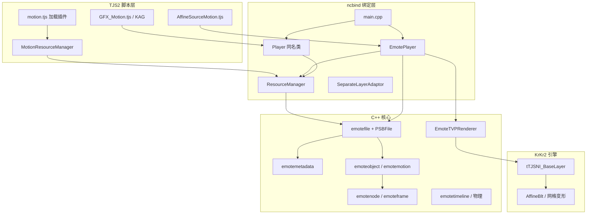

# MotionPlayer 架构概览

> **文档索引：** [`README.md`](README.md)  
> **文档版本：** 2026-06-08  
> **代码路径：** `cpp/plugins/motionplayer/`  
> **样本数据：** [`tests/test_files/emote/e-mote3.0バニラパジャマa.json`](../../../../tests/test_files/emote/e-mote3.0バニラパジャマa.json)（由同名 `.psb` 经 `psbfile` 导出，**非运行时格式**）  
> **API 与脚本用法：** [`MOTIONPLAYER_API_GUIDE.md`](MOTIONPLAYER_API_GUIDE.md)  
> **PSB 字段字典：** [`MOTIONPLAYER_PSB_STRUCT.md`](MOTIONPLAYER_PSB_STRUCT.md)  
> **渲染调试：** [`MOTIONPLAYER_RENDER_TEST.md`](MOTIONPLAYER_RENDER_TEST.md)

---

## 1. 概述

MotionPlayer 是 M2 Inc. 为 KiriKiri / TVP 提供的 **Motion / E-mote** 插件在 KrKr2 中的实现。原版 Windows 上分为 `motionplayer.dll`（MTN 场景动画）与 `emoteplayer.dll`（PSB 立绘）；本仓库将二者 **合并为静态库** `motionplayer`，经 `krkr2plugin` 链入引擎。

| 产品线 | 文件扩展名 | 脚本播放器 | 典型用途 |
|--------|------------|------------|----------|
| **E-mote** | `.PSB` | `Motion.EmotePlayer` | 立绘、口型/眨眼、差分 Timeline、物理 |
| **Motion** | `.MTN` | `Motion.Player` | KAG `[motion]`、场景特效、按钮 Hit |

脚本按 **扩展名** 选择播放器，与 PSB 根字段 `object.*.type` 无严格一一对应（e-mote 3.0 常见 `type: 0` 仍走 `EmotePlayer`）。

---

## 2. 分层架构



### 2.1 职责划分

| 层级 | 职责 |
|------|------|
| **脚本** | 插件加载、资源引用计数、仿射合成、KAG 标签到 `setVariable` / `playTimeline` 的映射 |
| **EmotePlayer** | TJS 属性/方法壳；持有 `emotefile*`、当前 `emotemotion*`、时钟 `clockPassed` |
| **emotefile** | PSB 解析、动画树构建、变量/Timeline/物理/眨眼更新 |
| **emotenode** | 节点树遍历、`progress` 求值、`drawToLayer` / 离屏位图 |
| **EmoteTVPRenderer** | Bezier 网格细分、`AffineBlt` 三角形贴片 |
| **psbfile** | `PSBFile` 二进制读表、`readAllObjs` 导出 JSON（调试用） |

> **说明：** 注释中「EmotePlayer 和 Player 是一个玩意」指 KrKr2 当前实现里 **立绘逻辑集中在 `EmotePlayer` + `emotefile`**；原版 Windows 的 `Motion.Player` 是更重的 MTN/子 Player 树实现，本仓库 `Player` 类与 `EmotePlayer` 并列注册，MTN 路径仍在演进中。

---

## 3. 源码模块图

```
cpp/plugins/motionplayer/
├── main.cpp                 # ncbind：motionplayer.dll / emoteplayer.dll 双模块名注册
├── emoteplayerclass.h/.cpp  # ResourceManager、EmotePlayer、SeparateLayerAdaptor
├── emotefile.h              # 数据模型总览（节点/帧/元数据/物理）
├── EmoteFileCore.cpp        # load → GenerateAniTree()，根对象解析
├── EmoteMetadata.cpp        # metadata：base、timeline、variable、eye/hair/bust…
├── EmoteMotion.cpp          # emoteobject、emotemotion
├── EmoteNode.cpp            # emotenode、emoteframe、progress/draw
├── EmoteTimeline.cpp        # emotetimeline、emoteTimeVar
├── EmotePhysics.cpp         # 风、发丝、胸揺れ模拟器
├── EmoteFrame.cpp           # 帧 content 解析
├── EmoteInternal.cpp        # Bezier 网格求点
├── EmoteTVPRenderer.cpp     # TVP 仿射网格绘制
└── docs/                    # 本文档、API 指南、progress 对照
```

依赖：`psbfile`（`PSB::PSBFile`）、`krkr2plugin`、OpenCV（贴图解码）、glm（矩阵）。

---

## 4. 运行时数据流

### 4.1 加载

```
ResourceManager::load(path)
  → emotefile::load(path)
      → PSBFile::loadPSBFile
      → emotefile::GenerateAniTree()
           ├─ spec → isKrkr / colorType
           ├─ metadata → emotemetadata
           ├─ object   → map<chara, emoteobject>
           ├─ screenSize → _limitArea 基准
           ├─ source   → 贴图/icon 字典
           └─ 扫描 motion 树计算 syncTime
  → 返回 file->root() 给 TJS（Dictionary，含 metadata 等）
```

脚本侧（`AffineSourceMotion`）：

1. `motion_manager.load("xxx.psb")` 得到 `metadata`
2. `new Motion.EmotePlayer(rm)`，`motionKey` = 放置路径
3. `chara` / `play(metadata.base.motion)` / `initPhysics(metadata)`

### 4.2 每帧更新（E-mote）

```
AffineSourceMotion.drawAffine
  → setCoord / setScale / setRotate / setVariable…
  → _player.progress(interval_ms)
  → _player.draw(SeparateLayerAdaptor | Layer)
```

`EmotePlayer::progress` 核心分支（`emoteplayerclass.cpp`）：

| 条件 | 行为 |
|------|------|
| `_metadata->_varList` 非空（E-mote 立绘） | `updateEyeControl` + `updateTimelineControl`；`emotemotion::progress(0, …)`（时间轴驱动变量，节点 tick 传 0） |
| 否则（偏 MTN / 无变量表） | `clockPassed` 推进；`progress(clockPassed, …)`；到 `lastTime` 或 `syncTime` 停止 |

### 4.3 绘制

```
EmotePlayer::draw(layer)
  → drawWithTVP
      ├─ clearLayerMainImage（可选）
      ├─ 离屏 tTVPBaseTexture(_width, _height)
      ├─ emotemotion::drawToBitmap / drawToLayer
      │     └─ emotenode 递归：网格变形 + EmoteTVPRenderer::drawPatch
      └─ MainImage.AffineBlt 合成到目标 Layer
```

`SeparateLayerAdaptor` 在 `AffineLayer` 上提供独立子 Layer，避免污染父层像素（`entryOwner` 时引用计数创建）。

### 4.4 MultiCache

路径形如 `a.psb:b.psb` 时，`play` 会对 `cacheData` 中多个 `emotefile` 调用 `addEmoteFile` 交叉挂载，便于双角色共享资源解析。

---

## 5. 内存对象模型（C++）

与 JSON / PSB 字段的对应关系：

```
emotefile
├── _metadata: emotemetadata
│   ├── base: chara, motion          ← metadata.base
│   ├── _varList: map<label, float>  ← metadata.variableList（仅 label，初值 0）
│   ├── _timelineControl[]           ← metadata.timelineControl
│   ├── _eyeControl / _eyebrowControl
│   ├── _hairControl / _partsControl / _bustControl
│   └── _selectorControl / _attrcomp
├── _objects: map<string, emoteobject*>
│   └── motion: map<string, emotemotion*>
│       ├── layer[]: emotenode* 树
│       ├── nodeList: 扁平列表（遍历用）
│       ├── parameter[]: emoteVar*（参数化节点）
│       └── lastTime, syncTime, loopTime
├── _source: map<string, emotesource*>
│   └── icon: map<string, emoteicon*>
└── _screenSize, _stereovisionProfile
```

**emotenode** 关键字段：

| 字段 | 含义 |
|------|------|
| `type` | 节点类型（布局/空白/贴片/模板遮罩等，见 §6.4） |
| `frameList` | 关键帧序列 |
| `children` | 子节点 |
| `label` | 图层名、Hit 名、motion 引用路径 |
| `meshDivision` | 网格细分密度 → 渲染性能 |
| `parameterize` | 绑定到 `emoteVar`，由变量驱动帧索引 |

**emoteframe.content** 常见键：`coordX/Y/Z`、`angle`、`sx/sy`、`zx/zy`、`opa`、`src`（`layout` / `blank/…` / `motion/…`）、`bp`（32 个 Bezier 控制点）、`mask`。

---

## 6. e-mote 3.0 数据格式（索引）

完整字段表与 `✅/⚠️` 标注见 **[`MOTIONPLAYER_PSB_STRUCT.md`](MOTIONPLAYER_PSB_STRUCT.md)**。贴图在世界坐标中的叠乘规则见 **[`MOTIONPLAYER_TEXTURE_WORLD_COORDS.md`](MOTIONPLAYER_TEXTURE_WORLD_COORDS.md)**。

| 文件 | 说明 |
|------|------|
| `e-mote3.0バニラパジャマa.psb` | **运行时**二进制 |
| `e-mote3.0バニラパジャマa.json` | `psbfile` 导出视图（单测 / diff / 文档） |

| 根键 | C++ 消费处 | 一句话 |
|------|------------|--------|
| `metadata` | `emotemetadata` | 变量、Timeline、物理、catalog |
| `object` | `_objects` | 角色 → motion clip → `layer` 树 |
| `screenSize` | `_screenSize` | 逻辑画布（样本 800×1080） |
| `source` | `_source` | 贴图资源与 `pixel` 索引 |
| `spec` | `GenerateAniTree` | `krkr` / `win` / `common` |

**与 §5 对象模型的对应：** `emotefile` → `emoteobject` → `emotemotion` → `emotenode` 树 + `emoteicon`；`frameList.content` 驱动 `progress` 中的 `renderMethod` 栈。

---

## 7. 脚本集成要点

### 7.1 插件入口

`data/system/motion.tjs`：优先 `emoteplayer.dll`，失败则 `motionplayer.dll`（KrKr2 静态插件同名注册）。

### 7.2 AffineSourceMotion

| 阶段 | 行为 |
|------|------|
| `_loadImages` | 根据扩展名设 `_storageType`：`psb` → `"emote"` |
| `createPlayer` | `Motion.EmotePlayer` + `play` + `initPhysics` |
| `drawAffine` | 仿射 → `progress` → `setDrawAffineTranslateMatrix` → `draw(adaptor)` |
| Timeline | `_playTimeline` / KAG `elm.timeline` |

### 7.3 与 PSB 解密

部分商业 PSB 需：

```tjs
Motion.ResourceManager.setEmotePSBDecryptSeed(seed);
Motion.ResourceManager.setEmotePSBDecryptFunc(func);
```

---

## 8. 测试与调试

| 手段 | 路径 |
|------|------|
| **立绘不可见 / 离屏无像素** | [`MOTIONPLAYER_DRAW_VISIBILITY.md`](MOTIONPLAYER_DRAW_VISIBILITY.md)（`EmoteDrawDbg` 日志说明） |
| **矩阵 / TVP 坐标 / 位置偏差** | [`MOTIONPLAYER_TVP_COORDINATES.md`](MOTIONPLAYER_TVP_COORDINATES.md)、[`MOTIONPLAYER_MATRIX_PIPELINE.md`](MOTIONPLAYER_MATRIX_PIPELINE.md) |
| JSON 结构对照 | `tests/test_files/emote/e-mote3.0バニラパジャマa.json` |
| 渲染脚本 | `tests/test_files/emote/motionplayer_render.tjs` |
| 单元测试 | `tests/unit-tests/plugins/motionplayer-dll.cpp` |
| PSB → JSON | `psbfile` 插件 / `tools/psb-export` |

**绘制调试日志（默认开）：** 编译宏 `EMOTE_DRAW_DEBUG`（见 `EmoteDrawDebug.h`）。每帧 `draw` 输出 `EmoteDrawDbg summary` 与可选 `HINT`。

---

## 9. 实现状态（KrKr2）

| 模块 | 状态 |
|------|------|
| PSB 加载 / 动画树 / 变量表 / Timeline 解析 | 较完整 |
| `progress` + `draw`（TVP 网格） | 可用，性能受 `meshDivision` 影响 |
| `initPhysics` / 风 / 完整 MTN Player | 部分 TODO |
| 与原版 Windows D3D 路径 | 未移植；使用 Layer + AffineBlt |

---

## 10. 相关文档

完整索引见 **[`README.md`](README.md)**。

---

## 11. 维护说明

- **结构真源：** `emotefile.h` + `EmoteFileCore.cpp` > 导出 JSON > [`MOTIONPLAYER_PSB_STRUCT.md`](MOTIONPLAYER_PSB_STRUCT.md) > 本文档 §5–§6。
- API 行为以 [`MOTIONPLAYER_API_GUIDE.md`](MOTIONPLAYER_API_GUIDE.md) 为准；架构变更请同步更新本文档 §2–§5。
