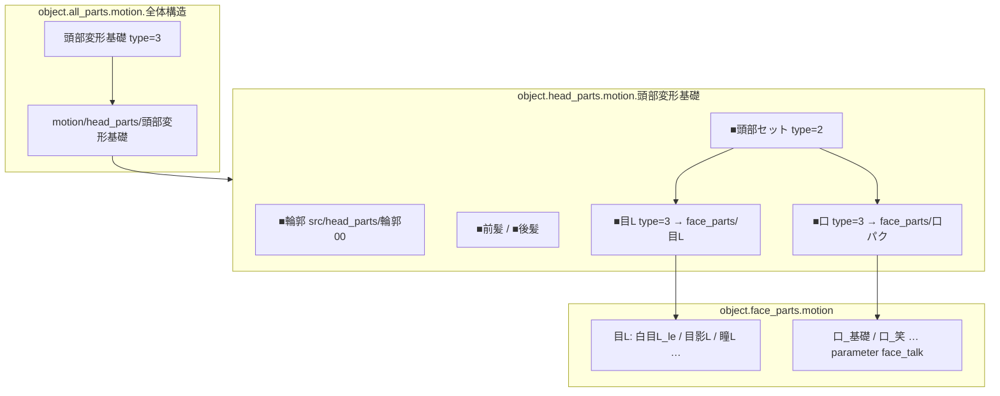
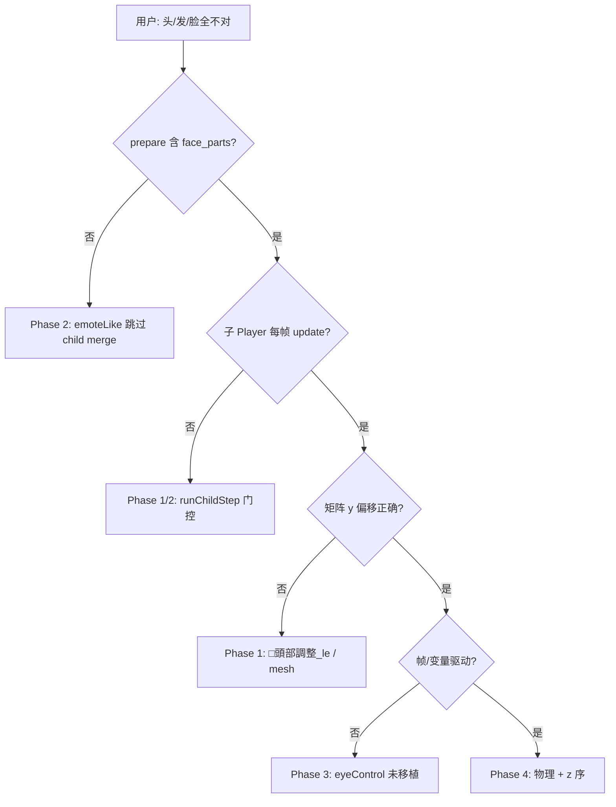
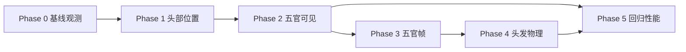

# MotionPlayer 头部 / 头发 / 五官渐进修复指南

> **黄金样本：** [`tests/test_files/emote/e-mote3.0バニラパジャマa.json`](../../../../tests/test_files/emote/e-mote3.0バニラパジャマa.json)（同名 `.psb`）  
> **索引：** [README.md](README.md)  
> **相关：** [MOTIONPLAYER_PSB_STRUCT.md](MOTIONPLAYER_PSB_STRUCT.md)、[MOTIONPLAYER_PROGRESS.md](MOTIONPLAYER_PROGRESS.md)、[MOTIONPLAYER_DRAW_VISIBILITY.md](MOTIONPLAYER_DRAW_VISIBILITY.md)

本文对照 **バニラパジャマa** JSON，说明当前「头发与阴影不对、脸部偏下、五官缺失或错位」的症状如何拆成可验收的修复阶段。每一阶段都有明确 JSON 锚点、代码落点与通过标准，避免一次性改整条渲染链。

---

## 0. 快速诊断（30 秒定位 Phase）

按下列顺序看日志 / 离屏图，**命中第一条即进入对应 Phase**，不要跳步：

| 顺序 | 检查项 | 异常表现 | 进入 |
|------|--------|----------|------|
| 1 | `emote init diag: parameter table empty` | 有 | 先修 `loadMotionParameterTableLike_sdl3`（Phase 0） |
| 2 | `emote first eval ... face=[... draw=n]` 且 `目`/`口`/`眉` 全 `src=n` | 有 | **Phase 2**（子 motion 未 merge 进 prepare） |
| 3 | 有轮廓+头发，但脸在胸口 / y 明显偏低 | 有 | **Phase 1**（`□頭部調整_le` / `首傾き設定` 矩阵链） |
| 4 | 五官可见但闭眼/半闭/口型错 | 有 | **Phase 3**（`eyeControl` / `parameterize` 帧时间） |
| 5 | 五官位置对，头发像贴图、阴影双层错位 | 有 | **Phase 4**（`initPhysics` + `objTriPriority`） |

**当前 KrKr2 典型组合：** Phase 2 + Phase 1 同时存在（只见 `■輪郭`/`■前髪`，无 `瞳L`/`目影L`；头块整体 y 偏移未完全进 `accumulated`）。

**Phase 0 一键基线（2026-06-08 快照）：**

```bash
# 见 MOTIONPLAYER_RENDER_TEST.md
./tests/test_files/render/run.sh   # 或单独跑 motionplayer-dll
# 过滤器: "motionplayer drawToBitmap alpha bbox regression"
# 期望: bbox≈(0,65)-(799,629), lim=800×1080, alphaSamples>0
```

---

## 1. 症状与 JSON 期望（对照表）

| 用户可见症状 | JSON 中应对应的结构 | 当前实现缺口（2026-06） |
|--------------|---------------------|-------------------------|
| 脸部整体偏下 / 与身体脱节 | `全体構造` 内 `□頭部調整_le`（`coord.y≈615`）、`首傾き設定`（`coord.y≈-421`）、`頭部同期UD/LR/SL` | 子 motion `頭部変形基礎` 的矩阵传播、mesh 变形链需逐节点验收；`groundCorrection` 仅部分节点生效 |
| 头发位置 / 摆动不对 | `head_parts/頭部変形基礎` → `center_fronthair` / `■前髪` / `■後髪`；`metadata.hairControl[]` | `initPhysics()` **空实现**；`hairControl`（type=1）只标 `_emoteDirty`，无 Spring 段链 |
| 头发阴影错位或缺失 | `目影L` 同级逻辑：`src/face_eye_kage_*`；发型侧 `objTriPriority`、`stencilType` | 多层 `type:0` 贴片依赖正确 **z 序** 与 **stencil 合成**；`prepareRenderItems` 排序须与 `objTriPriority` 一致 |
| 眼睛 / 眉 / 口不显示 | `■頭部セット` 下 `■目L/R`、`■口`、`■眉L/R`（`type:3` → `motion/face_parts/*`） | **e-mote 路径**下 `prepareRenderItems` **不合并** nodeType=3 子 Player 输出（见 §3.2） |
| 五官显示但帧错误（半闭眼当全开等） | `metadata.eyeControl[].edge` + `node`；`instantVariableList`；各层 `frameList` 多帧 `icon1..6` | `updateEyeControl` **未移植**；`eyeControl` 仅登记 `controllerBindings`，不驱动 `目影L` 等层的帧时间 |
| 口型不动 | `mouthControl[].talkLabel` → `face_talk`；`face_parts/口_*` 的 `parameter[].id` | `face_talk→talk` 已在 `applyEvalResultPostProcess`；子 motion 的 `parameter` 表需随 `progress` 同步到子 Player |

**基线变量（catalog `基礎状態`）：** 所有 `face_*`、`head_*` 应为 `0`（见 JSON `metadata.catalog[0].key`）。修复时先用该状态对比官方预览，再测 `挨拶` 等 preset。

---

## 2. 黄金 JSON：头部数据地图

### 2.1 三层 motion 引用



### 2.2 关键层标签（修复时 grep JSON）

| 用途 | `label` | 备注 |
|------|---------|------|
| 头相对身体偏移 | `□頭部調整_le` | `frameList[0].content.coord` ≈ `[2, 615, 0]` |
| 颈部 / 倾角 | `首傾き設定` | `coord` ≈ `[7, -421, 0]`，`angle` 关键帧 ±8° |
| 头身同步 | `頭部同期UD` / `LR` / `SL` | `type:2` 布局层，mesh 控制点驱动变形 |
| 前发锚点 | `center_fronthair` | `type:1` shape/point，对接 `hairControl[0].baseLayer` |
| 前发贴图 | `■前髪` | `src/head_parts/前髪00` |
| 眼部阴影 | `目影L` / `目影R` | `src/face_eye_kage_l/icon1..6`，时间轴 0/15/20/26/40/50 |
| 五官容器 | `■頭部セット` | 子层均为 `motion/face_parts/*` 的 type=3 |

### 2.3 metadata 控制器（与五官直接相关）

| 块 | 变量 | JSON 要点 | 代码现状 |
|----|------|-----------|----------|
| `eyeControl[0]` | `face_eye_open` | `edge: [[-10,20],[30,30],…]`，`node: [[5,30]]` | 仅 `collectControlBindings`；**无** `edge→帧时间` 映射 |
| `eyebrowControl[0]` | `face_eyebrow` | 多段 `edge` + `node` 二维索引 | 同上 |
| `mouthControl[0]` | `face_mouth` / `face_talk` | `talkLabel` | `applyEvalResultPostProcess` 已同步 talk |
| `hairControl[]` ×4 | `hair_UD_*` / `hair_LR_*` | `baseLayer`: `center_fronthair` 等 | `setVariable` type=1 → 物理组，**无仿真** |
| `clampControl` | `head_UD/LR` 等 | ±30 | `applyClampControlsLike_0x67C8A8` 已有 |
| `instantVariableList` | `face_eye_open`, `face_eyebrow`, `face_mouth` | 离散帧，无渐变 | Timeline 轨道标记 `instantVariable` |

### 2.4 参数表加载优先级

`loadMotionParameterTableLike_sdl3` 优先从 **`全体構造` 或 `頭部変形基礎`** 的 `parameter[]` 加载（参数条目最多或名称匹配）。五官子 motion（如 `face_parts/口_基礎`）另有独立 `parameter[].id = face_talk`，需在子 Player `play` 后绑定到父变量。

### 2.5 黄金 JSON 摘录（バニラパジャマa，已核对）

**metadata 基线（catalog `基礎状態`）：** 所有 `face_*`、`head_*` 为 `0`：

```json
"key": "move_UD,+0.0\n...\nface_eye_open,+0.0\nface_eyebrow,+0.0\nface_mouth,+0.0\nface_talk,+0.0\n..."
```

**全体構造 → 头相对身体：**

```json
{ "label": "□頭部調整_le", "frameList": [{ "content": { "coord": [2, 615, 0] } }] }
{ "label": "首傾き設定", "parameterize": 6,
  "frameList": [
    { "time": 0, "content": { "angle": -8, "coord": [7, -421, 0] } },
    { "time": 30, "content": { "coord": [7, -421, 0] } },
    { "time": 60, "content": { "angle": 8, "coord": [7, -421, 0] } }
  ]
}
```

**子 motion 引用（type=3 是五官不显示的关键）：**

```json
{ "label": "頭部変形基礎", "type": 3, "src": "motion/head_parts/頭部変形基礎" }
{ "label": "■目L", "type": 3, "src": "motion/face_parts/目L" }
{ "label": "■口", "type": 3, "src": "motion/face_parts/口パク" }
```

**face_parts/目L 内阴影帧（基线 `face_eye_open=0` → time=0）：**

```json
{ "label": "目影L", "objTriPriority": 2, "type": 0,
  "frameList": [
    { "time": 0, "content": { "src": "src/face_eye_kage_l/icon1" } },
    { "time": 15, "content": { "src": "src/face_eye_kage_l/icon2" } }
  ]
}
```

**hairControl[0] 锚点：**

```json
{ "label": "前髪揺れ", "baseLayer": "center_fronthair", "var_ud": "hair_UD_front", "var_lr": "hair_LR_front" }
```

---

## 2.6 根因优先级（为何「整个头都错」）



| 根因 | 影响范围 | 典型症状 |
|------|----------|----------|
| `emoteLikePrepare` 不 merge type=3 | 全部五官 + 口型子树 | 脸「空壳」：只有轮廓/头发贴片 |
| `runChildStep` 仅首帧 | `頭部変形基礎` 内变形 | 脸位置冻结或跟变量脱节 |
| `updateEyeControl` 缺失 | 目/眉/目影帧 | 显示但帧错，或 parameterize tick 恒 0 |
| `initPhysics` 空 | `center_fronthair` 链 | 头发无摆动；阴影相对头发错位 |

---

## 3. 运行时管线（为何会出现「头对了身不对」）

### 3.1 progress 链（立绘）

```
EmotePlayer.progress(dt)
  → progressEmoteLike_sdl3
      → applyEvalResultPostProcess（clamp、face_talk→talk）
      → syncParameterEntriesFromVariablesLike_sdl3
      → updateLayersEmoteLike_sdl3
          → Phase1 变量 / 参数表
          → Phase2 节点求值（parameterize 节点用 entry.value 作帧时间）
          → Phase3_Visibility
          → Phase3_MotionSubNode（isEmoteMode==true 时整段跳过）
```

**注意：** 本 PSB 根级常无 `type:1`，故 `isEmoteMode=false`，但 `variableList` 非空 → `isEmoteLikeMotion=true`。子 motion 步进条件为：

```cpp
runChildStep = !emoteLike || (flags & 0x01) || child._queuing || child._noUpdateYet;
```

即 **多数帧不会** 对子 Player 调用 `updateLayers`，依赖首帧 `flags&0x01` 初始化。五官/头发子树若需跟变量每帧变，必须在此补强。

### 3.2 draw 链（五官不显示的核心）

`prepareRenderItems` 在 `isEmoteLikeMotion` 时 **故意不** 调用 `appendChildEntriesAtCurrentNode`（注释：避免 NEKOPARA `頭部変形基礎` 子 prepare 风暴）：

```538:551:cpp/plugins/motionplayer/PlayerRenderItems.cpp
                // sdl3: e-mote 单棵树 walk；不 libkrkr2 式 nodeType=3 子 Player
                // prepare 合并（NEKOPARA 頭部変形基礎 会触发数百次子
                // prepare）。
                if(!emoteLikePrepare) {
                    if(node.nodeType == 3) {
                        appendChildEntriesAtCurrentNode(node.getChildPlayer(),
                                                        node.priorDraw != 0);
```

因此 `■目L` 等 **仅存在于子 Player 树** 的贴片，不会进入父级 `preparedRenderItems`，表现为五官缺失或只剩 `head_parts` 里直接挂的 `■輪郭` / `■前髪`。

**修复方向（Phase 2）：** 在保持「不全量 merge」前提下，对 `motion/face_parts/*` 与 `motion/head_parts/頭部変形基礎` 做 **有界合并**（按 label 白名单或深度限制），或改为 sdl3 式单树展开（长期）。

**建议白名单（首版 merge，避免 NEKOPARA 风暴）：**

| 父节点 `label` / `src` 匹配 | 合并深度 | 说明 |
|-----------------------------|----------|------|
| `■目L` / `■目R` / `■眉L` / `■眉R` / `■口` | 子 Player 全树 | 仅 5 个 type=3 容器 |
| `■頭部セット` | 不直接 merge；由其子节点触发 | JSON 容器 type=2 |
| `頭部変形基礎` | **不**全量 merge | 数百节点；只让步进 + 父树已有 `■輪郭`/`■前髪` |

**伪代码（`PlayerRenderItems.cpp`）：**

```cpp
const bool boundedFaceMerge =
    emoteLikePrepare &&
    node.nodeType == 3 &&
    (node.interpolatedCache.src.find("motion/face_parts/") != npos ||
     isFaceContainerLabel(node.layerName)); // ■目L 等
if (boundedFaceMerge || !emoteLikePrepare) {
    appendChildEntriesAtCurrentNode(node.getChildPlayer(), node.priorDraw != 0);
}
```

### 3.3 可见性掩码

e-mote `prepare` / `visibility` 使用 bitmask **6153**（含 nodeType 0、3、11、12）。若五官层 nodeType 正确但仍不绘制，先查 `stencilType`、`drawFlag`、`accumulated.active`（日志 `emote first eval`）。

---

## 4. 渐进式修复计划

原则：**每阶段只改一个子系统**，用 JSON 基线状态 + 离屏单测 + 局部截图验收。

### Phase 0 — 基线与观测（1–2 天）

**目标：** 固定「应显示什么」，避免后续改矩阵时无法回归。

| 动作 | 说明 |
|------|------|
| 脚本注入 catalog `基礎状態` 全部变量为 0 | 与 JSON `metadata.catalog[0]` 一致 |
| `play("全体構造")` + `progress(0)` + 离屏 draw | 过滤器：`motionplayer drawToBitmap alpha bbox regression` |
| 打开诊断日志 | 查看 `emote init diag`、`emote first eval` 中 `face=[...]` |
| 记录 bbox 与 `screenSize` 800×1080 | 当前单测 bbox 约 `(0,65)–(799,629)`，作 Phase 0 快照 |

**通过标准：**

- `parameterEntries` 非空，且含 `face_eye_open` / `face_mouth` 等 id  
- `face=` 日志里 **目/口/眉** 节点 `src` 非 `n`（若全为 `n`，直接进入 Phase 2）

---

### Phase 1 — 头部位置与变形（2–4 天）

**目标：** 轮廓 + 头发块区域与身体对齐，不涉及表情帧。

| 优先级 | JSON 锚点 | 代码落点 | 修改要点 |
|--------|-----------|----------|----------|
| P1.1 | `□頭部調整_le`、`首傾き設定` | `PlayerUpdateLayerEval.cpp` Phase2 | 核对 `coord`/`angle` 进 `accumulated` 与父链 `inheritMask` |
| P1.2 | `頭部同期UD/LR/SL` | `PlayerUpdateGeometry.cpp` mesh 路径 | mesh `bp` 控制点插值是否与 JSON 首帧一致 |
| P1.3 | `頭部変形基礎` type=3 | `PlayerUpdateChildMotion.cpp` | emoteLike 下 **每帧** 或 **变量变化时** 步进子 Player（`_emoteDirty` 门控），避免只 init 一次 |
| P1.4 | `groundCorrection` | `sub_6BAA10_groundCorrection` | 对 `■前髪` 父链节点抽样验证 |

**验收：**

- 离屏 bbox 纵向中心接近期望（相对 `□頭部調整_le` 的 y=615 可视区）  
- `■輪郭` + `■前髪`/`■後髪` 与身体无大面积重叠或「脸沉到胸口」

**不建议本阶段做：** `initPhysics`、eyeControl（避免变量干扰位置判断）。

---

### Phase 2 — 五官可见（子 motion 合并）（3–5 天）

**状态：** 首版已落地（2026-06-08），待离屏截图验收。

**目标：** `■目L/R`、`■眉L/R`、`■口` 进入渲染列表。

| 任务 | 说明 |
|------|------|
| **有界 child merge** | 在 `PlayerRenderItems::prepareRenderItems` 中，对 `src` 匹配 `motion/face_parts/` 或子树根 clip 为 `目L`/`目R`/`口パク`/`眉L` 的 nodeType=3 调用 `appendChildEntriesAtCurrentNode` |
| **子 parameter 同步** | `bindParameterValueLike_0x6C4668` 递归子 Player；`progress` 后保证 `face_parts` 内 `parameterize` 节点拿到父级 `face_*` 值 |
| **z 序** | 合并时保留子项 `objTriPriority`；`目影L` 应在 `瞳L` 之下（JSON 树顺序 + priority） |

**验收：**

- `emote first eval` 的 `face=` 含 `目影L`、`瞳L`、`口` 等且 `draw=y`  
- 离屏图眼部、口部区域 `alphaSamples > 0`（`EMOTE_DRAW_DEBUG=1`）  
- 仍允许帧内容错误（Phase 3 再修）

**风险：** 全量 merge `頭部変形基礎` 可能重现性能问题 → 用 **深度≤2** 或 **label 白名单** 限制。

---

### Phase 3 — 五官帧选择（eye / brow / mouth）（4–6 天）

**目标：** 基线状态下眼睛睁开、眉正常、口闭合。

| 任务 | JSON 依据 | 实现提示 |
|------|-----------|----------|
| **移植 `updateEyeControl`** | `eyeControl[0].edge` + `node` | 将 `face_eye_open` 数值映射到 `目L/目R/目影L/R` 等层的 **帧时间**（非仅 `parameterize` 索引） |
| **眉控** | `eyebrowControl[0]` | 同上，驱动 `眉DL`、`眉影l_le` 等 |
| **instant 变量** | `instantVariableList` | `frameSelectionTimeLike_0x6B7E44` 对已标 `instantVariable` 的轨道禁用插值 |
| **口型** | `mouthControl` + `face_parts/口_*` | 确认 `face_mouth=0` 时选中 `口_基礎` 首帧；`face_talk` 驱动 `口パク` motion |

**对照 JSON 的具体期望（基线 face_eye_open=0）：**

- `目影L` 应落在 `time=0` → `src/face_eye_kage_l/icon1`  
- `face_eye_open=15`（示例）应对应 `icon2`（`time=15` 关键帧）

**验收：**

- 变量扫描：`face_eye_open` 从 0→15→20，离屏眼部贴片名称/外形随之变化  
- 与官方 e-mote 预览或导出的参考图对比（可用 `tools/psb-export`）

---

### Phase 4 — 头发与阴影（5–8 天）

**目标：** 前发/后发摆动与阴影层关系正确。

| 任务 | 说明 |
|------|------|
| **实现 `initPhysics` + Spring** | 对照 `metadata.hairControl[]` 的 `param.bp/p/pv`、`length[]`、`scale_x/y[]`；写入 `center_fronthair` 等锚点层 |
| **变量驱动** | `hair_UD_front` 等经 `setVariable` type=1 进入物理组后，须真正施加到段链 |
| **阴影层** | `■前髪` 与后发 `stencilType` / 合成顺序；必要时查 `type:12` `stencilCompositeMaskLayerList` |

**验收：**

- `progress` 多帧后头发有惯性摆动（非静态贴图）  
- 发际线阴影无「双层错位」或「阴影飞到脸外」

---

### Phase 5 — 回归与性能（持续）

| 项 | 做法 |
|----|------|
| 单测 | 扩展 `motionplayer-dll`：头部 ROI 像素计数 / bbox 上限下限 |
| 黄金图 | 基线 + `挨拶` catalog 两帧 snapshot diff |
| 性能 | child merge 后 profiling `prepareRenderItems`；必要时缓存子树 prepare 结果 |

---

## 5. 调试手册

### 5.1 日志关键词

| 日志 | 含义 | 行动 |
|------|------|------|
| `parameter table empty` | 未加载 `parameter[]` | 查 `loadMotionParameterTableLike_sdl3`、clip 是否 `全体構造` |
| `emote first eval ... face=[... draw=n]` | 五官层未进绘制 | Phase 2 merge / visibility |
| `emptySrc=N` | parameterize 节点无贴图 | 帧时间 / `face_*` 变量 / 子 motion 未 play |
| `hidden=N` | `drawFlag` 或 visible 链关闭 | `stencilType`、`Phase3_Visibility` |
| `prepareRenderItems returned empty` | 整帧无输出 | 先查 bitmask 6153 与 active 链 |

### 5.2 建议 TJS 探针（最小）

```javascript
player.play("全体構造", Motion.PlayFlagForce);
// 注入 catalog 基礎状態 → 各 setVariable("face_eye_open", 0) 等
player.progress(0);
// 检查内部变量（若暴露 API）
// player.draw(layer);
```

### 5.3 C++ 断点 / 跟踪

| 文件 | 函数 |
|------|------|
| `PlayerRenderItems.cpp` | `prepareRenderItems` — 统计含 `目`/`髪` 的 entry 数 |
| `PlayerUpdateChildMotion.cpp` | `label_18` — 子 Player 是否 `runChildStep` |
| `PlayerVariable.cpp` | `syncParameterEntriesFromVariablesLike_sdl3` |
| `PlayerFrameProgress.cpp` | `applyEvalResultPostProcessLike_0x67CC9C` |

---

## 6. 阶段依赖关系



**可并行：** Phase 1 与 Phase 2 的「子 motion 步进」部分可同改 `PlayerUpdateChildMotion.cpp`，但验收应分开。

---

## 7. 源码索引

| 主题 | 路径 |
|------|------|
| 参数表 / 变量种子 | `PlayerCore.cpp` — `loadMotionParameterTableLike_sdl3`、`seedEmoteVariableDefaultsLike_sdl3` |
| 子 motion | `PlayerUpdateChildMotion.cpp` — `updateLayersPhase3_MotionSubNode` |
| 帧时间 / parameterize | `PlayerUpdateLayerEval.cpp` — `frameSelectionTimeLike_0x6B7E44` |
| 渲染项 | `PlayerRenderItems.cpp` — `prepareRenderItems` |
| 控制器元数据 | `RuntimeSupport.cpp` — `collectControlMetadata` |
| 眨眼 / 眉（待实现） | 参考 `sdl3/emoteplayerclass.cpp` — `updateEyeControl`（文档见 `MOTIONPLAYER_PROGRESS.md` §4） |
| 物理（待实现） | `PlayerCore.cpp` — `initPhysics` |
| 诊断 | `PlayerCore.cpp` — `logEmoteInitDiagnosticsOnce`、`logEmoteFirstEvalDiagnosticsOnce` |

---

## 8. 修订记录

| 日期 | 说明 |
|------|------|
| 2026-06-08 | 初版：对照 `e-mote3.0バニラパジャマa.json` 拆分 Phase 0–5 |
| 2026-06-08 | 增补 §0 快速诊断、§2.5 JSON 摘录、§2.6 根因图、Phase 2 白名单伪代码 |
| 2026-06-08 | **Phase 2 首版实现：** `RuntimeSupport.h::shouldBoundedMergeEmoteChildPrepare`；`PlayerRenderItems.cpp` 有界 merge；`PlayerUpdateChildMotion.cpp` 子 Player 步进 |
| 2026-06-08 | **根因补丁：** `updateLayersEmoteLike_sdl3` 补全 VertexComputation/Shape 等 Phase3（此前 prepare 无有效 corners，merge 不可见） |
