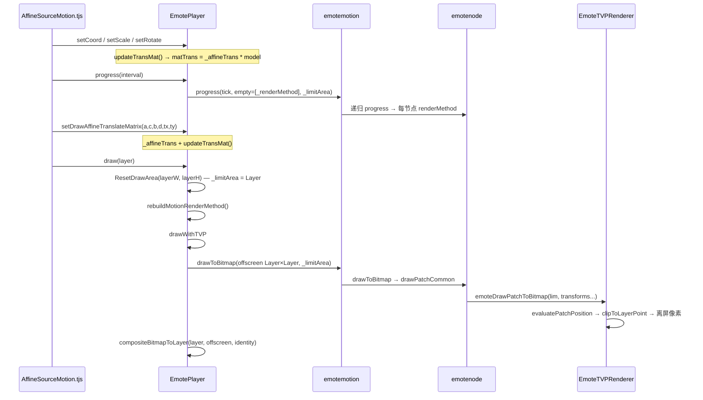

# MotionPlayer 矩阵与坐标变换管线（TVP 实现）

> **文档索引：** [`README.md`](README.md)  
> 权威对照：`docs/sdl3/emotefile.cpp`（GPU tessellation）、`docs/sdl3/emoteplayerclass.cpp`（Player / FBO）  
> TVP 实现：`emoteplayerclass.cpp`、`EmoteNode.cpp`、`EmoteInternal.cpp`、`EmoteTVPRenderer.cpp`  
> 脚本入口：`data/system/AffineSourceMotion.tjs` → `drawAffine`  
> **TVP 坐标系 / 仿射防踩坑：** [`MOTIONPLAYER_TVP_COORDINATES.md`](MOTIONPLAYER_TVP_COORDINATES.md)  
> **贴图在世界坐标中的定位（PSB 字段 + progress 实现）：** [`MOTIONPLAYER_TEXTURE_WORLD_COORDS.md`](MOTIONPLAYER_TEXTURE_WORLD_COORDS.md)

**路线 A（2026-06-08）：** TVP 与 SDL3 对齐 — `_limitArea` = Layer 尺寸、tess 根 `_affineTrans * model`、离屏 = Layer、`compositeBitmapToLayer` identity 1:1。下文 §1–§2 已按此更新；§4 旧「PSB 双阶段」描述若冲突，以路线 A 为准。

本文说明 **每一层坐标空间**、**每个函数的职责**、**矩阵如何叠乘**、**完整调用链**，以及如何用 `EmoteDrawDbg sampleIcon` 的 `tri` 判断问题落在哪一段。

---

## 1. 三套坐标空间（必须先分清）

| 空间 | 谁定义 | 典型尺寸 | 用途 |
|------|--------|----------|------|
| **Emote 逻辑 / progress lim** | 沿树传递的 `emotelimit`；子节点 blank 可大于屏幕 | 如 1830×1800、`progressLimMax` | `emotenode::progress` 里 `glm::ortho(lim)` 写入 `renderMethod.matTrans` |
| **Draw 视口 `drawLim`** | `EmotePlayer::_limitArea` = **Layer 尺寸** | 如 1280×720 | `drawToBitmap`、`clipToLayerPoint`（icon 的 `ortho` 用 progress `lim`，见 §5.3） |
| **Layer 父级仿射** | `AffineSourceMotion` 的 `calcMatrix` → `setDrawAffineTranslateMatrix` | 像素级 `tx,ty` + 2×2 | **乘入** tess 根 `_affineTrans * model`（SDL3 负号形式） |

```text
脚本 setCoord/setScale  ──►  model；setDrawAffine ──► _affineTrans
updateTransMat          ──►  renderMethod[0] = _affineTrans * model
emotenode::progress     ──►  renderMethod[1..n-1]（layout + projection*icon）
evaluatePatchPosition   ──►  clip 齐次坐标 (px,py,pw)
clipToLayerPoint(lim)   ──►  Layer 像素 (0..drawLim.w, 0..drawLim.h)
drawToBitmap(offscreen) ──►  compositeBitmapToLayer(identity) → MainImage
```

**`limMismatch=1` 是正常现象**：progress 子树 blank 可以大于 `drawLim`；SDL3 也如此。关键不是消掉 mismatch，而是 **NDC→视口** 与 **tess 矩阵顺序** 与 SDL3 一致。

---

## 2. 端到端调用链（NEKOPARA / Emote 立绘）



### 2.1 脚本侧（顺序固定，影响 C++ 侧设计）

`data/system/AffineSourceMotion.tjs` 的 `drawAffine`：

```javascript
// 1) Emote 内部位姿（PSB 坐标系）
_player.setCoord(+._imagex, +._imagey);
_player.setRotate(...);
_player.setScale(s);  // s = _emotescale * imagezoom * (100/resolutionx)

// 2) 建树（此时 _renderMethod 已是 model，但 Layer 仿射尚未设置）
_player.progress(_interval);  // 或 progress(0)

// 3) Layer 仿射（从 Kirikiri Layer 的 calcMatrix 逆算 6 参数）
var x = mtx.transformAreaX(1, 1);
var y = mtx.transformAreaY(1, 1);
_player.setDrawAffineTranslateMatrix(a, c, b, d, tx, ty);

// 4) 绘制
_player.draw(target);
```

因此 C++ **必须在 `draw()` 内 `setDrawAffine` 之后** 再 `rebuildMotionRenderMethod()`，否则节点 `renderMethod` 与当前帧 Layer 仿射不同步（已做）。

---

## 3. 核心数据结构

### 3.1 `emotelimit`

```cpp
// emotefile.h（概念）
struct emotelimit {
    float originX, originY;
    float width, height;
    float zMax;
};
```

- **progress**：父节点向子节点传 `{originX, originY, width, height, zMax}`，子 blank 可更大。  
- **draw**：离屏与 `clipToLayerPoint` 用 `_limitArea`（PSB screenSize）；`setCoord` 须 Layer→draw 比例（见 `MOTIONPLAYER_TVP_COORDINATES.md` §7）。

### 3.2 `emoteRender`（渲染栈的一层）

```cpp
// emotefile.h
struct emoteRender {
    int type;           // 0 不绘 1 贝塞尔+矩阵 2 仅矩阵 3 layout 穿透合并
    glm::mat4 matTrans;
    float controlPts[32];
    float opa;
    // originX/Y, width, height — FBO/裁剪元数据
};
```

每个 **icon 节点** 在 `progress` 结束时拥有 `renderMethod` 向量：

- `renderMethod[0]`：`EmotePlayer` 压入的根（`type=3`，`matTrans=model`）  
- `renderMethod.back()`：最接近叶子，常含 `projection * … * model(icon)`

### 3.3 `EmotePlayer` 侧矩阵

| 成员 | 含义 |
|------|------|
| `_renderMethod` | 传入树根的 `emoteRender`；`matTrans = model` |
| `_affineTrans` | Layer 仿射；**仅合成阶段使用** |
| `_limitArea` | draw 视口（PSB screenSize）；`_layerWidth/Height` = Layer 尺寸 |
| `m_BmpBits` | 离屏位图 `_width×_height` |

---

## 4. EmotePlayer：Player 级函数

### 4.1 `updateTransMat()`

**文件**：`emoteplayerclass.cpp`  
**调用**：`setCoord` / `setScale` / `setRotate` / `ResetDrawArea`（尺寸变化时）

```cpp
void EmotePlayer::updateTransMat() {
    _renderMethod.type = 3;
    _renderMethod.opa = 1.0f;
    glm::mat4 model = glm::mat4(1.0f);
    model = glm::translate(model, glm::vec3(currCoordx + currCamX, currCoordy + currCamY, 0));
    model = glm::rotate(model, glm::radians(currAngle), glm::vec3(0.0f, 0.0f, 1.0f));
    model = glm::scale(model, glm::vec3(currZx, currZy, 1.0f));
    _renderMethod.matTrans = model;   // TVP：Layer 仿射不进栈（见 compositeBitmapToLayer）
}
```

**功能**：把脚本 `setCoord/setScale/setRotate` 合成 Emote **根矩阵** `model`，作为 `progress` 时 `empty[0]`。

---

### 4.2 `setDrawAffineTranslateMatrix(a,b,c,d,tx,ty)`

**功能**：保存 Kirikiri Layer 对单位正方形的仿射（见脚本 `transformArea(1,1)` 逆算的 6 参数）。矩阵语义与 TVP `t2DAffineMatrix` 一致，详见 [`MOTIONPLAYER_TVP_COORDINATES.md`](MOTIONPLAYER_TVP_COORDINATES.md) §4。

脚本调用为 `setDrawAffineTranslateMatrix(a, c, b, d, tx, ty)`，故 C++ 形参 `(a,b,c,d)` 实际对应 `(m11, m21, m12, m22)`。

```cpp
// TVP 像素：x' = a*x + c*y + tx,  y' = b*x + d*y + ty  （勿用 -b/-c OpenGL 写法）
_affineTrans = glm::mat4(a, b, 0, 0,
                         c, d, 0, 0,
                         0, 0, 1, 0,
                         tx, ty, 0, 1);
// updateTransMat() 只刷新 model，不把 _affineTrans 写入 _renderMethod
```

**TVP 与 SDL3 差异**：SDL 在 GPU 根矩阵用 `_affineTrans * model`；TVP 须在离屏用 **仅 `model`** 走 tess/ortho，再在 `compositeBitmapToLayer` 对整张贴图做 Layer 仿射。TVP 底层虽为 OpenGL，但 `AffineBlt` 对外仍是 **左上原点、Y 向下** 的像素坐标（Y↔NDC 在 `RenderManager_ogl::OperateTriangles` 内完成）。

---

### 4.3 `progress(mstime)`

**功能**：推进时间轴；**建树**（第一次，可能在 `setDrawAffine` 之前）。

```cpp
std::vector<emoteRender> empty;
empty.push_back(_renderMethod);
_currmotion->progress(tick, empty, _limitArea);
```

- E-mote 立绘：`tick=0`，另调 `updateEyeControl` / `updateTimelineControl`  
- MTN：`tick=clockPassed`

---

### 4.4 `ResetDrawArea(layerW, layerH)`

**功能**：记录 Layer 尺寸；`_limitArea` 与离屏 **保持 PSB `screenSize`**（与 SDL3 不同，见 [`MOTIONPLAYER_TVP_COORDINATES.md`](MOTIONPLAYER_TVP_COORDINATES.md) §7）。

```cpp
_layerWidth = layerW; _layerHeight = layerH;
ensureLimitAreaFromFile();  // _limitArea / _width / _height ← screenSize
updateTransMat();
```

---

### 4.5 `rebuildMotionRenderMethod()`

**功能**：在 `draw()` 里、`setDrawAffine` 之后，用 **最新** `_renderMethod` 和 `_limitArea` 再跑一遍 `emotemotion::progress`。

```cpp
empty.push_back(_renderMethod);
_currmotion->progress(0 or clockPassed, empty, _limitArea);
```

**必要性**：保证 `setCoord` / `setScale` 后的 `model` 已写入各节点 `renderMethod`。`setDrawAffine` 只影响 composite，不触发 tess 重建需求，但 `draw()` 内统一 rebuild 无害。

---

### 4.6 `draw()` → `drawWithTVP()`

```cpp
void EmotePlayer::draw(...) {
    ResetDrawArea(layerW, layerH);
    rebuildMotionRenderMethod();
    drawWithTVP(layer);
}

void EmotePlayer::drawWithTVP(layer) {
    offscreen->Fill(0);
    _currmotion->drawToBitmap(offscreen, targetClip, _limitArea, nullptr);
    compositeBitmapToLayer(layer, offscreen, _width, _height, _affineTrans);
}
```

---

### 4.7 `compositeBitmapToLayer(..., layerAffine)`

**功能**：离屏整张贴到 Layer；用 `_affineTrans` 把离屏矩形 `(0,0)-(w,h)` 映射到 Layer 像素。

```cpp
// 离屏三角 → Layer 三角
dstTri[0] = layerAffine * (0, 0)
dstTri[1] = layerAffine * (srcWidth, 0)
dstTri[2] = layerAffine * (0, srcHeight)
mainImage->AffineBlt(dstRect, srcBitmap, srcRect, dstTri, bmCopy, 255, hda=false, ...);
```

**不是**整层拉伸；与脚本「Layer 矩阵」语义一致。

---

## 5. emotenode::progress — 建树与 `matTrans`

### 5.1 入口行为

```cpp
renderMethod.clear();
renderMethod = renderList;  // 继承父级栈（含根 model）
```

然后按帧插值 `currCoordx/y`、`currOpa`、贝塞尔 `currbp` 等，再 `model = T * R * S`（平移→旋转→剪切缩放）。

### 5.2 `orthoForLim(lim)`

```cpp
glm::mat4 orthoForLim(const emotelimit &l) {
    return glm::ortho(-l.originX, l.width - l.originX,
                      l.height - l.originY, -l.originY, l.zMax, -l.zMax);
}
```

**注意**：子 blank 的 `lim` 可大于 `drawLim`（`limMismatch=1`）。**icon 的 `projection = orthoForLim(当前 progress lim)`**（与 SDL3 相同）；**`clipToLayerPoint` 单独用 `_limitArea`（screenSize）**。勿用 `ortho(drawViewport)` 替代 `ortho(lim)`，否则 layout 栈与大 blank 坐标系不一致，`tri` 会飞出离屏（±5000+）。

### 5.3 可绘制 icon（`!isLayout`）典型写入

父级为 layout（`renderMethod.back().type == 3`）时：

```cpp
model = translate(-originX-currOx, -originY-currOy) * scale(width, height);
emt.matTrans = projection * emt.matTrans * model;  // projection = orthoForLim(lim)
```

否则：

```cpp
emt.matTrans = projection * model;
```

**结果**：`renderMethod` 长度 = 树深（你日志里 `surf=14` = 14 层 surface）。

### 5.4 子节点传递

```cpp
ch->progress(tick, renderMethod, {originX, originY, width, height, lim.zMax});
```

---

## 6. 绘制路径：从 `drawToBitmap` 到像素

### 6.1 `emotemotion::drawToBitmap`

按 z 排序遍历 icon 节点 → `emotenode::drawToBitmap` → `drawPatchCommon(lim, ...)`，`lim = _limitArea`。

### 6.2 `drawPatchCommon` — 对齐 SDL3 `glUniform`

**文件**：`EmoteNode.cpp`

SDL3 `draw()` 中：

```cpp
for (i = n-1; i >= 0; --i)
    glUniformMatrix4fv(..., "transforms[idxCnt++]", renderMethod[i].matTrans);
```

TVP 等价为 **逆序填入、正序求值**：

```cpp
for (int32_t i = 0; i < surfaceCount; ++i) {
    const size_t srcIdx = surfaceCount - 1 - i;
    patchTransforms[i] = renderMethod[srcIdx].matTrans;
    patchControlPoints[i] = (type==1) ? controlPts : default_control_points;
}
emoteDrawPatchToBitmap(target, targetClip, lim,
    surfaceCount, glm::value_ptr(patchTransforms[0]), ...);
```

**叠乘顺序（列向量）**：

```text
clipPoint = M[0] * M[1] * ... * M[n-1] * bezierPath(uv)
其中 M[i] = renderMethod[n-1-i] 在 CPU 数组 transforms[i]

等价于：先 renderMethod[n-1]（叶/icon 侧）作用 UV，最后 renderMethod[0]（根 model）
```

**不要**改成 `patchTransforms[i]=renderMethod[i]` 正序填入，否则会变成「根矩阵先作用 UV」，与 SDL3 tessEval 不一致。

---

## 7. `evaluatePatchPosition` — CPU 版 tessEval

**文件**：`EmoteInternal.cpp`  
**对照**：`docs/sdl3/emotefile.cpp` tessEvaluationShader `main()`

### 7.1 算法（每层 surface）

```cpp
// 输入 uv ∈ [0,1]²（参数域角点；映到 TVP 三角见 §9：(1,0)(1,1)(0,0)）
for (int i = 0; i < surfaceCount; ++i) {
    if (i > 0) {
        // 层间 UV 交换（与 GLSL 完全一致）
        px = 1.0f - (oldY / 2.0f + 0.5f);
        py = 0.5f + oldX / 2.0f;
    }
    bezierSurface2D(px, py, controlPoints[i], sx, sy);
    t = glm::mat4(transforms + i*16) * vec4(sx, sy, 0, 1);
    px, py, pz, pw = t;
}
outX = px;
outY = -py;   // 对应 gl_Position = lastPt * vec4(1,-1,1,1) 的 Y 翻转
outW = pw;
```

**功能**：把参数域 `(u,v)` 经 14 层 Bézier + 矩阵，得到 **clip 齐次坐标** `(outX, outY, outZ, outW)`。

**限制（TVP）**：SDL 用 16×16 tess 网格；TVP 默认 `kEnableCpuBezierMesh=false` 时只用 **3 个角点** 做一次 `AffineBlt` 仿射近似，**不等价**于 GPU 全网格（变形大时布局会偏，但不应整团飞出屏幕）。

---

## 8. `clipToLayerPoint` — NDC → 离屏像素

**文件**：`EmoteTVPRenderer.cpp`

```cpp
void clipToLayerPoint(float px, float py, float pw, const emotelimit &viewportLim, tTVPPointD &out) {
    const float w = (pw != 0.0f) ? pw : 1.0f;
    const double ndcX = px / w;
    const double ndcY = py / w;
    out.x = viewportLim.originX + (ndcX * 0.5 + 0.5) * viewportLim.width;
    out.y = viewportLim.originY + (1.0 - (ndcY * 0.5 + 0.5)) * viewportLim.height;
}
```

**功能**：等价于 `glViewport(0,0,lim.width,lim.height)` + 左上原点 bitmap Y 向下。

**参数 `lim`**：必须传 **`drawLim`（`_limitArea`）**，不要对 `progressLim` 做二次线性缩放（错误尝试，已回退）。

---

## 9. `affineTargetTriangle` + `AffineBlt`

```cpp
// TVP AffineBlt：p0 左上 / p1 右上 / p2 左下（bitmap Y 向下）
// SDL tessCoord=(v,u)：贴 (w,0) 取 patch(0,1)，贴 (0,h) 取 patch(1,0)
evaluatePatchPosition(0,0, ...) → p0;
evaluatePatchPosition(0,1, ...) → p1;
evaluatePatchPosition(1,0, ...) → p2;

// 半像素偏移（TVP 像素中心）
xOffset = -0.5 - targetClip.left;
yOffset = -0.5 - targetClip.top;

target->AffineBlt(triClip, sourceBitmap, sourceRect, dstTri,
                  bmCopy, opa255, ..., hda=false, ...);
```

| 参数 | 值 | 说明 |
|------|-----|------|
| `hda` | **false** | 与 `Layer::AffineCopy(dfAlpha)` 一致；`true` 时透明底不写入 alpha |
| `triClip` | 三角 bbox ∩ targetClip | **macOS 上必须用 `triClip` 作 destrect**；用整层 `targetClip` 时 `OperateTriangles` 常无输出、`alphaSamples~=0` |
| `method` | 默认 blend `bmCopy` | 离屏 `Fill(0)` 后 `bmAlpha` 可能仍不写 alpha；与 CENTER 调试路径一致 |

---

## 10. SDL3 GPU 路径对照表

| 步骤 | SDL3 | TVP |
|------|------|-----|
| 视口 | `glViewport(0,0,lim.w,lim.h)` | `clipToLayerPoint(drawLim)` |
| 矩阵 uniform | `transforms[k]=renderMethod[n-1-k]` | `patchTransforms` 同上 |
| 曲面求点 | tessEval 16×16 网格 | `evaluatePatchPosition`；默认 3 角仿射 |
| Y 翻转 | `gl_Position = lastPt * (1,-1,1,1)` | `clipToLayerPoint` 中 `1 - ndcY`；**composite 不再翻转** |
| Layer 仿射 | `_affineTrans * model` 在根 `renderMethod[0]` | 仅 `compositeBitmapToLayer`；`updateTransMat` 只用 `model` |
| 输出 | `glReadPixels` → Layer | 离屏 `m_BmpBits` → `compositeBitmapToLayer` |

---

## 11. 调试日志怎么读

修复前错误日志（`_affineTrans` 误入 tess，`offscreen=800×1080`）：

```text
tri=(-9311.7,8318.4)(-9212.9,8305.2)(-9312.1,8200.1) inOffscreen=0 alphaSamples~=0
```

修复后期望（`tri` 在 screenSize 离屏内）：

```text
drawLim=800x1080
tri 落在 [0,800)×[0,1080)
inOffscreen=1  alphaSamples~ > 0
```

| 字段 | 含义 |
|------|------|
| `surf` | `renderMethod.size()`，全栈参与 `evaluatePatchPosition`（正常，可 >1） |
| `tri` | 采样 icon 在 **离屏像素** 坐标；应对齐 `drawLim`（screenSize），**不是** Layer 尺寸 |
| `inOffscreen=0` | 三角在离屏外 → tess/ortho 问题，或 `_affineTrans` 误进 tess |
| `progressLimMax` / `limMismatch=1` | blank 子树大于 screenSize；**可忽略**若 `tri` 已在 drawLim 内 |
| `alphaSamples~` | 离屏非透明像素数；composite 前应为 >0 |

**建议排查顺序**：

1. `EMOTE_DRAW_DEBUG_CENTER=1`：若中心网格可见 → 贴图/合成通，问题在矩阵链。  
2. 看 `tri` 是否随 `setCoord`/`setScale` 合理变化。  
3. 对比 SDL3 同 PSB 同帧的 GPU 结果（若有构建）。

---

## 12. 相关文件索引

| 文件 | 职责 |
|------|------|
| `data/system/AffineSourceMotion.tjs` | `drawAffine` 脚本顺序 |
| `emoteplayerclass.cpp` | Player、离屏、合成、`rebuildMotionRenderMethod` |
| `EmoteNode.cpp` | `progress` 建树、`drawPatchCommon` |
| `EmoteInternal.cpp` | `evaluatePatchPosition` |
| `EmoteTVPRenderer.cpp` | `clipToLayerPoint`、`affineTargetTriangle`、`AffineBlt` |
| `EmoteDrawDebug.cpp` | `sampleIcon` / `tri` / `inOffscreen` 统计 |
| `docs/sdl3/emotefile.cpp` | tessEval + draw uniform |
| [`MOTIONPLAYER_DRAW_VISIBILITY.md`](MOTIONPLAYER_DRAW_VISIBILITY.md) | 可见性、`hda`、离屏问题 |
| [`MOTIONPLAYER_TVP_COORDINATES.md`](MOTIONPLAYER_TVP_COORDINATES.md) | TVP vs OpenGL 坐标、`t2DAffineMatrix`、常见矩阵错误 |
| [`README.md`](README.md) | 文档索引 |

---

## 13. 已知限制与未决项

1. **CPU 3 角仿射 vs GPU 全 tess**：大变形部位（头发 `isNeedBp`）形状会与 SDL 有差；不应导致整团 `tri` 远离屏幕。  
2. **`surf` 很大**：只能逐层 `evaluatePatchPosition`，不能折叠成单层矩阵（层间 UV 交换非线性）。  
3. **Layer 仿射（TVP）**：勿把 `_affineTrans` 并入 `renderMethod`；仅 `compositeBitmapToLayer`。SDL GPU 路径可合并。  
4. **`inOffscreen=0` 仍出现时**：优先查 `renderMethod` 栈数值（progress）、`drawLim`、角点 `evaluate` 结果；勿用 `progressLim` 缩放 patch 坐标。

---

*文档版本：2026-06-08。TVP 双阶段：tess 用 PSB screenSize + `model`；composite 用 `_affineTrans`（t2DAffine）。*
