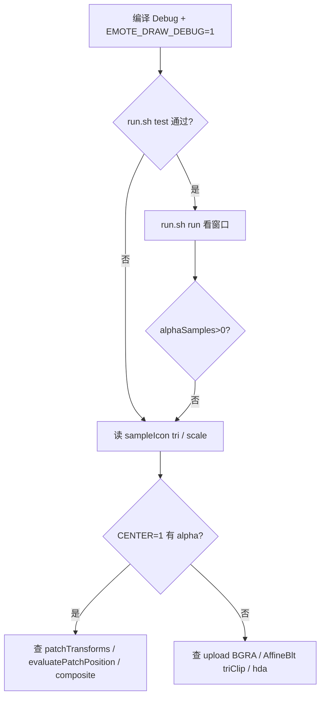
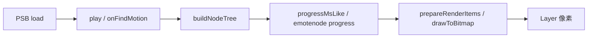

# MotionPlayer 渲染调试与测试跑法

> **文档索引：** [`README.md`](README.md)  
> **版本：** 2026-06-08  
> **夹具：** `tests/test_files/emote/e-mote3.0バニラパジャマa.psb`（decrypt seed `742877301`）  
> **一键脚本：** [`tests/test_files/render/run.sh`](../../../../tests/test_files/render/run.sh)  
> **可见性日志字段：** [`MOTIONPLAYER_DRAW_VISIBILITY.md`](MOTIONPLAYER_DRAW_VISIBILITY.md)  
> **矩阵 / lim：** [`MOTIONPLAYER_MATRIX_PIPELINE.md`](MOTIONPLAYER_MATRIX_PIPELINE.md)、[`MOTIONPLAYER_TVP_COORDINATES.md`](MOTIONPLAYER_TVP_COORDINATES.md)

本文说明如何在 **macOS Debug** 下编译 motionplayer、用最小 `startup.tjs` 启动 KrKr2 窗口、读 `EmoteDrawDbg` 日志，以及跑 Catch2 离屏回归。

---

## 1. 目录与前置

| 路径 | 用途 |
|------|------|
| `tests/test_files/render/startup.tjs` | 最小 Emote 可见性调试（1280×720 窗口，单帧 `progress`+`draw`） |
| `tests/test_files/render/run.sh` | 编译 / 启动 / 单测封装 |
| `tests/test_files/render/krkr_render.log` | 默认重定向的 KrKr2 标准输出（含 SDL_Log） |
| `tests/test_files/emote/*.psb` | PSB 夹具 |
| `tests/unit-tests/plugins/motionplayer-dll` | C++ 离屏 `drawToBitmap` 回归 |

**首次使用前：**

1. 在仓库根目录配置并构建 Debug（见 §2）。
2. 打开 `startup.tjs`，把 `kPsbPath` 改成你本机仓库里的 PSB **绝对路径**（或确认 `Storages.isExistentStorage` 能通过）。
3. （可选）在 `startup.tjs` 里取消注释 `Timer` 与 `global.__emoteTest*`，否则只画 **一帧**（适合看首帧日志）。

---

## 2. 编译

在仓库根目录：

```bash
cmake --preset="MacOS Debug Config"
cmake --build out/macos/debug --target krkr2 motionplayer-dll
```

产物：

- 可执行：`out/macos/debug/bin/krkr2/krkr2.app/Contents/MacOS/krkr2`
- 单测：`out/macos/debug/tests/unit-tests/plugins/motionplayer-dll`

**调试宏（CMake，可选）：**

```bash
# 屏幕中心网格贴 icon，忽略人物矩阵（验证贴图/合成）
cmake --preset="MacOS Debug Config" \
  -DEMOTE_DRAW_DEBUG_CENTER=1
cmake --build out/macos/debug --target krkr2
```

| 宏 | 默认 | 含义 |
|----|------|------|
| `EMOTE_DRAW_DEBUG` | `1`（`EmoteDrawDebug.h`） | 每帧 `EmoteDrawDbg summary` / `sampleIcon` / `HINT` |
| `EMOTE_DRAW_DEBUG_CENTER` | `0` | 居中网格贴片，跳过离屏 composite |
| `EMOTE_DRAW_DEBUG_SOLID` | `0` | CENTER 模式下用 `Fill` 色块代替贴图 |

关闭日志：在 `motionplayer/CMakeLists.txt` 或本地 cache 中对 `motionplayer` 增加 `EMOTE_DRAW_DEBUG=0`。

---

## 3. 窗口 render 测试（KrKr2 + startup.tjs）

### 3.1 推荐：`run.sh`

```bash
cd /path/to/krkr2
./tests/test_files/render/run.sh build    # 仅编译
./tests/test_files/render/run.sh run      # 前台跑窗口，日志 → krkr_render.log
./tests/test_files/render/run.sh run-bg   # 后台 8s 后 kill（CI/快速采样）
./tests/test_files/render/run.sh test     # motionplayer-dll 离屏回归
./tests/test_files/render/run.sh center   # 以 EMOTE_DRAW_DEBUG_CENTER=1 重配并 run
```

环境变量（可选）：

| 变量 | 默认 | 说明 |
|------|------|------|
| `KRKR2_BUILD_DIR` | `out/macos/debug` | CMake 构建目录 |
| `KRKR2_RENDER_LOG` | `tests/test_files/render/krkr_render.log` | KrKr2  stdout/stderr |
| `KRKR2_RENDER_BG_SEC` | `8` | `run-bg` 存活秒数 |

### 3.2 手动启动

```bash
KRKR=out/macos/debug/bin/krkr2/krkr2.app/Contents/MacOS/krkr2
STARTUP=/path/to/krkr2/tests/test_files/render/startup.tjs

cd tests/test_files/render && /path/to/krkr2.app/Contents/MacOS/krkr2 \
  > krkr_render.log 2>&1
```

说明：

- 在 **`tests/test_files/render`** 目录下启动，使引擎加载同目录的 `startup.tjs`（KrKr2 对 `-startup` 参数解析与 XP3 冲突，故 `run.sh` 用 `cd` + 本地 `startup.tjs`）。
- 日志里应出现：`Loading startup script: .../tests/test_files/render/startup.tjs`。
- `Plugins.link("emoteplayer.dll")`：引擎侧模块名仍为 `emoteplayer.dll`，实现链在静态库 `motionplayer` 中。

### 3.3 日志里看什么

首帧或每 60 帧会打印（`EmoteDrawDebug.cpp`）：

```
EmoteDrawDbg summary: offscreen=... layer=... drawLim=... progressLimMax=... limMismatch=... alphaSamples~=... iconTry=... iconDrawn=...
EmoteDrawDbg sampleIcon[...]: surf=... tri=(...)(...)(...) scale=... dataAlpha~=... texAlpha~=...
EmoteDrawDbg HINT: ...
```

| 现象 | 建议 |
|------|------|
| `alphaSamples~=0` 且 `iconDrawn>0` | 三角形在 `drawLim` 外，或 `AffineBlt`/`hda`、composite 问题 → §4 |
| `limMismatch=1` | `progress` 见过 blank 大 lim（如 1830×1800），绘制用 Layer 1280×720 → 矩阵文档 |
| `tri` 负坐标或远大于 `drawLim` | `patchTransforms` 顺序 / `evaluatePatchPosition` / 未 `rebuildMotionRenderMethod` |
| `EMOTE_DRAW_DEBUG_CENTER=1` 后 `alphaSamples~>0` | 贴图与 Layer 合成 OK，问题在 tess 矩阵链 |
| `CENTER` 红条不见 | Layer 未合成到屏幕，与 Emote 无关 |

更全字段表见 [`MOTIONPLAYER_DRAW_VISIBILITY.md` §3](MOTIONPLAYER_DRAW_VISIBILITY.md)。

### 3.4 与正式游戏脚本的差异

`startup.tjs` **未**走 `AffineSourceMotion.tjs` 完整链（无每帧 `setDrawAffineTranslateMatrix`）。排查游戏内问题时，应在 `draw` 前保证：

1. `player.progress(dt)`
2. `player.setDrawAffineTranslateMatrix(1,0,0,1,0,0)`（或脚本实际仿射）
3. `player.draw(adaptor)` — C++ 内会在 `draw` 里 `rebuildMotionRenderMethod()`（见 `emoteplayerclass.cpp`）

---

## 4. C++ 离屏单元测试（无窗口）

```bash
out/macos/debug/tests/unit-tests/plugins/motionplayer-dll \
  "motionplayer drawToBitmap alpha bbox regression" -s
```

| 用例 | 作用 |
|------|------|
| `motionplayer drawToBitmap alpha bbox regression` | PSB `screenSize` 800×1080 离屏，统计非透明像素与 bbox |
| `motionplayer drawToBitmap produces visible pixels` | 仅 INFO `visiblePixels` |
| `motionplayer minimal chain via TJS script` | 执行 `tests/test_files/emote/motionplayer_render.tjs` |

**SKIP：** `visiblePixels=0` 表示矩阵/tess 路径仍无输出；修好后用 `-s` 看 `bbox=`，必要时更新用例内 `kMinVisiblePixels` 等常量。

**环境变量：**

- `KRKR2_MOTIONPLAYER_TEST_PSB` — 覆盖默认 PSB 路径（见下文 §9）。
- `KRKR2_MOTIONPLAYER_PREPARE_TIMEOUT_MS` — `motionplayer-render` 类单测超时（防挂死回归）。

---

## 5. 分层排查顺序



1. **单测** — 固定 800×1080、无 Layer 仿射，最快回归 tess。  
2. **CENTER 模式** — 隔离矩阵。  
3. **render 窗口** — 1280×720、`EmotePlayer` 离屏 + identity composite。  
4. **游戏 Affine 链** — `MOTIONPLAYER_MATRIX_PIPELINE.md` § AffineSourceMotion。

---

## 6. IDE / CLion

1. **Executable：** `out/macos/debug/bin/krkr2/krkr2.app/Contents/MacOS/krkr2`  
2. **Program arguments：** `-startup $ProjectFileDir$/tests/test_files/render/startup.tjs`  
3. **Working directory：** 仓库根 `$ProjectFileDir$`（与 `Storages` / 日志路径一致）  
4. **Unit test：** Catch2 目标 `motionplayer-dll`，过滤器 `motionplayer drawToBitmap*`

---

## 7. 相关文档

完整索引见 **[`README.md`](README.md)**。常用：`MOTIONPLAYER_DRAW_VISIBILITY.md`、`MOTIONPLAYER_MATRIX_PIPELINE.md`、`sdl3/` 参考实现。

---

## 8. 常见问题

**Q: `PSB not found`**  
A: 修改 `startup.tjs` 的 `kPsbPath` 为本地绝对路径。

**Q: 窗口一闪就关 / 只一帧**  
A: 启用 `Timer`（`startup.tjs` 底部注释块）并保留 `global.__emoteTestWin` 等防 GC。

**Q: 日志没有 `EmoteDrawDbg`**  
A: 确认链接的是刚编译的 `motionplayer`，且 `EMOTE_DRAW_DEBUG` 非 0。

**Q: `create motionWorkLayer failed`**  
A: 无 `Motion.Player` 工作层时可能出现，最小 Emote 测试通常可忽略。

**Q: 单测与窗口结论不一致**  
A: 单测直接 `drawToBitmap`，`lim` = PSB `screenSize`（800×1080），不经 `compositeBitmapToLayer`。窗口路径：tess 在 screenSize 离屏（`model` 根栈），Layer 1280×720 由 `_affineTrans` 在 composite 阶段映射。

---

## 9. 附录：测试策略与分层目标

> 原独立文档 `motionplayer-render-test-feasibility.md` 已并入本节。

### 9.1 目标优先级

| 优先级 | 目标 | 可自动化 |
|--------|------|----------|
| P0 | `motionplayer-dll`：`drawToBitmap` 离屏回归不挂死、有可见像素统计 | ✅ |
| P0 | `motionplayer-render`：`progressMsLike` + `prepareRenderItems` 在超时内返回 | ✅ |
| P1 | 快照加载后节点树 / render item 数量合理 | ✅ |
| P2 | 像素级 golden（与参考帧比对） | ⚠️ 需 `tools/psb-export` + visual-test |
| P3 | 完整 TJS `EmotePlayer.draw` + KAG 窗口 | ⚠️ 本目录 `run.sh run` |

**不作硬性断言：** 历史文档中「NEKOPARA 卡死 = 子 Player 全量 `updateLayers`」**未证实**，已作废（见 [`MOTIONPLAYER_PROGRESS.md`](MOTIONPLAYER_PROGRESS.md) §0）。

### 9.2 管线切入点



| 阶段 | 无 GL 可测 | 本仓库入口 |
|------|------------|------------|
| 解析 + 建树 | ✅ | `motionplayer-dll`、`motionplayer-render.cpp` |
| Emote 步进 | ✅ | `EmotePlayer::progress` → `progressMsLike` |
| 像素输出 | 需离屏位图 | `motionplayer-dll` `drawToBitmap*` |

### 9.3 技术选型

| 层级 | 选型 |
|------|------|
| 框架 | Catch2 v3 |
| 夹具 | 真实 PSB + decrypt seed `742877301` |
| 超时 | `KRKR2_MOTIONPLAYER_PREPARE_TIMEOUT_MS` |
| Golden（可选 P2） | psb-export + Python compare |
