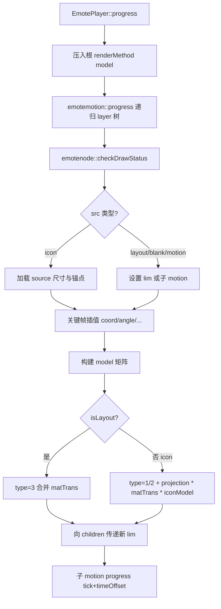

# E-mote 贴图世界坐标：数据结构与实现

> **文档索引：** [`README.md`](README.md)  
> **样例资产：** [`tests/test_files/emote/e-mote3.0バニラパジャマa.json`](../../../../tests/test_files/emote/e-mote3.0バニラパジャマa.json)  
> **相关文档：**  
> - [`MOTIONPLAYER_PSB_STRUCT.md`](MOTIONPLAYER_PSB_STRUCT.md) — PSB/JSON 字段字典  
> - [`MOTIONPLAYER_MATRIX_PIPELINE.md`](MOTIONPLAYER_MATRIX_PIPELINE.md) — 矩阵叠乘与 draw 调用链  
> - [`MOTIONPLAYER_TVP_COORDINATES.md`](MOTIONPLAYER_TVP_COORDINATES.md) — TVP 像素坐标与仿射防踩坑  
> **核心代码：** `EmoteNode.cpp`、`EmoteFrame.cpp`、`EmoteFileCore.cpp`、`emoteplayerclass.cpp`、`EmoteTVPRenderer.cpp`

本文说明：**每个贴图在 Emote 逻辑世界坐标系中最终落在何处**，由 PSB 里哪些字段决定，以及 KrKr2 `motionplayer` 如何在 `progress` / `draw` 阶段把这些字段变成变换矩阵。

---

## 1. 核心结论

贴图的「世界坐标」**不是** `source` 里某个单独字段，而是下列因素**沿 `layer` 树逐级叠乘**的结果：

| 层级 | 数据来源 | 作用 |
|------|----------|------|
| 世界坐标系定义 | `screenSize` | 逻辑画布范围与原点 |
| 节点局部变换 | `frameList[].content` 的 `coord/angle/sx/sy/zx/zy/ox/oy/mesh` | 在父坐标系内平移、旋转、缩放、剪切、网格形变 |
| 坐标区域 | `src: "layout"` / `src: "blank/w:h:ox:oy"` | 定义子树可用的 `emotelimit`（宽、高、原点） |
| 贴图锚点 | `source.<组>.icon.<名>.originX/Y` | 贴图局部枢轴，决定 `coord` 挂在图的哪一点 |
| 子动作引用 | `src: "motion/..."` | 嵌套另一棵 motion 树，带 `timeOffset` |
| 离散参数 | `parameterize` + `motion.parameter` + `metadata.variableList` | 用变量值映射到不同 `tick`，切换关键帧 |
| 物理/控制 | `bustControl`、`hairControl` 等 | 通过变量间接改子树位姿 |
| Player 根变换 | `EmotePlayer.setCoord/setScale/setRotate` | 整棵 Emote 树的全局平移/旋转/缩放 |
| 屏幕合成 | `setDrawAffineTranslateMatrix` + `compositeBitmapToLayer` | 离屏结果贴到 Kirikiri Layer 像素空间 |

**叶子 icon 节点**（`src: "src/body_parts/下半身00"` 这类）往往**不写 `coord`**，其世界位置完全由祖先 layout/blank/变形节点决定；`source.originX/Y` 只定义**局部锚点**，不是世界坐标。

---

## 2. 坐标空间（与矩阵管线文档的关系）

实现里至少区分三套空间（详见 [`MOTIONPLAYER_MATRIX_PIPELINE.md`](MOTIONPLAYER_MATRIX_PIPELINE.md) §1）：

```text
┌─────────────────────────────────────────────────────────────┐
│  Emote 逻辑世界（screenSize + layer 树 progress）              │
│  例：800×1080，blank 子树可扩到 1830×1800                      │
└──────────────────────────┬──────────────────────────────────┘
                           │ glm::ortho(lim) + renderMethod 栈
                           ▼
┌─────────────────────────────────────────────────────────────┐
│  离屏位图 / drawLim（EmotePlayer::_limitArea，常 = Layer 尺寸） │
└──────────────────────────┬──────────────────────────────────┘
                           │ compositeBitmapToLayer(_affineTrans)
                           ▼
┌─────────────────────────────────────────────────────────────┐
│  Kirikiri Layer 像素（左上原点，Y 向下）                       │
└─────────────────────────────────────────────────────────────┘
```

本文讨论的「世界坐标」主要指 **第一层：Emote 逻辑世界**，即以 `screenSize` 为基准、在 `emotenode::progress` 中沿树传递的坐标。

---

## 3. PSB/JSON 数据模型

### 3.1 `screenSize` — 世界坐标系边界

```json
"screenSize": {
  "width": 800,
  "height": 1080,
  "originX": 0,
  "originY": 0
}
```

- 解析：`EmoteFileCore.cpp` → `emotefile::_screenSize`
- 运行：作为初始 `emotelimit` 传入根 `emotemotion::progress`；`orthoForLim` 用 `{originX, originY, width, height, zMax}` 构造正交投影
- **注意：** TVP 路径下 `_limitArea` / 离屏 = **PSB `screenSize`**；Layer 尺寸仅用于 composite。progress 子树 blank 可大于 screenSize（`limMismatch` 属正常）

### 3.2 `object` → `motion` → `layer[]` — 场景图

角色部件组织为**有向树**：

```text
object.all_parts.motion.全体構造
  └── layer[]（根列表，按 priority 排序绘制）
        └── children[]（递归子节点）
              └── frameList[]（该节点的时间轴关键帧）
```

每个 `layer` 节点字段（完整表见 [`MOTIONPLAYER_PSB_STRUCT.md`](MOTIONPLAYER_PSB_STRUCT.md) §8）中与位姿直接相关的：

| 字段 | 说明 |
|------|------|
| `label` | 节点名，调试与 `getNodeByName` 定位用 |
| `type` | 节点类型（0 普通、12 模板合成等） |
| `frameList` | 关键帧序列 |
| `children` | 子节点；子节点收到的 `lim` 由本节点 `originX/Y/width/height` 决定 |
| `parameterize` | 若非 null，本节点（及 motion 内所有子节点）用变量驱动 `tick` |
| `inheritMask` | 变换继承掩码（部分分支未完全实现） |
| `meshDivision` / `meshCombine` / `meshTransform` | 网格细分与组合策略 |

### 3.3 `frameList[].content` — 单帧变换与资源引用

`EmoteFrame.cpp` 解析 `content` 中的数值字段；`EmoteNode::checkDrawStatus` 根据 `src` 决定节点类型。

**变换字段（插值来源）：**

| 字段 | 成员变量 | 默认 | 含义 |
|------|----------|------|------|
| `coord` [x,y,z] | `coordX/Y/Z` | 0 | 父坐标系平移；`z` 影响深度穿透 |
| `angle` | `angle` | 0 | 绕 Z 旋转（度），跨 0°/360° 有特殊插值 |
| `sx`, `sy` | `sx`, `sy` | 0 | 剪切（错切） |
| `zx`, `zy` | `zx`, `zy` | 1 | 缩放 |
| `ox`, `oy` | `ox`, `oy` | 0 | 绘制附加偏移（与 icon 锚点相加） |
| `opa` | `opa` | 1 | 透明度 |
| `mesh.bp` | `bp[32]` | 单位网格 | 贝塞尔曲面控制点偏移 |
| `timeOffset` | `timeOffset` | 0 | 引用子 motion 时的时间偏移 |

**`coord` 特殊值（`progress` 内动态修正）：**

- `NaN` → 替换为 `-lim.originX` 或 `-lim.originY`
- `Inf` → 替换为 `lim.width - originX` 或 `lim.height - originY`  
  用于「贴边」类关键帧，由父级 `lim` 决定实际像素。

**`src` 的四种解析路径（`checkDrawStatus`）：**

| `src` 形式 | 节点类型 | 行为 |
|------------|----------|------|
| `src/<组名>/<图标名>` | `isIcon = true` | 查 `source.<组>.icon.<名>`，设 `width/height/originX/originY`，解码像素 |
| `layout` / `clip` | `isLayout = true` | 继承父 `lim` 的宽高与原点，不绘制，只传递/合并矩阵 |
| `motion/<路径>` | 引用 `emotemotion` | 子树时间轴；`progress(tick + timeOffset, ...)` |
| `blank/w:h:ox:oy` | layout 类 | 自定义子坐标区域：`width×height`，原点 `(ox,oy)` |

**贴图引用路径示例：**

```json
"src": "src/body_parts/下半身00"
```

解析：`findsourceByName` 按 `/` 分段 → `source["body_parts"].icon["下半身00"]`（`EmoteFileCore.cpp`）。

### 3.4 `source` — 贴图资源与局部锚点

```json
"source": {
  "body_parts": {
    "icon": {
      "下半身00": {
        "width": 438,
        "height": 853,
        "originX": 219,
        "originY": 426.5,
        "clip": { "left": 0.044, "top": 0.045, "right": 0.956, "bottom": 0.955 },
        "pixel": { "__psb": "resource", "index": 69, ... }
      }
    }
  }
}
```

| 字段 | 世界坐标中的作用 |
|------|------------------|
| `width`, `height` | 贴图四边形尺寸；参与 `scale(width, height)` |
| `originX`, `originY` | **局部枢轴**：绘制前 `translate(-originX - ox, -originY - oy)` |
| `clip` | UV 裁剪（图集内子矩形） |
| `pixel` | PSB chunk 索引，RL 等压缩解码 |

**区分两个「原点」：**

- `source.originX/Y`：**贴图自身**的挂接点（相对贴图左上角）
- `blank/...:ox:oy` 或父 `lim.originX/Y`：**节点坐标系**的原点（相对父级世界）

### 3.5 元数据：参数、物理、PSD 导入

| 数据 | 运行时是否直接定位贴图 |
|------|------------------------|
| `metadata.variableList` + `motion.parameter` + `parameterize` | ✅ 间接：改变节点使用的 `tick` |
| `metadata.timelineControl` | ✅ 时间线变量曲线 |
| `bustControl` / `hairControl` / `partsControl` | ✅ 物理模拟写回变量 |
| `metadata.psdScrapbookImportInfoMap` 等 | ❌ 编辑器 PSD 导入信息，当前 C++ 渲染未读取 |

---

## 4. 实现思路：`progress` 如何算出世界矩阵

### 4.1 总流程



入口（`emoteplayerclass.cpp`）：

```cpp
std::vector<emoteRender> empty;
empty.push_back(_renderMethod);  // updateTransMat() 写入的根 model
_currmotion->progress(tick, empty, _limitArea);
```

### 4.2 关键帧选取与插值

`checkDrawStatus(tick)`：

1. 在 `frameList` 中找满足 `frame.time <= tick` 的最后一帧
2. 若下一帧也有 `content`，对 `coord/angle/sx/sy/zx/zy/ox/oy/opa/bp` 线性插值
3. 参数化节点（`isParameterize`）先把 `tick` 换成 `getTickByIdx(parameterIdx)`：

```cpp
// EmoteMotion.cpp
float emotemotion::getTickByIdx(int32_t parameterIdx) {
    // 从 variableList 读当前变量值 → transToTick()
    // tick = division * ((currVal - rangeBegin) / (rangeEnd - rangeBegin))
}
```

因此 `head_LR = 15` 会让 `parameterize: 6` 的节点跳到对应时间的关键帧，从而改变 `coord` 等。

### 4.3 单节点 `model` 矩阵构造

`EmoteNode.cpp` 中复合顺序（注释写明与 GLM 调用顺序相反，即右乘语义）：

```text
model = T(coordX, coordY, 0)
      × R(angle)
      × Shear(sx, sy)
      × S(zx, zy, 1)
```

### 4.4 `renderMethod` 栈与三种 type

`emoteRender`（`emotefile.h`）：

| type | 含义 |
|------|------|
| 0 | 不绘制，截断子树 |
| 1 | 矩阵 + 贝塞尔网格（`controlPts`） |
| 2 | 仅矩阵 |
| 3 | layout/motion：矩阵穿透合并到下一级，无独立透明度/网格 |

**layout 节点（`isLayout`）：** 将 `model` 乘到栈顶 `type==3` 的 `matTrans`，或新建 `type=3` 条目；**不绘制**。

**icon 节点（`isIcon`）：** 在父 layout 矩阵基础上：

```cpp
model = translate(model, vec3(-originX - currOx, -originY - currOy, 0));
model = scale(model, vec3(width, height, 1));
emt.matTrans = projection * parentLayout.matTrans * model;
```

其中 `originX/Y` 来自 `source`（icon 加载时写入节点），`projection = orthoForLim(drawViewport)`。

### 4.5 向子节点传递 `lim`

每个节点 `progress` 结束时：

```cpp
for (auto ch : children)
    ch->progress(tick, renderMethod,
                 { originX, originY, width, height, lim.zMax },
                 drawViewport);
```

子节点的 `coord` 是**相对该 `lim` 坐标系**的平移。世界位姿 = 祖先链上所有 `model` 与 layout 合并矩阵的乘积。

### 4.6 绘制阶段

`drawToBitmap` / `drawPatchCommon`：

1. 取 `renderMethod` 栈（逆序传入 tessellation，与 SDL3 一致）
2. `emoteDrawPatchToBitmap` → `evaluatePatchPosition` 把单位 patch 顶点变换到 clip 空间
3. `clipToLayerPoint(drawLim)` 映到离屏像素
4. `EmotePlayer::compositeBitmapToLayer` 用 `_affineTrans` 贴到 Layer

贴图最终屏幕位置 = **世界矩阵栈** × **Player 根 model** × **Layer 仿射**。

---

## 5. 实例：追踪「下半身」贴图的世界坐标

### 5.1 叶子节点（只有 `src`，无 `coord`）

```json
{
  "label": "■下半身",
  "frameList": [{
    "time": 0,
    "type": 2,
    "content": {
      "src": "src/body_parts/下半身00",
      "ox": 0, "oy": 0,
      "mask": 131073,
      "bm": 0
    }
  }]
}
```

该节点 `coord` 默认为 0，世界位置 = 父链变换 × 锚点修正。

### 5.2 贴图锚点

```json
"下半身00": {
  "width": 438,
  "height": 853,
  "originX": 219,
  "originY": 426.5
}
```

绘制时等价于：先把图左下角对齐到父 `coord`，再向左上偏移 `(219+ox, 426.5+oy)`，再拉满 `438×853` 四边形。

### 5.3 典型父链

在 `motion.body_parts.下半身変形基礎` 中，祖先节点常见组合：

1. **`blank/480:937:240:468`** — 下半身变形区域（宽 480，高 937，原点 240,468）
2. **`mesh.bp` 关键帧** — 贝塞尔形变（身体左右倾等）
3. **`parameterize: 6`** — 绑定 `body_LR` 等变量，驱动不同 `tick` 的 `coord`/`angle`
4. 更上层 **`layout` + `coord`** — 例如全身 `move_UD`/`move_LR` 的整体平移

查法：在 JSON 中自 `■下半身` **向上**搜索父 `frameList`，累加各层 `coord` 与 `mesh` 效果（精确值需跑 `progress` 或开 `EmoteDrawDbg sampleIcon`）。

---

## 6. 脚本层叠加变换

`data/system/AffineSourceMotion.tjs` 的 `drawAffine` 顺序（不可打乱）：

```javascript
// 1) Emote 根位姿（逻辑世界内整体移动/缩放/旋转）
_player.setCoord(+._imagex, +._imagey);
_player.setRotate(...);
_player.setScale(s);

// 2) 建树
_player.progress(_interval);

// 3) Kirikiri Layer 仿射（屏幕像素）
_player.setDrawAffineTranslateMatrix(a, c, b, d, tx, ty);

// 4) 绘制
_player.draw(target);
```

- `setCoord` 等 → `updateTransMat()` → `_renderMethod.matTrans` 作为 `progress` 栈底
- `setDrawAffineTranslateMatrix` → 仅 `_affineTrans`，在 `compositeBitmapToLayer` 使用（TVP 路径不进 tess 栈，见 [`MOTIONPLAYER_TVP_COORDINATES.md`](MOTIONPLAYER_TVP_COORDINATES.md)）

---

## 7. 调试与验证

| 手段 | 用途 |
|------|------|
| [`e-mote3.0バニラパジャマa.json`](../../../../tests/test_files/emote/e-mote3.0バニラパジャマa.json) | 对照 PSB 字段与树结构 |
| `EmoteDrawDbg sampleIcon <label>` | 查看某 `label` 节点 tess 后三角面顶点（判断矩阵段错误） |
| `motionplayer-dll` 单测 | 加载 PSB 回归 |
| `tests/test_files/render/motionplayer_render.tjs` | 端到端渲染 |

判断位姿 bug 落在哪一段（摘自矩阵管线文档）：

1. `tri` 在 Emote 世界内就错 → 查 `layer` 树 `coord` / `blank` / `parameterize`
2. 世界对、离屏错 → 查 `ortho` / `drawViewport` / `clipToLayerPoint`
3. 离屏对、Layer 错 → 查 `setDrawAffineTranslateMatrix` 参数顺序

---

## 8. 与编辑器/导入数据的关系

`metadata.psdScrapbookImportInfoMap`、`psdLayoutImportInfoMap` 等保存了 PSD 图层名、`clipRect`、`z` 顺序等**导入时**的参考信息。KrKr2 当前运行时代码**不读取**这些字段来定位贴图；实际位姿以 `motion.layer` 树里烘焙好的 `frameList` 为准。

若在编辑器中移动图层后重新导出 PSB，`frameList` 中的 `coord` 与 `blank` 会更新，而 `source.originX/Y` 通常描述贴图自身枢轴，不一定随整体平移而改变。

---

## 9. 设计要点小结

1. **场景图 + 时间轴**：位姿是树结构问题，不是贴图表的平铺坐标。
2. **layout 与 icon 分离**：中间节点只改矩阵、不画图，减少 FBO 层数；叶子 icon 才解码像素。
3. **双原点模型**：`lim.origin` 定义子坐标系，`source.origin` 定义贴图挂接点；绘制时先合并祖先矩阵，再减贴图锚点。
4. **参数化 = 改 tick**：表情/身体角度不写进 icon 节点，而由 `parameterize` 切换关键帧时间。
5. **大 blank 坐标系**：变形子树常用远大于 `screenSize` 的 blank（如 `1830×1800`），progress lim 与 draw lim 可不一致，投影必须用 `drawViewport` 避免坐标溢出。

---

## 10. 文件索引

| 文件 | 职责 |
|------|------|
| `EmoteFileCore.cpp` | 加载 `screenSize`、`source`、`object` |
| `EmoteMotion.cpp` | 构建 `layer` 树、`parameter`、`getTickByIdx` |
| `EmoteNode.cpp` | `checkDrawStatus`、`progress` 矩阵栈、`drawPatchCommon` |
| `EmoteFrame.cpp` | 解析 `frameList.content` 数值字段 |
| `EmoteTimeline.cpp` / `EmotePhysics.cpp` | 时间线与物理写回变量 |
| `emoteplayerclass.cpp` | 根 `model`、`_limitArea`、`draw` 编排 |
| `EmoteTVPRenderer.cpp` | tessellation、`evaluatePatchPosition`、`clipToLayerPoint` |
