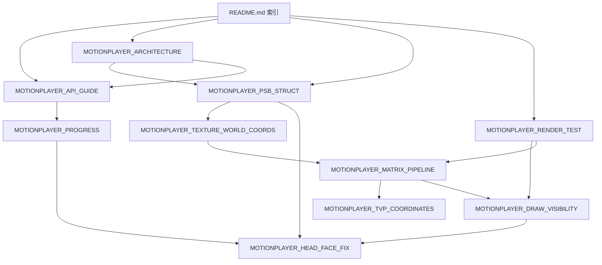

# MotionPlayer 文档索引

> **代码路径：** `cpp/plugins/motionplayer/`  
> **样本资产：** [`tests/test_files/emote/e-mote3.0バニラパジャマa.json`](../../../../tests/test_files/emote/e-mote3.0バニラパジャマa.json)（同名 `.psb` 的运行时格式）  
> **官方 API 伪代码：** [`../manual.tjs`](../manual.tjs)  
> **生产脚本：** [`data/system/AffineSourceMotion.tjs`](../../../../data/system/AffineSourceMotion.tjs)

KrKr2 将原版 `motionplayer.dll` + `emoteplayer.dll` 合并为静态插件，同时支持 **E-mote 立绘（`.PSB`）** 与 **Motion 场景（`.MTN`）**。本文档目录说明如何阅读各专题文档。

---

## 命名约定

| 规则 | 说明 |
|------|------|
| 文件名 | `MOTIONPLAYER_<主题>.md`，全大写 + 下划线 |
| 索引 | 本文件 `README.md` 为唯一入口；子文档文首链回此处 |
| 参考实现 | `sdl3/` 为 SDL3/GPU 对照源码，**不是**运行时文档 |

---

## 按场景选文档

### 入门与 API

| 文档 | 何时阅读 |
|------|----------|
| [**MOTIONPLAYER_API_GUIDE.md**](MOTIONPLAYER_API_GUIDE.md) | TJS 插件加载、`Motion.EmotePlayer` / `Motion.Player` API、常量歧义、脚本调用链 |
| [**MOTIONPLAYER_ARCHITECTURE.md**](MOTIONPLAYER_ARCHITECTURE.md) | 分层架构、C++ 类职责、`emotefile` 对象模型、实现状态 |

### PSB / e-mote 数据

| 文档 | 何时阅读 |
|------|----------|
| [**MOTIONPLAYER_PSB_STRUCT.md**](MOTIONPLAYER_PSB_STRUCT.md) | PSB/JSON **字段字典**（`metadata`、`layer`、`frameList`、`source` 等） |
| [**MOTIONPLAYER_TEXTURE_WORLD_COORDS.md**](MOTIONPLAYER_TEXTURE_WORLD_COORDS.md) | 贴图**世界坐标**由谁控制、`coord`/`blank`/`source.origin`、`progress` 矩阵栈 |
| [**MOTIONPLAYER_PROGRESS.md**](MOTIONPLAYER_PROGRESS.md) | `progress` 入口对照、KrKr2 vs sdl3、**2026-05-28 勘误**（作废的「双路径/卡死」叙述） |

### 渲染与坐标

| 文档 | 何时阅读 |
|------|----------|
| [**MOTIONPLAYER_MATRIX_PIPELINE.md**](MOTIONPLAYER_MATRIX_PIPELINE.md) | 三套坐标空间、`renderMethod` 栈、`drawAffine` 调用链、`EmoteDrawDbg tri` 分段排查 |
| [**MOTIONPLAYER_TVP_COORDINATES.md**](MOTIONPLAYER_TVP_COORDINATES.md) | TVP 像素坐标 vs OpenGL、`setDrawAffineTranslateMatrix`、仿射防踩坑 |
| [**MOTIONPLAYER_DRAW_VISIBILITY.md**](MOTIONPLAYER_DRAW_VISIBILITY.md) | 立绘不显示、`EmoteDrawDbg` 日志字段、`hda` / `alphaSamples` |
| [**MOTIONPLAYER_HEAD_FACE_FIX.md**](MOTIONPLAYER_HEAD_FACE_FIX.md) | **头部/头发/五官**错位对照 JSON 的渐进修复（バニラパジャマa 样本） |

### 测试与调试

| 文档 | 何时阅读 |
|------|----------|
| [**MOTIONPLAYER_RENDER_TEST.md**](MOTIONPLAYER_RENDER_TEST.md) | `run.sh` / `startup.tjs`、Catch2 `motionplayer-dll`、编译宏、**测试策略附录** |

---

## 文档关系（避免重复阅读）

| 主题 | 权威文档 | 其它文档中的处理 |
|------|----------|------------------|
| PSB/JSON 字段表 | `MOTIONPLAYER_PSB_STRUCT` | `ARCHITECTURE` §6 仅保留索引 |
| 贴图世界坐标 | `MOTIONPLAYER_TEXTURE_WORLD_COORDS` | `PSB_STRUCT` §8/§10 链到该文 |
| TJS API 列表 | `MOTIONPLAYER_API_GUIDE` | `ARCHITECTURE` §7 仅保留集成要点 |
| `progress` 行为 | `MOTIONPLAYER_PROGRESS` | API 指南只引用，不重复勘误表 |
| 矩阵 / draw 链 | `MOTIONPLAYER_MATRIX_PIPELINE` | TVP 坐标细节在 `TVP_COORDINATES` |
| 跑测试 / 日志 | `MOTIONPLAYER_RENDER_TEST` | 原 `render-test-feasibility` 已并入附录 |

---

## `sdl3/` 参考代码

| 文件 | 用途 |
|------|------|
| `sdl3/emotefile.cpp` | GPU tessellation、`progress` 建树（与 TVP 行为对照） |
| `sdl3/emoteplayerclass.cpp` | Player / FBO / 根矩阵 |
| `sdl3/emoteplayer.cpp` | 入口示例 |

**注意：** sdl3 **没有** KrKr2 `Player::frameProgress` / `updateLayers` 全量路径；勿用「sdl3 双路径」推断 KrKr2 必須分流（见 `MOTIONPLAYER_PROGRESS` §0）。

---

## 相关插件文档

| 文档 | 说明 |
|------|------|
| [`docs/rust/README.md`](../../../../docs/rust/README.md) | Rust 层架构、FFI 选型、迁移索引 |
| [`docs/rust/modules/psbfile.md`](../../../../docs/rust/modules/psbfile.md) | psbfile 首个 Rust 迁移模块 |

## 外部资源

| 资源 | 说明 |
|------|------|
| [`manual.tjs`](../manual.tjs) | M2 官方 API 伪代码（日文） |
| [`data/system/motion.tjs`](../../../../data/system/motion.tjs) | 插件 `Plugins.link` |
| [`data/system/AffineSourceMotion.tjs`](../../../../data/system/AffineSourceMotion.tjs) | 立绘 `drawAffine` 生产链 |
| `tests/unit-tests/plugins/motionplayer-dll.cpp` | 离屏 `drawToBitmap` 回归 |
| `tests/test_files/render/run.sh` | 一键编译 / 窗口 / 单测 |

---

## 维护说明

1. **新增文档**须使用 `MOTIONPLAYER_` 前缀，并在本 README 登记。
2. **字段/结构变更**以 `EmoteFileCore.cpp` / `emotefile.h` 为准，同步 `MOTIONPLAYER_PSB_STRUCT.md`。
3. **API 变更**同步 `MOTIONPLAYER_API_GUIDE.md` 与 `main.cpp` NCB 注册。
4. 避免在多篇文档重复大段表格；用链接指向权威文档。

| 日期 | 说明 |
|------|------|
| 2026-06-08 | 统一命名、合并重复内容、建立本索引 |
| 2026-06-08 | TVP 双阶段坐标：`model` 进 tess、`_affineTrans` 仅 composite；icon `ortho(progress lim)` 勿强制 screenSize |
