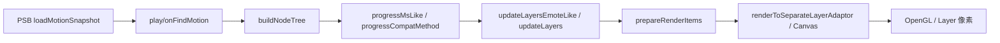

# motionplayer 渲染测试 — 可行性分析与技术选型

> 文档版本：2026-05-28（勘误）  
> 关联实现：`tests/unit-tests/plugins/motionplayer-render.cpp`  
> 夹具说明：`tests/test_files/emote/e-mote3.0バニラパジャマa.psb`（与 psbfile 测试共用）  
> progress 叙述以 [`progress-flow-comparison.md`](progress-flow-comparison.md) §0 为准。

---

## 1. 背景与目标

motionplayer 渲染管线涉及 **PSB 解析 → 节点树 → progress/updateLayers → prepareRenderItems → SLA/Canvas 执行**。

**历史问题（现象保留，根因未证实）：** NEKOPARA e-mote3 等场景曾出现 hung/killed、渲染不可见。旧文档曾归因于「全量 `updateLayers` / 子 Player 递归」—— **2026-05-28 勘误：该根因作废**，测试目标改为 **回归不挂死 + 行为可观测**，不断言特定 progress 分流架构。

**测试目标：**

| 优先级 | 目标 | 可自动化 |
|--------|------|----------|
| P0 | 回归：EmotePlayer 链 `progressMsLike` + prepare 在 e-mote 夹具上 **不挂死**（有时间上限） | ✅ |
| P0 | 回归：progress 步进后 `prepareRenderItems` 可完成（无越界/死循环） | ✅ |
| P1 | 快照加载后节点树 / render item 数量在合理范围 | ✅ |
| P2 | 像素级 golden（与参考帧比对） | ⚠️ 需 GL/图层 mock |
| P3 | 完整 TJS `EmotePlayer.draw` 端到端 | ⚠️ 需 KAG + 窗口 |

~~P0「isEmoteLikeMotion 分流、e-mote 不走子 Player 全量 prepare」~~ — 已改为上表表述（不绑定未证实的架构结论）。

---

## 2. 渲染管线拆解（测试切入点）

| 阶段 | 主要符号 | 依赖 | 无 GL 可测 |
|------|----------|------|------------|
| 解析 | `loadMotionSnapshot` | 磁盘 PSB | ✅ |
| 初始化 | `onFindMotion` / `playMotionLike` | TJS VM（`RandomGenerator`） | ✅ |
| 步进 | **`progressMsLike_0x6D2A54`**（EmotePlayer） | 已加载 motion | ✅ |
| 几何/可见性 | `updateLayers*` | runtime.nodes | ✅（间接） |
| 渲染列表 | `prepareRenderItems` | activeMotion + nodes | ✅ |

---

## 3. 单元测试设计（Catch2）

### 3.1 夹具与入口

- 默认 PSB：`tests/test_files/emote/e-mote3.0バニラパジャマa.psb`
- 环境变量：`KRKR2_MOTIONPLAYER_TEST_PSB`、`KRKR2_MOTIONPLAYER_PREPARE_TIMEOUT_MS`
- 测试入口：`motionplayer-render.cpp` — 构造 `Player` / 加载 / **`progressMsLike`** / `prepareRenderItems`

### 3.2 P0 断言（逻辑回归）

- `loadMotionSnapshot` + `onFindMotion` 不抛、不 abort
- **`progressMsLike(16)` + `progressMsLike(0)`** 在超时内返回
- `prepareRenderItems()` 在超时内返回
- 可选：`isEmoteLikeMotion(*runtime)` 为 true（**数据条件**，非「分流契约」）

### 3.3 不测什么（当前）

- 像素 golden（P2，另见 `tools/psb-export` + `visual-test`）
- 完整 `EmotePlayer.draw` + Layer（P3）

---

## 4. 技术选型摘要

| 层级 | 选型 | 理由 |
|------|------|------|
| 框架 | Catch2 v3 | 仓库标准 |
| 夹具 | 真实 PSB + decrypt seed | 与 NEKOPARA 同系 |
| 超时 | `KRKR2_MOTIONPLAYER_PREPARE_TIMEOUT_MS` | 防回归挂死 |
| Golden | psb-export + Python compare | 可选 P2 |

---

## 5. 修订记录

| 日期 | 说明 |
|------|------|
| 2026-05-28 | 初版可行性 |
| 2026-05-28 | 勘误：撤回「卡死根因 / isEmoteLikeMotion 分流必测」；Emote 步进以 `progressMsLike` 为准 |
