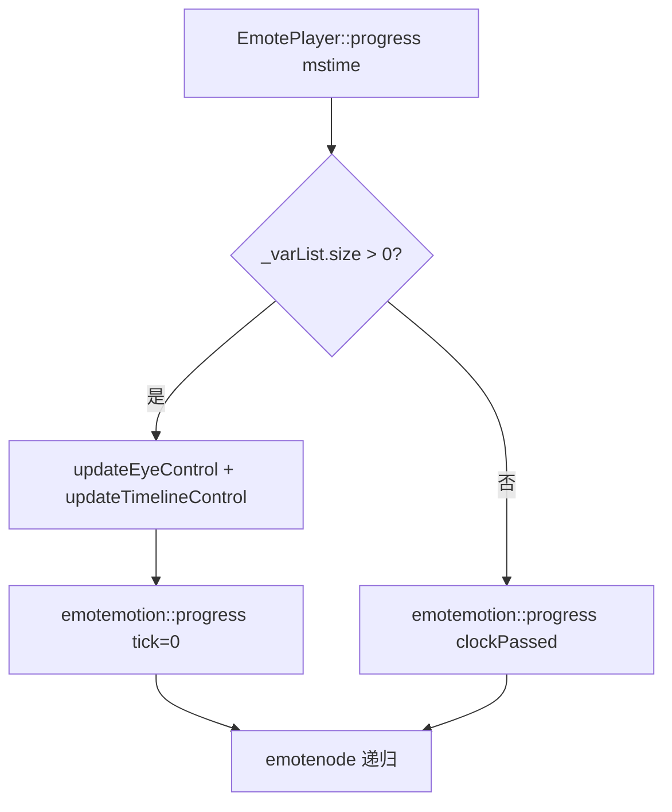

# Motion `progress` 逻辑流程对比

> **版本：** 2026-05-28（勘误）  
> **基准游戏：** NEKOPARA Vol.0（`AffineSourceMotion.tjs` → `drawAffine` → `_player.progress`）  
> **脚本对照：** `data/system/AffineSourceMotion.tjs`  
> **代码真源：** 以 `PlayerFrameProgress.cpp`、`EmotePlayer.cpp` **当前实现**为准；本文描述架构与参考关系，不断言未复现问题的根因。

---

## 0. 勘误（2026-05-28）

以下结论在 **2026-05-27 版** 及关联 PLAN/API 文档中曾出现，**现已作废**：

| 作废表述 | 更正 |
|----------|------|
| sdl3 存在与 KrKr2 同构的 **progress 双路径分流**（`progressEmoteLike_sdl3` vs 全量） | ❌ sdl3 **只有** `EmotePlayer::progress` 一个入口；内部分支是 `_varList.size()>0`，**无** `Player` / `frameProgress` / `updateLayers` |
| E-mote **必须**靠 `isEmoteLikeMotion` 做 progress 策略路由 | ❌ `isEmoteLikeMotion` 是 KrKr2 **内部启发式**（见 §2.3），用于 eval/updateLayers 等细节；**不是** sdl3/原版 API 的必备架构 |
| NEKOPARA **卡死/killed** 根因 = 子 Player 每帧全量 `updateLayers` | ❌ **未证实**；属代码结构推断 + 日志联想，**不能**作为设计依据 |
| 日志 `emoteMode=0` ⇒ 走错 progress 路径 / 不是 emote | ❌ 仅表示 PSB 根 `type!=1`；**不能**单独推导路径或故障原因 |
| 脚本 E-mote 走 `progressCompatMethod` | ❌ 生产路径是 `Motion.EmotePlayer.progress` → `progressMsLike_0x6D2A54`（见 §1.2） |

**维护原则：** sdl3 仅作 **emotefile 树 + tick 语义** 的只读参考；KrKr2 反编译 `Player` 管线与之 **架构不同**，不宜用「必须分流否则卡死」概括。

---

## 1. 脚本入口与 C++ 映射（当前代码）

### 1.1 共同脚本行为

```
AffineSourceMotion.drawAffine()
  ├─ setCoord / setScale / setRotate / setDrawAffineTranslateMatrix
  ├─ _player.progress(_interval) 或 progress(0)
  └─ _player.draw(target)          // 与 progress 分离

AffineSourceMotion.sync()
  ├─ _player.pass()                // 无参
  └─ _player.progress(1)
```

**参数：** 脚本传 **毫秒**；C++ 内 `delta * (60/1000)` 为帧时间（`kMotionFramesPerMillisecond`）。

### 1.2 KrKr2 两条 NCB 入口（勿混为一谈）

| 脚本类 | C++ 链 | 说明 |
|--------|--------|------|
| **`Motion.EmotePlayer`**（立绘，`AffineSourceMotion`） | `EmotePlayer::progress` → **`Player::progressMsLike_0x6D2A54`** | **生产主路径** |
| **`Motion.Player`**（MTN / KAG） | `Player::progressCompatMethod` | 含 `isEmoteLikeMotion` 分支（见 §3.2） |

**`progressMsLike_0x6D2A54`（当前实现，以代码为准）：**

```
ensureMotionLoaded
frameProgress(delta_ms * 60/1000)
updateLayersEmoteLike_sdl3()    // 非全量 updateLayers()
calcBounds
```

`progressMsLike` 内曾注释掉的 `isEmoteLikeMotion → progressEmoteLike_sdl3` **分流未启用**。

---

## 2. `isEmoteLikeMotion` 是什么？为何出现在代码里？

### 2.1 定义

```cpp
// RuntimeSupport.h
inline bool isEmoteLikeMotion(const PlayerRuntime &runtime) {
    return runtime.isEmoteMode ||
        (runtime.activeMotion &&
         !runtime.activeMotion->variableLabels.empty());
}
```

| 条件 | 含义 |
|------|------|
| `isEmoteMode` | PSB 根 `type == 1` |
| `variableLabels` 非空 | 解析了 `metadata.base.variableList` |

### 2.2 与 sdl3 的对应关系（局部、非整架构）

sdl3 在 **同一** `EmotePlayer::progress` 内：

```cpp
if (_currentfile->_metadata->_varList.size() > 0) {
    updateEyeControl(clockPassed);
    updateTimelineControl(clockPassed);
    _currmotion->progress(0, ...);
} else {
    _currmotion->progress(clockPassed, ...);
}
```

KrKr2 的 `isEmoteLikeMotion` **近似** sdl3 的「有 variableList」这一 **数据条件**，用于在 **Player 反编译架构** 里调整 eval/updateLayers 行为（例如 Phase2 非 parameter 节点 `nodeEvalTime=0`、`updateLayers()` 内选用 `updateLayersEmoteLike_sdl3`）。

### 2.3 它不是什么

- **不是** 文件格式权威标签（`.PSB` 仍由脚本 `_storageType=="emote"` 决定用哪个 TJS 类）。
- **不是** sdl3 里的独立 progress API。
- **不应** 再写成「E-mote 必须依赖 progress 双路径才能运行」。

---

## 3. 三套实现对照

### 3.1 sdl3（只读，`emoteplayerclass.cpp` + `emotefile.cpp`）

- **架构：** `emotefile` / `emotemotion` / `emotenode` 单树递归。
- **progress：** 一个函数；墙钟 `clockPassed += mstime/speedRatio`；有 varList 时树 tick=**0**。
- **无：** `frameProgress`、`updateLayers`、子 `Player`、Phase3 网格管线。



### 3.2 KrKr2 `Motion.Player` — `progressCompatMethod`

```
ensureMotionLoaded
if (isEmoteLikeMotion) → progressEmoteLike_sdl3   // 仅 Player 脚本入口
else → frameProgress + updateLayers() 全量 + calcBounds + dispatchEvents
```

立绘脚本 **通常不用** 此入口（见 §1.2）。

### 3.3 KrKr2 `Motion.EmotePlayer` — `progressMsLike`（生产）

```
frameProgress(dt)
updateLayersEmoteLike_sdl3()
calcBounds
```

与 `progressEmoteLike_sdl3` **不是同一条链**；二者都调用 `updateLayersEmoteLike_sdl3`，但 **frameProgress 是否全量、Timeline/控制器步进** 与 `progressEmoteLike` 有差异，需以代码 diff 为准，不宜笼统写「已对齐 sdl3」。

### 3.4 `updateLayers` 与轻量变体

`Player::updateLayers()` 内部：

```
if (isEmoteLikeMotion) → updateLayersEmoteLike_sdl3()
else → Phase1/2 + 全量 Phase3（Vertex/Particle/Shape/…）
```

| 函数 | Phase3 |
|------|--------|
| `updateLayersEmoteLike_sdl3` | 仅 Visibility + 受限 MotionSubNode 等 |
| 全量 `updateLayers` | Camera、VertexComputation、Particle、Anchor… |

这是 **updateLayers 实现选择**，不等于 progress 层「必须两套公开 API」。

---

## 4. 时间语义参考（sdl3 → KrKr2 可对齐的片段）

| 概念 | sdl3 | KrKr2 中常见映射（分散在多处） |
|------|------|-------------------------------|
| 墙钟 | `clockPassed += mstime/speedRatio` | `frameProgress` / `preProgressPlayingTimelines` |
| 有 varList 时 body tick | `progress(0)` | `_clampedEvalTime=0`、`nodeEvalTime=0`（Phase2）等 |
| 口/眼帧 | `getTickByIdx` / parameter | `parameterEntries` + `syncParameterEntriesFromVariablesLike_sdl3` |
| 眨眼 | `updateEyeControl` | **待完整移植**（PLAN F-10） |

**注意：** KrKr2 `Player._speed` 为 **bool**，与 sdl3 `speedRatio`（默认 20）**不等价**；时间倍率需单独对照游戏脚本。

---

## 5. 日志解读（保守）

| 日志 | 可确定 | 不可确定 |
|------|--------|----------|
| `emoteMode=0` | PSB 根 `type=0` | 是否走错 progress、是否卡死原因 |
| `hidden=81` / `draw=n` | 可见性/渲染链可能未就绪 | 与 progress 分流无直接因果 |
| `emote init diag` 刷屏 | 诊断过 verbose | 性能问题需 profiling，不单归因子 Player |
| 进程 killed | 需复现 + 采样 | **勿**预设为 MotionSubNode 风暴 |

---

## 6. 源码索引

| 角色 | 路径 |
|------|------|
| sdl3 参考 progress | `sdl3/emoteplayerclass.cpp` — `EmotePlayer::progress` |
| sdl3 树 | `sdl3/emotefile.cpp` — `emotemotion::progress` |
| Emote 生产 progress | `EmotePlayer.cpp` → `PlayerFrameProgress.cpp` — `progressMsLike_0x6D2A54` |
| Player progress | `PlayerFrameProgress.cpp` — `progressCompatMethod` / `progressEmoteLike_sdl3` / `frameProgress` |
| updateLayers | `PlayerUpdateLayers.cpp` |
| 启发式 | `RuntimeSupport.h` — `isEmoteLikeMotion` |
| 脚本 | `data/system/AffineSourceMotion.tjs` |

---

## 7. 修订记录

| 日期 | 说明 |
|------|------|
| 2026-05-27 | 初版（含已作废的「卡死根因 / 必须分流」叙述） |
| 2026-05-28 | **勘误：** 区分 EmotePlayer vs Player 入口；撤回卡死根因与 sdl3「双路径」等价说法；以当前 `progressMsLike` 代码为准 |
