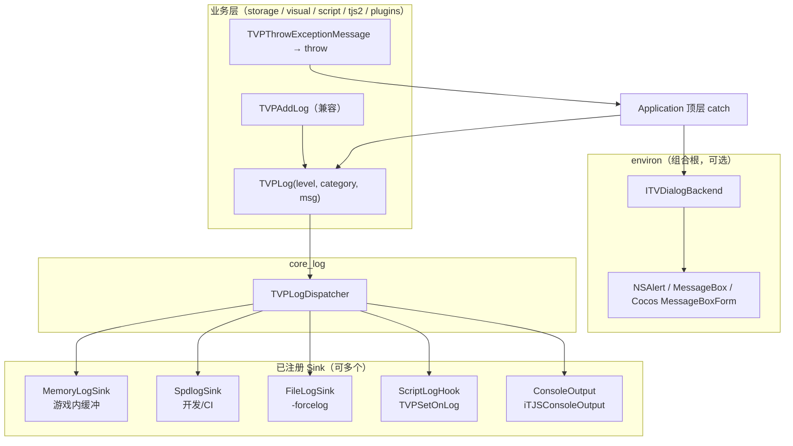

# Core 日志与用户提示统一方案

> **文档版本：** 2026-06-09  
> **状态：** 设计稿（未实施）  
> **相关路径：** `cpp/core/utils/`、`cpp/core/environ/`、`cpp/core/tjs2/`、`tools/xp3/`  
> **背景：** core 内并存 `TVPAddLog`、spdlog、stdio、OS 弹窗等多套输出机制，职责交叉、难以在无 UI 场景（xp3、CI）复用

---

## 1. 现状概览

### 1.1 四条并行输出链路

```
业务代码
  ├─ TVPAddLog / TVPAddImportantLog     → 内存缓冲 + 脚本回调 + 控制台 + 可选写文件
  ├─ spdlog::get("core") / ("tjs2")     → 直接打，与 TVPAddLog 不互通
  ├─ TVPThrowExceptionMessage           → throw eTJSError
  │     └─ Application::ShowException   → TVPShowSimpleMessageBox + 退出
  ├─ TVPShowSimpleMessageBox            → 各平台原生 / Cocos UI
  └─ std::cerr / FILE* / printf         → 工具链、日志文件
```

### 1.2 关键文件与职责

| 机制 | 主要文件 | 行为 |
|------|----------|------|
| 引擎主日志 | `cpp/core/utils/DebugIntf.{h,cpp}` | 环形缓冲、`TVPSetOnLog` 脚本钩子、`TVPStartLogToFile`、`PrintConsole` |
| spdlog | 散落：`tjs2/`、`environ/`、`visual/`、`plugins/` 等 | 各模块独立 `spdlog::get(...)`，无统一级别/分类 |
| 异常抛出 | `cpp/core/msg/MsgIntf.{h,cpp}` | `TVPThrowExceptionMessage` 仅 `throw`，边界清晰 |
| 异常呈现 | `cpp/core/environ/Application.cpp` | `ShowException` 硬编码弹窗并 `TVPExitApplication` |
| OS / UI 弹窗 | `cpp/core/environ/Platform.h` + 各平台 `Platform.cpp` | `TVPShowSimpleMessageBox*`；头文件含 `#include <spdlog/spdlog.h>` |
| 崩溃上报 | `cpp/core/environ/DumpSend.cpp` | 直接调 `TVPShowSimpleMessageBox` |
| 工具桩 | `tools/xp3/tool/ToolRuntimeStubs.cpp` | `TVPAddLog` 空实现或 stderr |

### 1.3 典型调用链

**脚本/引擎日志：**

```
TVPAddLog(msg)
  → TVPLogDeque（内存）
  → TVPOnLog 回调（TJS 脚本）
  → Application::PrintConsole → TVPConsoleLog（environ / MainScene）
  → 可选 FILE*（TVPLoggingToFile）
```

**致命错误：**

```
TVPThrowExceptionMessage(fmt, ...)
  → throw eTJSError
  → Application::Run / 顶层 catch
  → ShowException(e)
  → TVPShowSimpleMessageBox(e, title)   // 无法关闭
  → TVPSystemUninit(); TVPExitApplication(0)
```

**开发调试（绕过主通道）：**

```
spdlog::get("core")->error("...");
// 与 TVPAddLog 互不可见，游戏内日志窗口看不到
```

### 1.4 问题归纳

| 问题 | 影响 |
|------|------|
| 双轨日志（TVPAddLog vs spdlog） | 同一错误可能只出现在一处；排查困难 |
| core 语义层直接弹窗 | storage / archive / 工具无法「只记日志不弹 UI」 |
| `Platform.h` 捆绑 spdlog | 平台头与日志实现耦合，include 即依赖 spdlog |
| 无统一级别与分类 | 无法按模块过滤、无法统一开关 debug |
| xp3 / headless 需手写桩 | `ToolRuntimeStubs` 与引擎行为不一致 |

---

## 2. 设计目标

1. **单一写入 API**：业务代码只通过 `TVPLog`（及兼容包装 `TVPAddLog`）输出，不直接选后端。
2. **core 只发事件，不做呈现**：弹窗、Cocos MessageBox、Win32 MessageBox 仅在 **environ 组合根**注册，core 模块不调用 OS UI。
3. **弹窗可选**：`ITVDialogBackend` 为 `nullptr` 时，错误只写日志，行为确定。
4. **旧 API 薄封装**：`TVPAddLog` → `TVPLog(Info, …)`，避免一次性改数千处调用。
5. **与模块解耦一致**：新能力落在独立 `core_log`（或 `core_msg` 子目录），不塞进 `Platform.h`。

---

## 3. 目标架构



### 3.1 分层规则

| 层级 | 允许 | 禁止 |
|------|------|------|
| `core_storage` / `archive_*` / `core_visual` 等 | `TVPLog`、`TVPThrowExceptionMessage` | `spdlog::`、`TVPShowSimpleMessageBox`、`printf` 新增 |
| `core_log` | 接口、Dispatcher、Sink 抽象 | 平台 UI、Cocos |
| `core_utils` | `MemoryLogSink`（由 DebugIntf 演进） | 直接弹窗 |
| `environ` | 注册 Sink、实现 `ITVDialogBackend`、`ShowException` 策略 | — |
| `tools/xp3` | 注册 `SpdlogSink` + `DialogBackend=nullptr` | 自写 `TVPAddLog` 桩（长期应删除） |

---

## 4. 接口草案

> 以下为设计占位，实施时可微调命名与头文件路径。

### 4.1 日志

```cpp
// cpp/core/log/TVPLog.h（拟新建 core_log 模块）

enum class TVPLogLevel {
    Trace, Debug, Info, Warn, Error, Fatal
};

struct ITVPSink {
    virtual void write(TVPLogLevel level,
                       const char *category,
                       const ttstr &message) = 0;
    virtual ~ITVPSink() = default;
};

void TVPLog(TVPLogLevel level, const char *category, const ttstr &message);
void TVPRegisterLogSink(std::unique_ptr<ITVPSink> sink);
void TVPUnregisterAllLogSinks();  // 测试 / 工具重启用

// 兼容层（保留在 DebugIntf.h）
void TVPAddLog(const ttstr &line);          // → TVPLog(Info, "engine", line)
void TVPAddImportantLog(const ttstr &line); // → TVPLog(Warn, "engine", line) + 重要缓冲
```

**Sink 实现归属：**

| Sink | 建议位置 | 说明 |
|------|----------|------|
| `MemoryLogSink` | `core_utils`（DebugIntf 改造） | 保留 `TVPGetLastLog`、重要日志缓冲 |
| `SpdlogSink` | `core_log` 或 `environ` | 映射 `TVPLogLevel` → spdlog level；category 作 logger name |
| `FileLogSink` | `core_utils` | 承接现有 `TVPStartLogToFile` / `TVPLoggingToFile` |
| `ScriptLogHookSink` | `core_utils` | 包装 `TVPSetOnLog` |
| `ConsoleSink` | `environ` | 桥接 `TVPConsoleLog` / MainScene |

### 4.2 用户提示（弹窗，可选）

```cpp
// cpp/core/log/TVPDialog.h — 仅声明，core 无平台实现

struct ITVDialogBackend {
    virtual int showMessage(const ttstr &text,
                            const ttstr &caption,
                            const std::vector<ttstr> &buttons) = 0;
    virtual int showYesNo(const ttstr &text, const ttstr &caption) = 0;
    virtual ~ITVDialogBackend() = default;
};

void TVPSetDialogBackend(ITVDialogBackend *backend);  // nullptr = 不弹窗
ITVDialogBackend *TVPGetDialogBackend();
```

**environ 实现示例：**

| 后端 | 场景 | 行为 |
|------|------|------|
| `NativeDialogBackend` | Win32 / macOS | 现有 `TVPShowSimpleMessageBox` 迁入 |
| `CocosDialogBackend` | iOS / Android | `TVPMessageBoxForm` |
| `LogOnlyDialogBackend` | xp3 / CI | `TVPLog(Error, …)`，返回默认按钮 |
| `nullptr` | headless | 同 LogOnly，无额外类型 |

现有 `TVPShowSimpleMessageBox` **降级**为 `NativeDialogBackend` / `CocosDialogBackend` 的内部实现，**不再**作为 core 级公共 API 暴露给 storage / visual。

### 4.3 错误路径统一

```
TVPThrowExceptionMessage(...)
  → throw eTJSError

Application 顶层 catch（environ）
  → TVPLog(Error, "exception", e)           // 必做
  → if (auto *d = TVPGetDialogBackend())
        d->showMessage(e, title, buttons);  // 可选
  → TVPOnError() / 写文件策略（保持现有开关）
  → 是否 exit：由 Application 策略决定（可配置「仅日志」模式）
```

`ShowException` 不再直接 `#include` 平台弹窗；只依赖 `ITVDialogBackend`。

---

## 5. CMake 与模块归属

### 5.1 拟新增

```cmake
# cpp/core/log/CMakeLists.txt
add_library(core_log STATIC ...)
target_link_libraries(core_log PUBLIC tjs2)
# 不链 cocos2d、不链 environ
```

### 5.2 链接关系

```
KRKR2_FOUNDATION_LIBS += core_log   # 与 core_msg 同级

core_utils      → core_log（MemoryLogSink 实现）
environ         → core_log + 注册 SpdlogSink / DialogBackend
tools/xp3       → core_log（仅 SpdlogSink，Dialog=nullptr）
```

### 5.3 Platform.h 清理（实施后）

- 移除 `#include <spdlog/spdlog.h>`
- `TVPShowSimpleMessageBox*` 声明移至 `environ/DialogBackend.h`（或各平台 cpp 内 static）
- `Platform.h` 保留路径、内存、退出等平台能力

---

## 6. 各目标配置

### 6.1 引擎（krkr2 主程序）

启动早期（`AppDelegate` / `TVPInit*` 之后）：

```cpp
TVPRegisterLogSink(std::make_unique<MemoryLogSink>());
TVPRegisterLogSink(std::make_unique<SpdlogSink>("core"));
TVPRegisterLogSink(std::make_unique<FileLogSink>());  // 若 -forcelog
TVPRegisterLogSink(std::make_unique<ScriptLogHookSink>());
TVPSetDialogBackend(&g_nativeOrCocosDialogBackend);
```

### 6.2 xp3 工具

```cpp
TVPRegisterLogSink(std::make_unique<SpdlogSink>("xp3"));
TVPSetDialogBackend(nullptr);
// 删除 ToolRuntimeStubs 里 TVPAddLog 空实现，改链 core_log
```

### 6.3 单元测试

```cpp
TVPUnregisterAllLogSinks();
TVPRegisterLogSink(std::make_unique<MockSink>());  // 断言消息
TVPSetDialogBackend(nullptr);
```

---

## 7. 迁移阶段

| 阶段 | 内容 | 行为变化 | 风险 |
|------|------|----------|------|
| **0** | 新增 `core_log`：`TVPLog` + `SpdlogSink`；`TVPAddLog` 内部扇出到 Dispatcher | 无（多一路 spdlog 镜像） | 低 |
| **1** | `ITVDialogBackend`；`ShowException` / `DumpSend` 改走接口 | 无 UI 目标可不弹窗 | 中 |
| **2** | CI / 文档约定：禁止 core 新增直接 `spdlog::` | 无 | 低 |
| **3** | 分批将散落 `spdlog::` 改为 `TVPLog` | 无 | 中，可模块分批 |
| **4** | `Platform.h` 瘦身；xp3 去掉 `ToolRuntimeStubs` 日志桩 | 工具日志与引擎一致 | 低 |
| **5** | （可选）统一 spdlog 配置：格式、轮转、环境变量 `TVP_LOG_LEVEL` | 可能有格式差异 | 低 |

**纪律（与 storage 重构相同）：**

- 每个阶段独立 PR，**先接线不改语义**，再改调用点。
- 禁止用 **link-time 双实现**（不同模块各写一份 `TVPAddLog`）解决差异；差异用 **注册不同 Sink / DialogBackend** 表达。

---

## 8. 禁止事项

| 不要做 | 原因 |
|--------|------|
| 在 `archive_xp3` / `core_storage` 内 `#include <spdlog/spdlog.h>` | 污染 foundation，工具链被迫拉 spdlog 配置 |
| 在 core 模块 `catch` 里直接 `TVPShowSimpleMessageBox` | 无法 headless |
| 为 xp3 再写一套 `TVPAddLog` 桩长期保留 | 与引擎行为分叉 |
| 用宏在编译期切换「弹窗版 / 无弹窗版」同一函数名 | 即 link-time 双实现，可读性差 |
| 一次性删除 `TVPAddLog` | 调用面过大，应保留兼容包装 |

---

## 9. 与现有 API 对照

| 现有 | 迁移后 |
|------|--------|
| `TVPAddLog(s)` | `TVPLog(Info, "engine", s)` 或继续 `TVPAddLog(s)` |
| `TVPAddImportantLog(s)` | `TVPLog(Warn, "engine", s)` + 重要缓冲 |
| `spdlog::get("core")->info(...)` | `TVPLog(Info, "core", ...)` |
| `TVPShowSimpleMessageBox(...)` | `TVPGetDialogBackend()->showMessage(...)`（仅 environ） |
| `ShowException(e)` | `TVPLog` + 可选 `DialogBackend` + exit 策略 |
| `TVPOnError()` | 保留；内部改为通过 Dispatcher 触发 FileSink |
| `TVPSetOnLog(fn)` | 由 `ScriptLogHookSink` 注册 |
| `printf` / `std::cerr`（工具） | `TVPLog` 或测试专用 MockSink |

---

## 10. 验收标准

实施后应满足：

1. **一条主通道**：任意模块日志经 `TVPLog` 可到达 spdlog 与内存缓冲（阶段 0 完成即可验证）。
2. **xp3 不弹窗**：解包失败只打日志，不链 Cocos / MessageBox。
3. **core_storage 无 UI 依赖**：grep 无 `TVPShowSimpleMessageBox`、`MessageBox`、`NSAlert`。
4. **异常可配置**：environ 可切换「弹窗 + 退出」与「仅日志」（调试 / 自动化）。
5. **旧脚本兼容**：TJS `Debug` 类、`TVPGetLastLog`、`-forcelog` 行为不变。

---

## 11. 参考

- 模块边界：`docs/CORE_MODULE_DECOUPLING.md`
- 日志实现：`cpp/core/utils/DebugIntf.cpp`
- 弹窗声明：`cpp/core/environ/Platform.h`
- 异常边界：`cpp/core/msg/MsgIntf.cpp`、`cpp/core/environ/Application.cpp`（`ShowException`）
- 工具桩：`tools/xp3/tool/ToolRuntimeStubs.cpp`

---

## 12. 变更记录

| 日期 | 说明 |
|------|------|
| 2026-06-09 | 初稿：现状梳理、目标架构、分阶段迁移 |
