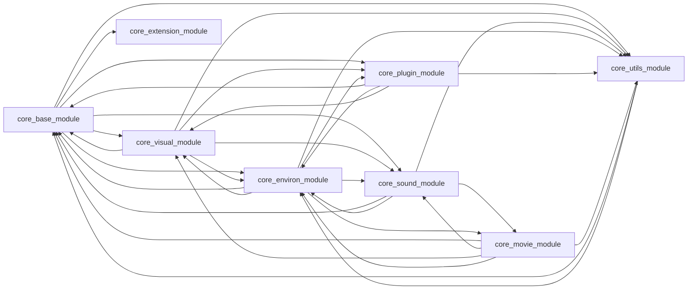
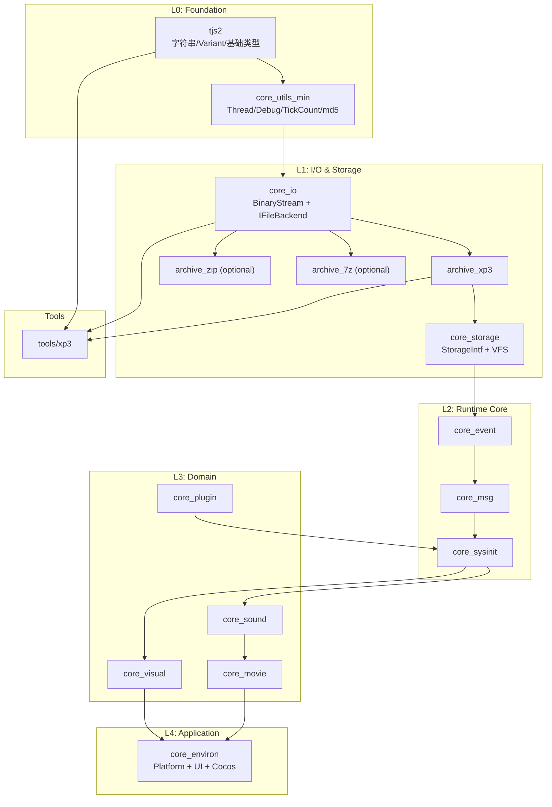

# Core 模块解耦与 xp3 工具重构分析

> **文档版本：** 2026-06-09  
> **相关路径：** `cpp/core/`、`tools/xp3/`  
> **背景：** xp3 解包工具只需虚拟文件系统能力，但当前链接 `core_base_module` 会间接拉入整个引擎栈

---

## 1. 现状概览

### 1.1 xp3 工具实际需求

`tools/xp3/main.cpp` 实际使用的 API 极少：

```cpp
void extractArchive(const std::string &file, const std::string &destDir) {
    const std::unique_ptr<tTVPArchive> arc{ TVPOpenArchive(ttstr{ file }, false) };
    const tjs_uint count = arc->GetCount();
    for(tjs_int i = 0; i < count; i++) {
        ttstr name = arc->GetName(i);
        const std::unique_ptr<tTJSBinaryStream> src{ arc->CreateStreamByIndex(i) };
        // ... 写入本地文件
    }
}
```

实际依赖链：

| 层级 | 组件 | 用途 |
|------|------|------|
| 字符串/类型 | `tjs2`（`ttstr`、基础类型） | 路径与字符串 |
| 存储抽象 | `StorageIntf`（`tTVPArchive`、`TVPOpenArchive`） | 打开归档 |
| XP3 实现 | `XP3Archive.cpp` | 解析/解压 XP3 |
| 流 I/O | `tTJSBinaryStream`、`TVPCreateStream` | 读文件 |
| 压缩 | zlib | XP3 段解压 |

本质上只需要 **虚拟文件系统（VFS）+ XP3 归档读取器**。

### 1.2 当前链接关系

`tools/xp3/CMakeLists.txt`：

```cmake
target_link_libraries(${PROJECT_NAME} PUBLIC tjs2 PRIVATE core_base_module)
```

`core_base_module` 的 CMake 却链了几乎所有 core 模块和重型第三方库：

```cmake
target_link_libraries(${PROJECT_NAME} PUBLIC tjs2 PRIVATE
    core_visual_module core_plugin_module core_environ_module
    core_extension_module core_sound_module core_utils_module)

target_link_libraries(${PROJECT_NAME} PRIVATE
    uchardet::libuchardet unrar::unrar
    LibArchive::LibArchive zstd::libzstd
    cocos2dx::cocos2d)
```

**xp3 工具编译时会间接拉入：Cocos2d-x、OpenCV、FFmpeg、OpenAL、FreeType、WebP、UI 表单、插件系统等，与解包完全无关。**

---

## 2. 核心问题诊断

### 2.1 模块间循环依赖（最严重）

当前 CMake 依赖形成环，而不是分层 DAG：



后果：

- 无法单独编译/测试任意一层
- 工具被迫链接整个引擎
- 修改 base 可能触发全量重编
- 链接器要解析大量符号，构建慢、二进制大

### 2.2 `core_base_module` 职责过重（God Module）

`base` 同时包含：

| 类别 | 源文件示例 | xp3 是否需要 |
|------|-----------|-------------|
| 归档格式 | XP3 / ZIP / 7z / TAR | 仅 XP3 |
| 存储系统 | StorageIntf / Impl | 需要（但应精简） |
| 脚本管理 | ScriptMgnIntf / Impl | 否 |
| 事件系统 | EventIntf / Impl | 否 |
| 系统初始化 | SysInitIntf / Impl | 否 |
| KAG 解析 | KAGParser | 否 |
| 消息系统 | MsgIntf / Impl | 否 |

`base` 本应是底层基础，却混入了上层业务逻辑。

### 2.3 源码级反向依赖（头文件/实现穿透）

底层实现直接 `#include` 上层模块，例如：

**StorageImpl.cpp**（存储层 → 游戏引擎/UI）：

```cpp
#include <cocos/cocos2d.h>
#include "WindowImpl.h"
#include "Application.h"
```

**ScriptMgnIntf.cpp**（脚本管理 → 窗口/图层/音频/插件）：

```cpp
#include "WindowIntf.h"
#include "LayerIntf.h"
#include "CDDAIntf.h"
#include "MIDIIntf.h"
#include "WaveIntf.h"
#include "PluginIntf.h"
```

**SysInitImpl.cpp**（初始化 → 图形/图层）：

```cpp
#include "GraphicsLoaderIntf.h"
#include "LayerIntf.h"
```

这是 **架构倒置**：foundation 依赖 presentation/runtime，而不是反过来。

### 2.4 平台与引擎耦合在 base 层

- `StorageImpl` 使用 Cocos2d `FileUtils` 做文件访问
- `environ` 含 Cocos AppDelegate、SDL、UI 表单
- 工具/单元测试无法脱离 Cocos 运行

### 2.5 xp3 工具的具体痛点

| 问题 | 影响 |
|------|------|
| 链接 `core_base_module` | 拉入 8 个 core 模块 |
| 间接依赖 cocos2dx | 工具需 vcpkg 装完整游戏引擎 |
| 间接依赖 FFmpeg / OpenCV 等 | 编译慢、依赖多 |
| 无法 headless 最小化部署 | 工具体积大 |
| 无法独立测试 XP3 解析 | 必须启动整个引擎栈 |

---

## 3. 目标架构：分层解耦

### 3.1 推荐分层（自底向上）



**原则：**

1. **只允许向下依赖**，禁止环
2. **接口与实现分离**（`StorageIntf.h` 不 include 上层头）
3. **可选组件**（ZIP/7z/TAR 用 CMake option 控制）
4. **平台抽象**（`IFileBackend`，默认 `StdFileBackend` 用 `std::filesystem`）

### 3.2 xp3 工具的理想依赖

```cmake
# 目标状态
target_link_libraries(xp3 PRIVATE
    tjs2
    core_io          # BinaryStream
    archive_xp3      # 仅 XP3
    core_storage_min # TVPOpenArchive + 本地文件 backend
)
# 不链接: visual, sound, movie, environ, cocos2dx
```

预计效果：

- 编译依赖从 ~30 个 vcpkg 包 → **tjs2 + zlib + fmt/spdlog**
- 链接时间显著缩短
- 可单独为 XP3 写单元测试

---

## 4. 重构方案（分阶段）

### Phase 0：度量与约束（1–2 天）

1. 用脚本生成模块依赖图，CI 禁止新增环
2. 列出各模块 `#include` 跨层引用
3. 为 xp3 建最小链接 baseline（当前 vs 目标）

### Phase 1：抽出 `core_io` + `archive_xp3`（1 周，最高 ROI）

**新建模块：**

```
cpp/core/io/
├── BinaryStream.cpp/h
├── IFileBackend.h          # 抽象文件接口
├── StdFileBackend.cpp      # std::filesystem 实现
├── UtilStreams.cpp         # 精简版，去掉 Platform 依赖
└── CMakeLists.txt

cpp/core/archive/
├── xp3/
│   ├── XP3Archive.cpp/h    # 从 base 移出
│   └── CMakeLists.txt
```

**改动要点：**

- `XP3Archive.cpp` 中 `TVPCreateStream` → 注入 `IFileBackend`
- 去掉 `MsgIntf.h`、`EventIntf.h`、`SysInitIntf.h` 等非必要 include
- XP3 extraction filter 保留回调接口（已有 `tTVPXP3ArchiveExtractionFilter`）

**xp3 工具 CMake 改为：**

```cmake
target_link_libraries(xp3 PRIVATE tjs2 core_io archive_xp3)
```

### Phase 2：精简 `core_storage`（1–2 周）

1. 从 `StorageImpl.cpp` **移除** `#include <cocos/cocos2d.h>` 和 `WindowImpl.h`
2. 文件访问统一走 `IFileBackend`：
   - 运行时：`CocosFileBackend`（在 environ 注册）
   - 工具/测试：`StdFileBackend`
3. `TVPOpenArchive` 保留，但 archive creator 表改为 **注册机制**，不再硬编码全部格式：

```cpp
// 注册式，工具只注册 XP3
TVPRegisterArchiveCreator(tTVPXP3Archive::Create);
```

4. ZIP/7z/TAR 拆成独立 `archive_*` 库，按需链接

### Phase 3：拆分 `core_base_module`（2–3 周）

| 新模块 | 自 base 迁出 | 依赖 |
|--------|-------------|------|
| `core_event` | EventIntf/Impl | io, utils |
| `core_msg` | MsgIntf/Impl | event |
| `core_sysinit` | SysInitIntf/Impl | storage, msg |
| `core_script` | ScriptMgnIntf/Impl | sysinit, tjs2 |
| `core_kag` | KAGParser | script |

**删除 base 对其他 domain 模块的 CMake 链接**，改为 domain 依赖 runtime core。

### Phase 4：打破 domain 环（2–3 周）

当前环的典型解法：

| 环 | 解法 |
|----|------|
| base ↔ visual | base 只保留接口；visual 实现并注册 |
| environ ↔ visual/sound | environ 做 **composition root**，在启动时注入依赖 |
| utils ↔ environ | utils 去掉 environ 依赖；平台相关放到 environ |
| sound ↔ movie | movie 依赖 sound（单向），sound 不依赖 movie |

**依赖注入示例：**

```cpp
// environ/Application.cpp - 唯一组装点
void TVPInitializeModules() {
    TVPSetFileBackend(std::make_unique<CocosFileBackend>());
    TVPRegisterArchiveCreators({ XP3, ZIP, ... });
    TVPSetSoundBackend(...);
}
```

### Phase 5：统一 `krkr2core` 接口库（可选）

保留现有 `krkr2core` INTERFACE 目标给主程序用，内部改为：

```cmake
target_link_libraries(krkr2core INTERFACE
    tjs2 core_io core_storage core_event core_msg core_sysinit
    core_visual core_sound core_movie core_plugin core_environ
)
```

工具只链接所需子集。

---

## 5. xp3「只要 VFS」的三种实现路径

### 方案 A：最小链接（推荐，改动适中）

- 沿用现有 `TVPOpenArchive` API
- 新建 `core_io` + `archive_xp3` + `core_storage_min`
- xp3 工具几乎不用改代码，只改 CMake
- **优点**：与引擎行为一致，filter 兼容
- **缺点**：仍依赖 tjs2 部分基础设施

### 方案 B：独立 XP3 库（零引擎依赖）

- 新建 `libxp3`，只依赖 C++17 + zlib
- 自实现 XP3 index/segment 解析（从 `XP3Archive.cpp` 提取纯逻辑）
- xp3 工具直接用 `libxp3::extract(path, dest)`
- **优点**：完全独立，可发布为通用工具
- **缺点**：与引擎 filter/加密逻辑需同步维护

### 方案 C：短期 workaround

- xp3 工具 CMake 暂时不链 `core_base_module`
- 只编译 `XP3Archive.cpp` + 精简 `StorageIntf.cpp` + `BinaryStream.cpp`
- 用 `OBJECT` 库或源码列表直接编入 xp3
- **优点**：最快见效
- **缺点**：技术债，难维护

**建议：Phase 1 用方案 A，长期可演进为方案 B 供外部使用。**

---

## 6. 关键接口设计草案

### 6.1 文件后端抽象

```cpp
// core/io/IFileBackend.h
struct IFileBackend {
    virtual ~IFileBackend() = default;
    virtual std::unique_ptr<tTJSBinaryStream> OpenRead(const ttstr& path) = 0;
    virtual bool Exists(const ttstr& path) = 0;
    virtual ttstr GetLocalPath(const ttstr& path) = 0; // 空 = 非本地
};

// 全局或 context 注入，替代 TVPCreateStream 内部硬编码
void TVPSetFileBackend(std::unique_ptr<IFileBackend> backend);
```

### 6.2 归档注册

```cpp
using ArchiveCreatorFn = tTVPArchive*(*)(const ttstr&, tTJSBinaryStream*, bool);
void TVPRegisterArchiveCreator(ArchiveCreatorFn fn);
tTVPArchive* TVPOpenArchive(const ttstr& name, bool normalize);
```

工具启动时：

```cpp
TVPSetFileBackend(std::make_unique<StdFileBackend>());
TVPRegisterArchiveCreator(tTVPXP3Archive::Create);
```

### 6.3 模块依赖规则（CI 强制）

```
允许: L(n) → L(n-1), L(n-2), ...
禁止: L(n) → L(n+1)
禁止: 同层互依赖（除非通过接口 + 注册）
```

---

## 7. 风险与注意事项

| 风险 | 缓解 |
|------|------|
| StorageImpl 体量大（~1400 行），拆分易引入回归 | 先加 XP3 单元测试，再重构 |
| XP3 加密/filter 与插件 `xp3filter` 耦合 | filter 保持回调；插件在运行时注册 |
| Cocos FileUtils 行为与 std::filesystem 差异 | 抽象层 + 对比测试 |
| 全量重构周期长 | 分阶段，每阶段 xp3 工具可独立验证 |
| 现有插件依赖 `krkr2core` 单体 | 保留 INTERFACE 聚合目标，内部逐步拆分 |

---

## 8. 优先级建议

| 优先级 | 任务 | 预期收益 |
|--------|------|----------|
| P0 | 新建 `core_io` + `archive_xp3`，xp3 改 CMake | 工具可轻量编译 |
| P0 | StorageImpl 去掉 cocos/Window 直接 include | 打破最严重反向依赖 |
| P1 | 拆分 base → event/msg/sysinit/script | 模块边界清晰 |
| P1 | CMake 去环 + CI 依赖检查 | 防止退化 |
| P2 | ZIP/7z/TAR 可选 archive 组件 | 按需链接 |
| P2 | 独立 `libxp3` 供外部使用 | 工具产品化 |
| P3 | environ 作为唯一 composition root | 架构最终态 |

---

## 9. 总结

**根本问题**：`core_base_module` 既是「基础层」又是「聚合层」，CMake 和源码双向依赖所有 domain 模块，导致 xp3 这类只需 VFS 的工具被迫链接整个 KrKr2 引擎（Cocos、FFmpeg、OpenCV、UI 等）。

**解耦核心**：

1. **纵向分层**：Foundation → I/O/Storage → Runtime → Domain → Application
2. **横向拆分**：base 按职责拆成 io、storage、event、msg、sysinit 等
3. **依赖注入**：文件后端、归档 creator、平台服务在 environ 组装
4. **xp3 短期**：只链 `tjs2 + core_io + archive_xp3`
5. **长期**：可选独立 `libxp3`，与引擎并行维护

---

## 10. Phase 2 第一步进展（2026-06-09）

已完成：

| 改动 | 说明 |
|------|------|
| `cpp/core/common/TVPPlatform.h` | 用 `TargetConditionals.h` 替代 cocos 平台宏 |
| `StorageImpl.cpp` | 移除 `#include <cocos/cocos2d.h>`，`tTVPFileMedia::Open` 读路径优先走 `IFileBackend` |
| `cpp/core/environ/CocosFileBackend.*` | 移动端经 `FileUtils` 读打包资源 |
| `TVPInitEnvironFileBackends()` | 桌面：`LocalFileBackend`；移动：`MobileFileBackend`（CMake 条件编译） |
| 移除 `ChainedFileBackend` | 不再用链式 rollback；移动端在 `MobileFileBackend` 内显式先 Cocos 后 Local |
| `core_io` 类重命名 | `tTVPLocalFileStream` → `tTVPStdioFileStream`，避免与 `StorageImpl.h` 冲突 |
| `core_base_module` | `PUBLIC` 链接 `core_io` |

桌面端行为不变（不注册 `CocosFileBackend`，仍走原有 `tTVPLocalFileStream`）。

---

## 11. Phase 1 落地进展（2026-06-09）

已完成的改动：

| 模块 | 路径 | 说明 |
|------|------|------|
| `core_io` | `cpp/core/io/` | `IFileBackend`、`StdFileBackend`、`tTVPLocalFileStream` |
| `archive_xp3` | `cpp/core/archive/xp3/` | `XP3Archive.cpp/h` 从 `base` 迁出 |
| `core_storage_min` | `cpp/core/storage_min/` | 工具链专用最小存储层 + 运行时桩 |
| `xp3` 工具 | `tools/xp3/CMakeLists.txt` | 链接 `tjs2 + core_io + core_storage_min`，不再链接 `core_base_module` |

`core_base_module` 改为 `PUBLIC` 链接 `archive_xp3`，主程序行为不变。

**xp3 工具当前依赖（对比重构前）：**

- 重构前：间接链接 cocos2dx / FFmpeg / OpenCV / 全部 core 模块
- 重构后：`tjs2`、`zlib`、`fmt`、`spdlog`、`oniguruma`、`Boost::locale`（经 tjs2 传递）

---

## 12. 相关文件索引

| 路径 | 说明 |
|------|------|
| `tools/xp3/main.cpp` | xp3 解包工具入口 |
| `tools/xp3/CMakeLists.txt` | 当前链接 core_base_module |
| `cpp/core/base/CMakeLists.txt` | base 模块依赖定义 |
| `cpp/core/base/XP3Archive.cpp` | XP3 归档实现 |
| `cpp/core/base/StorageIntf.h` | 存储/VFS 抽象接口 |
| `cpp/core/base/impl/StorageImpl.cpp` | 存储实现（含 cocos 耦合） |
| `cpp/core/CMakeLists.txt` | krkr2core 聚合目标 |
| `cpp/plugins/xp3filter.cpp` | XP3 解密/过滤插件 |
