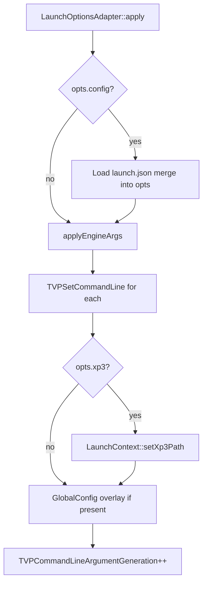

# LaunchOptionsAdapter

[← 索引](README.md)

---

## 1. 是否需要适配器？

**需要。** 但是 **单向、薄层** 适配：

```text
CliParser / Intent / launch.json
        ↓
   LaunchOptions
        ↓
LaunchOptionsAdapter::apply()    ← 唯一适配点
        ↓
   TVPSetCommandLine ──→ TVPProgramArguments
   LaunchContext
   GlobalConfigManager（可选 overlay）
        ↓
   引擎各处 TVPGetCommandLine()   ← 不改
```

**不需要：**

- 包装或重写 `TVPGetCommandLine`  
- 让 `SysInitImpl` / plugins 依赖 argparse  
- CliParser ↔ TVPGetCommandLine 双向同步  

---

## 2. Adapter API（草案）

```cpp
#pragma once
#include "launch/LaunchOptions.h"

namespace krkr::launch {

class LaunchOptionsAdapter {
public:
    /// 将 LaunchOptions 应用到引擎状态（可多次调用会覆盖同名字段）
    static void apply(const LaunchOptions& opts);

    /// 仅应用 engineArgs（供测试或动态追加）
    static void applyEngineArg(const std::string& arg);

    /// 从 launch.json 填充 LaunchOptions 并 apply
    static void applyConfigFile(const std::filesystem::path& path);

private:
    static void applyEngineArgs(const std::vector<std::string>& args);
    static void normalizeAndSetCommandLine(const std::string& name,
                                             const std::string& value);
};

} // namespace krkr::launch
```

---

## 3. apply() 流程



**顺序说明：**

1. 先合并 `launch.json`（若指定 `--config`）  
2. 再应用 `engineArgs`（CLI 同名项 **覆盖** JSON，CLI 优先）  
3. 最后设置 `xp3Path`  

---

## 4. engineArgs → TVPSetCommandLine

吉里吉里参数格式：`-name=value` 或 `-flag`（等价 `-flag=yes`）。

### 规范化规则

| 输入 | 写入 |
|------|------|
| `debug` | `-debug=yes` |
| `-debug` | `-debug=yes` |
| `-debug=yes` | `-debug=yes` |
| `-contfreq=60` | `-contfreq=60` |

### 参考实现

```cpp
void LaunchOptionsAdapter::applyEngineArg(const std::string& raw) {
    if (raw.empty())
        return;

    std::string s = raw;
    if (s[0] != '-')
        s.insert(s.begin(), '-');

    const auto eq = s.find('=');
    if (eq == std::string::npos) {
        TVPSetCommandLine(ttstr(s).c_str(), ttstr("yes"));
        return;
    }

    const ttstr name(s.substr(0, eq));
    const ttstr val(s.substr(eq + 1));
    TVPSetCommandLine(name.c_str(), val);
}

void LaunchOptionsAdapter::applyEngineArgs(
    const std::vector<std::string>& args) {
    for (const auto& a : args)
        applyEngineArg(a);
}
```

### 与 Windows 现有逻辑对齐

`win32/Platform.cpp` 中：

```cpp
// argv[i] 无 '=' → TVPSetCommandLine(name, "yes")
// 有 '='     → TVPSetCommandLine(key, val)
```

Adapter 与之 **语义一致**，便于迁移后删除 Platform 内重复解析。

---

## 5. TVPGetCommandLine 行为（既有，Adapter 需知晓）

```585:607:cpp/core/sysinit/impl/SysInitImpl.cpp
bool TVPGetCommandLine(const tjs_char *name, tTJSVariant *value) {
    TVPInitProgramArgumentsAndDataPath(false);
    // 线性扫描 TVPProgramArguments，前缀匹配 -name 或 -name=value
    ...
}
```

- `TVPSetCommandLine` 会 **插入到 vector 头部**（高优先级）  
- `TVPCommandLineArgumentGeneration` 递增 → 各模块可缓存失效重读  

Adapter **只写** `TVPSetCommandLine`，不直接改 `TVPProgramArguments` vector（除非未来实装 `PushAllCommandlineArguments`）。

---

## 6. PushAllCommandlineArguments

当前为空：

```486:486:cpp/core/sysinit/impl/SysInitImpl.cpp
static void PushAllCommandlineArguments() {}
```

| 方案 | 做法 | 推荐 |
|------|------|------|
| **A** | Adapter 仅 `TVPSetCommandLine` | ✅ Phase 1 |
| **B** | 实装 `PushAllCommandlineArguments` 推 `_argc/_argv`，Adapter 不再单独写 | 可选，贴近原版 Kirikiri |

Phase 1 采用 **方案 A** 即可；引擎行为与 `TVPSetCommandLine` 一致。

---

## 7. Mobile：无 CliParser 的同一 Adapter

```cpp
LaunchOptions opts;
opts.xp3 = jniGetStringExtra(env, intent, "xp3Path");
opts.engineArgs = jniGetStringArrayExtra(env, intent, "engineArgs");
LaunchOptionsAdapter::apply(opts);
```

RN Settings / Kotlin 只负责构造 **与 Desktop 相同的 `LaunchOptions` 字段**。

---

## 8. 常见 engineArgs 映射表（供 launcher 文档引用）

| engineArg | TVPGetCommandLine 名 | 说明 |
|-----------|----------------------|------|
| `-debug=yes` | `-debug` | 脚本调试 |
| `-contfreq=60` | `-contfreq` | 控制器频率 |
| `-startup=boot.tjs` | `-startup` | 启动脚本名 |
| `-datapath=...` | `-datapath` | 数据目录（若启用） |
| `-fsbpp=32` | `-fsbpp` | 全屏色深 |

完整列表见各模块内 `TVPGetCommandLine` 调用；Adapter **不做** 语义校验，原样转发。

---

## 9. 测试清单

- [ ] `apply({engineArgs:{"-debug=yes"}})` → `TVPGetCommandLine(L"-debug")` 真  
- [ ] CLI `-debug=yes` 覆盖 JSON 内 `-debug=no`  
- [ ] `--xp3` → `LaunchContext::hasStartupTarget()` 真  
- [ ] 空 `LaunchOptions` 不改变已有 `TVPProgramArguments`（若需明确行为）  
- [ ] Windows Unicode 路径 + `-debug=yes` 组合  

---

## 10. 不要做的事

| 反模式 | 原因 |
|--------|------|
| 引擎模块 `#include CliParser.h` | 耦合外壳 |
| 删除 `TVPGetCommandLine` | 改动面巨大 |
| Adapter 内启动游戏 | 只写状态；启动仍由 Application/MainScene 负责 |
| 在 Adapter 里弹 UI | Desktop CLI 模式无 UI |
