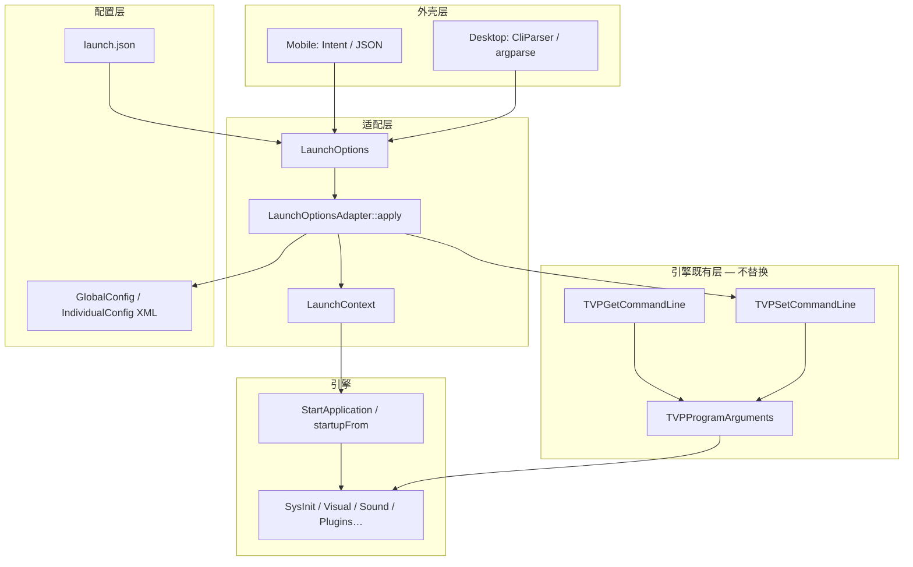
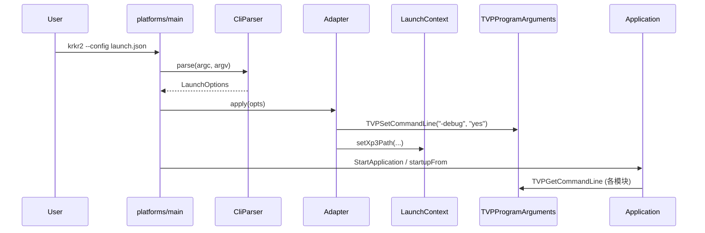
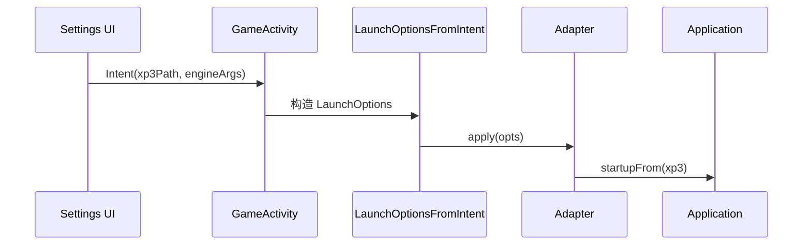

# 启动层总体架构

[← 索引](README.md)

---

## 1. 三层模型



| 层 | 职责 | 禁止 |
|----|------|------|
| **CliParser** | 解析 `--xp3`、`--config`、`--help` | 被引擎模块直接 `#include` |
| **LaunchOptions** | 平台无关的结构化结果 | 含 TJS / ttstr 细节 |
| **Adapter** | 写入 `TVPSetCommandLine` + `LaunchContext` | 替换 `TVPGetCommandLine` |
| **TVPGetCommandLine** | 引擎运行时查询 `-debug` 等 | 解析 `argc/argv` |

---

## 2. 为什么需要适配器

**CliParser 与 TVPGetCommandLine 是两套语法、两个时代：**

| | CliParser | TVPGetCommandLine |
|--|-----------|-------------------|
| 示例 | `krkr2 --xp3 foo.xp3 -- -debug=yes` | `TVPGetCommandLine(L"-debug", &val)` |
| 消费者 | `main`、外部 launcher | 全引擎（几十处） |
| 格式 | GNU 风格 `--long` | 吉里吉里 `-key=val` / `-flag` |

**结论：** 写 **单向适配器** `LaunchOptionsAdapter::apply()`，把 CliParser 结果灌进既有体系；**不**给 `TVPGetCommandLine` 再包一层 parser。

---

## 3. 启动数据流

### 3.1 Desktop（CLI）



### 3.2 Mobile（无 argc CLI）



**Mobile 不经过 argparse**；与 Desktop 共用 **`LaunchOptions` + `apply()`**。

---

## 4. LaunchContext（外壳状态）

与 `TVPGetCommandLine` 分离，存放 **吉里吉里没有标准开关** 的外壳字段：

```cpp
struct LaunchContext {
    static std::optional<std::filesystem::path> xp3Path();
    static void setXp3Path(std::filesystem::path p);
    static bool hasStartupTarget();  // true → 跳过文件选择 UI
};
```

| 字段 | 来源 | 不进 TVPGetCommandLine 的原因 |
|------|------|--------------------------------|
| `xp3Path` | `--xp3` / launch.json / Intent | 原 Kirikiri 用项目目录，KrKr2 外壳扩展 |
| `configPath` | `--config` | 纯 KrKr2 launcher 概念 |

逐步替代：

- `TVPMainFileSelectorForm::filePath`  
- 各 `main.cpp` 里对 `argv[1]` 的直接赋值  

---

## 5. 与配置系统关系

```text
launch.json          GlobalConfig.xml       IndividualConfig.xml
(一次启动 profile)    (全局持久化)            (单游戏持久化)
        │                    │                        │
        └──────── LaunchOptionsAdapter::apply ────────┘
                              │
                    引擎启动 + TVPSetCommandLine
```

- **launch.json**：launcher / RN 生成，描述「这次怎么启动」  
- **GlobalConfig XML**：现有设置页持久化；可被 launch.json **覆盖部分字段**（overlay）  
- **不必** Phase 1 把 XML 改成 JSON  

详见 [launch-config.md](launch-config.md)。

---

## 6. 与 UI 层关系

| 模式 | 文件选择 | 设置 |
|------|----------|------|
| Desktop CLI | `--xp3` / 文件关联 | `--config` 或外部 launcher 写 JSON |
| Desktop + 可选 UI | [UI 层](../UI_LAYER.md) launcher | RN/Electron 写 launch.json |
| Mobile | Intent | Settings Activity |

引擎 **无 UI 模式**：`LaunchContext::hasStartupTarget()` 为真时，不显示 `MainFileSelectorForm`。

---

## 7. 迁移阶段

| 阶段 | 内容 |
|------|------|
| **L0** | 文档评审（本文档集） |
| **L1** | 新增 `launch/`，实现 `CliParser` + `Adapter` + `LaunchContext` |
| **L2** | 统一 `platforms/*/main.cpp`；Windows 逻辑迁入 Adapter |
| **L3** | 实装或删除 `PushAllCommandlineArguments`；Android JNI `apply()` |
| **L4** | 外部 launcher / RN 对接 `launch.json` schema |
| **L5** | 移除 Cocos 文件选择 UI（配合 UI 迁移） |

---

## 8. 开放问题

| # | 问题 | 倾向 |
|---|------|------|
| 1 | Windows `CommandLineToArgvW` 与 UTF-8 | main 层统一转 UTF-8 再交 argparse |
| 2 | `PushAllCommandlineArguments` | Adapter 只调 `TVPSetCommandLine`（方案 A） |
| 3 | `--` 与 `-debug` 无等号 | 适配器规范化为 `-debug=yes` |
| 4 | Linux `gtk_init` 消费 argc | parse 在 `gtk_init` 之前或拷贝 argv |
