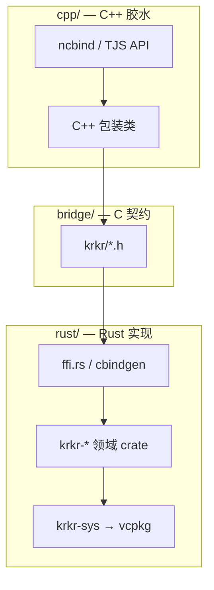

# 目录与分层架构

[← 索引](README.md)

---

## 1. 设计目标

| 目标 | 做法 |
|------|------|
| **可扩展** | 每块重写 = 独立 Rust crate + 独立 C++ 薄壳 |
| **语言边界清晰** | Rust 只在 `rust/`；C++ 只在 `cpp/`；契约在 `bridge/` |
| **依赖不重复** | zlib/lz4 等以 **vcpkg 为唯一来源**（见 [dependencies.md](dependencies.md)） |
| **渐进迁移** | 模块可独立开关；C++ 与 Rust 路径可并存 |
| **多平台** | 与 `out/linux|macos|windows|android` 及 `vcpkg_android.cmake` 一致 |

---

## 2. 仓库目录

```text
krkr2/
├── vcpkg.json
├── cmake/
│   ├── KrkrRust.cmake
│   └── vcpkg_android.cmake
├── docs/rust/                         # ★ Rust 层文档
├── rust/                              # ★ 全部 Rust 源码
│   ├── krkr-ffi/
│   ├── krkr-sys/{zlib,lz4,…}
│   ├── crates/{krkr-psb,…}
│   └── tools/
├── bridge/
│   ├── include/krkr/{common.h,psb.h,…}
│   └── manifest.toml
├── cpp/plugins/{psbfile,motionplayer,…}
└── out/<platform>/<config>/
    └── rust-target/<triple>/<profile>/
```

**不把 `.rs` 放在 `cpp/plugins/`。** 例如 `cpp/plugins/psbfile/` 只保留 TJS、ncbind 与 `PSBFile` 包装。

---

## 3. 三层职责



| 目录 | 放什么 | 不放什么 |
|------|--------|----------|
| `rust/crates/*` | 可单测的解析与算法 | `tjs.h`、`ncbind` |
| `rust/krkr-sys/*` | `build.rs` 链 vcpkg | 业务逻辑 |
| `bridge/include` | 稳定 C 头 | 实现细节 |
| `cpp/plugins/*` | 插件注册、类型转换 | 大块算法（迁走后删） |

---

## 4. 多模块扩展

1. 在 `rust/crates/` **新增 crate**
2. 在 `bridge/manifest.toml` **登记一行**
3. 在 `cpp/plugins/<name>/CMakeLists.txt` **链入 staticlib**
4. 在 `docs/rust/modules/` **新增模块文档**

```toml
[[module]]
name = "psb"
crate = "krkr-psb"
ffi_header = "bridge/include/krkr/psb.h"
cpp_glue = "cpp/plugins/psbfile"
abi_version = 1
```

**命名：** Rust 包 `krkr-<领域>`；C 符号前缀 `krkr_psb_` / `krkr_motion_`。

**依赖方向（Rust 内部）：**

```text
krkr-psb  ──►  krkr-ffi, krkr-sys/zlib（按需）
krkr-motion-*  ──►  krkr-psb
```

仅「需被 C++ 调用」的边界走 `ffi.rs` + `bridge/include`。
