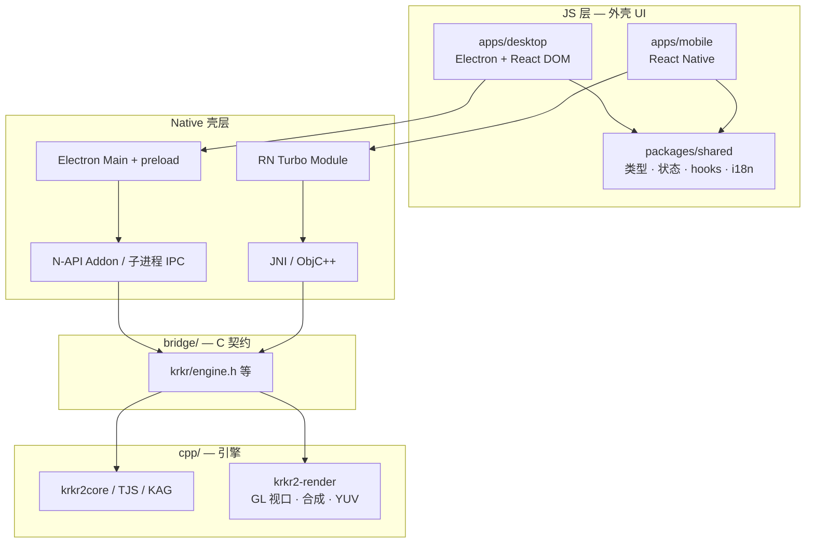
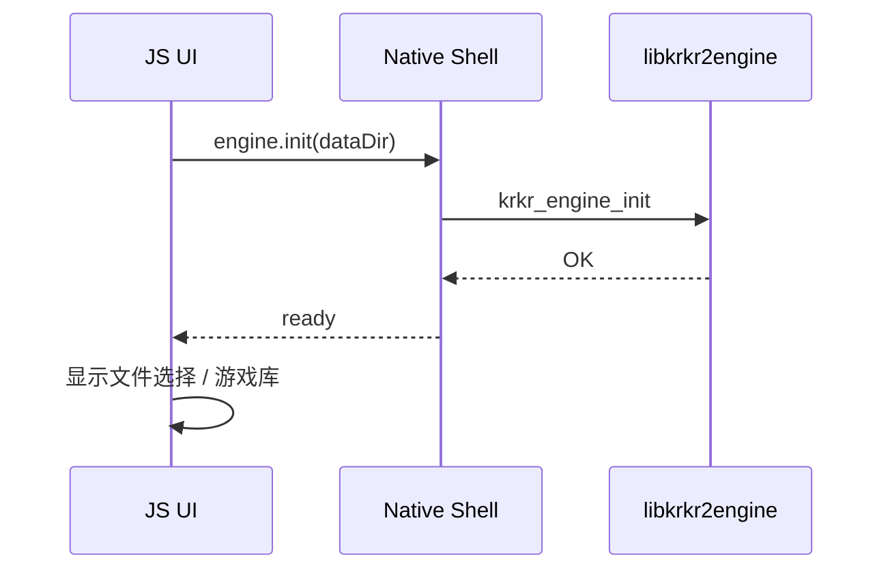
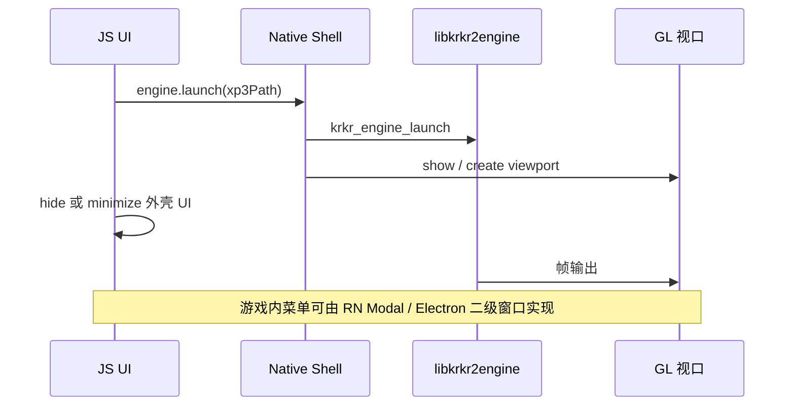

# 总体架构

[← 索引](README.md)

---

## 1. 分层模型



| 层 | 职责 | 禁止 |
|----|------|------|
| **JS 外壳** | 导航、设置、游戏库、对话框、更新检查 | 直接访问 TJS / XP3 解析 |
| **Native 壳** | 窗口、权限、文件对话框、GL 视口宿主 | 业务逻辑 duplicated 在多处 |
| **C ABI** | 稳定、窄接口、JSON 事件 | 暴露 C++ 类 / STL |
| **C++ 引擎** | 模拟器核心、渲染、插件 | UI 布局 / CSS |

---

## 2. 核心原则

### 2.1 JS 不管游戏渲染

吉里吉里游戏画面必须由 **Native OpenGL / GLES 管线** 输出。  
不得在 Electron Renderer 或 RN JS 层用 Canvas/WebGL 重实现 KAG 合成。

### 2.2 C++ 引擎保持单源

`libkrkr2engine`（名称待定，下同）为 Desktop / Mobile 共用动态库：

- Desktop：Electron 经 N-API 或子进程加载
- Android：`System.loadLibrary` + JNI
- iOS（若启用）：Framework + ObjC++

### 2.3 UI 与渲染解耦迁移

| 子系统 | 现依赖 | 目标 |
|--------|--------|------|
| 外壳 UI | Cocos Widget / `BaseForm` | React / RN |
| 游戏视口 | Cocos `MainScene` / `YUVSprite` | `krkr2-render` + GLFW / GLSurfaceView |
| 资源打包 | `ui/cocos-studio` | `apps/*` build 产物 + 静态资源 |

两轨可并行：**先 UI，后渲染**（见 [migration.md](migration.md)）。

---

## 3. 平台架构

### 3.1 Desktop（Electron）

```text
┌──────────────────────────────────────────────────────────┐
│ Electron Main Process (Node.js)                          │
│  · 应用生命周期、单例锁、自动更新（可选）                  │
│  · BrowserWindow 管理                                    │
│  · krkr-engine：N-API addon 或 krkr2-engine 子进程       │
├──────────────────────────────────────────────────────────┤
│ Preload (contextBridge)                                  │
│  · 暴露 window.krkr：launchGame / getPreferences / …     │
├──────────────────────────────────────────────────────────┤
│ Renderer (Vite + React)                                  │
│  · 外壳 UI：文件选择、设置、游戏库                        │
├──────────────────────────────────────────────────────────┤
│ Native GL 视口（游戏运行时）                              │
│  · 方案 A（推荐过渡）：独立 top-level 窗口 / 子进程窗口   │
│  · 方案 B（长期）：Native addon 嵌入 HWND / NSView       │
│  · 方案 P1：暂留 Cocos GL，Electron 仅外壳               │
└──────────────────────────────────────────────────────────┘
```

**支持平台：** Windows x64、Linux x64、macOS arm64（与现 README 一致）。

### 3.2 Mobile（React Native）

```text
┌──────────────────────────────────────────────────────────┐
│ RN JS (Hermes)                                           │
│  · React Navigation · 设置 · 游戏库                       │
├──────────────────────────────────────────────────────────┤
│ Turbo Module: KrkrEngineModule                           │
│  · 同构 packages/shared 的 EngineBridge 实现              │
├──────────────────────────────────────────────────────────┤
│ Native UI: KrkrGameView (自定义 View)                     │
│  · Android: GLSurfaceView + libkrkr2engine.so            │
│  · iOS: MTKView / GLKView（未来）                         │
├──────────────────────────────────────────────────────────┤
│ libkrkr2engine.so                                        │
└──────────────────────────────────────────────────────────┘
```

**必须使用 Bare Workflow**（或 Expo Dev Client + custom native code）。Expo Go 无法加载自定义 C++ 与 GL 视口。

### 3.3 平台能力对照

| 能力 | Electron | React Native |
|------|----------|--------------|
| 外壳 UI | React DOM + shadcn 等 | RN 组件 + 同源 design tokens |
| 系统文件对话框 | `dialog.showOpenDialog` | Document Picker + SAF |
| 深链 / 拖拽打开 XP3 | Main 进程处理 | Intent / Share Extension |
| 引擎进程 | 同进程 addon 或子进程 | 同进程 .so |
| 游戏 GL 视口 | Native 子窗口 / 嵌入 | `KrkrGameView` |
| 安装包体积 | +100～180 MB（Chromium） | RN 标准 + native .so |

---

## 4. 运行时生命周期

### 4.1 应用启动



### 4.2 启动游戏



### 4.3 退出游戏

- `krkr_engine_stop` → 释放 TJS 上下文与游戏资源  
- 隐藏 GL 视口，恢复外壳 UI  
- **不** 销毁全局 `krkr_engine_init`（除非用户退出应用）

---

## 5. 与现有 C++ 模块关系

```text
cpp/
├── core/
│   ├── environ/
│   │   ├── ui/              ← 迁移源（Cocos Form）→ 废弃
│   │   └── cocos2d/         ← 渲染迁移源 → krkr2-render
│   ├── visual/              ← LayerBitmap / RenderManager → krkr2-render
│   └── …                    ← 保留
├── plugins/                 ← 保留；Rust 插件见 docs/rust/
└── …

bridge/
└── include/krkr/
    ├── common.h             ← 已有约定
    └── engine.h             ← 新增：UI 层引擎 API

apps/                        ← 新增
packages/                    ← 新增
```

---

## 6. 安全与权限

| 项 | 要求 |
|----|------|
| Electron | `contextIsolation: true`，禁 `nodeIntegration` in renderer |
| Preload | 仅暴露白名单 API |
| RN | Turbo Module 不暴露任意文件读写路径给 JS；敏感操作走 native 校验 |
| C ABI | 路径参数 UTF-8，引擎内做规范化与沙箱目录约束（沿用现有 Storage 逻辑） |

---

## 7. 非功能性指标（目标）

| 指标 | Desktop | Mobile |
|------|---------|--------|
| 冷启动到可交互 UI | < 3 s（SSD） | < 4 s（中端机） |
| 外壳 UI 内存 | Electron 基线 ~150 MB | RN 基线 + engine |
| 引擎崩溃 | 子进程方案可隔离；同进程需 breakpad（已有 Android） | 捕获 SIGSEGV，回到外壳 |

---

## 8. 开放问题（评审待定）

| # | 问题 | 备选 |
|---|------|------|
| 1 | Desktop GL 嵌入方式 | P1 保留 Cocos / 子窗口 / HWND 嵌入 |
| 2 | Electron 与子进程 vs N-API | 子进程利于崩溃隔离；N-API 低延迟 |
| 3 | iOS 优先级 | 与 RN 一并规划或 Phase 2 |
| 4 | Linux 是否分发 WebView2 式 Runtime | Electron 自带 Chromium，无此问题 |
| 5 | 现有 `ui/cocos-studio` 资源 | 迁移期双轨；完成后删除 |
