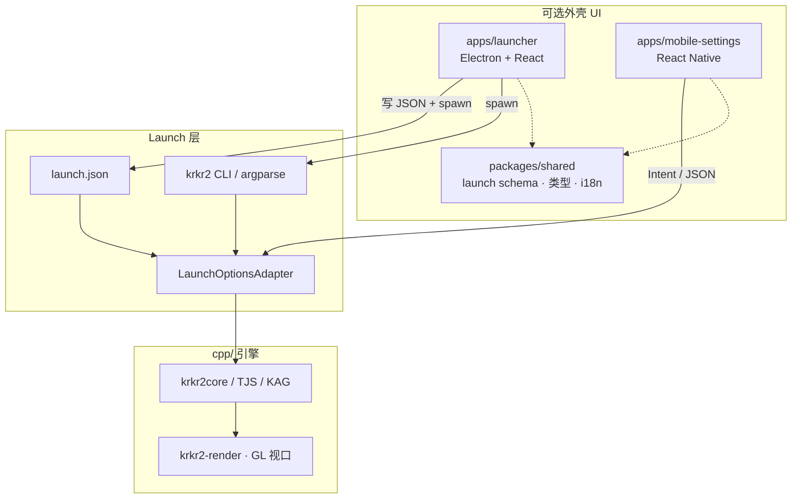
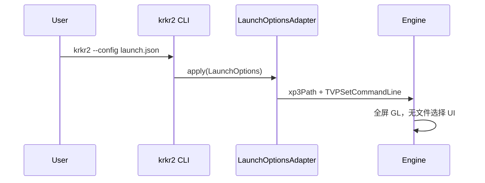
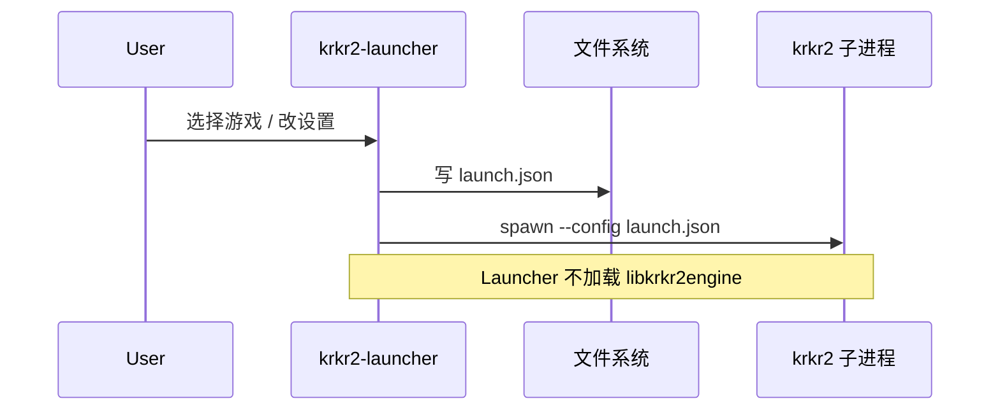
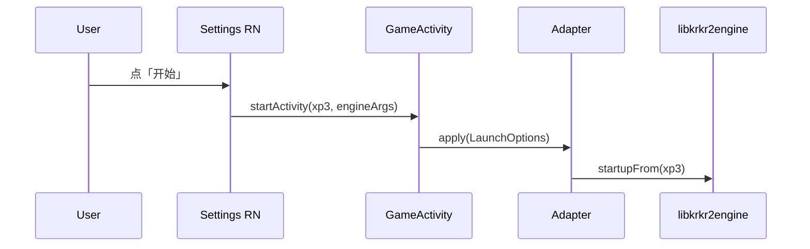

# 总体架构

[← 索引](README.md)

---

## 1. 修订摘要（相对初版）

| 项 | 初版 | **现行** |
|----|------|----------|
| Desktop UI | Electron 包全套 + 嵌 GL | **引擎无 UI**；可选 **独立 Launcher** |
| Desktop 启动 | Electron IPC → 引擎 | **`krkr2 --config launch.json`**（见 Launch 层） |
| Mobile UI | RN 包游戏 + 设置 | **RN 仅 Settings**；**Game 独立 Native Activity** |
| 跨端统一 | Electron + RN 双套 UI 页 | **统一 launch.json schema** + Mobile 一套 RN 设置页 |
| 引擎桥 | N-API 同进程 | Desktop **子进程 spawn** 为主；Mobile **JNI + Intent** |

---

## 2. 分层模型



| 层 | 职责 | 禁止 |
|----|------|------|
| **Launcher / RN Settings** | 游戏库、偏好、生成启动参数 | 内嵌 GL / 链 TJS |
| **Launch 层** | 解析 CLI / JSON → `TVPSetCommandLine` + `xp3Path` | UI 布局 |
| **引擎** | 模拟、渲染、插件 | 内置 Desktop 图形 shell（长期） |

---

## 3. 核心原则

### 3.1 游戏画面只在 Native GL

KAG 合成必须在 **OpenGL / GLES** 完成。  
Launcher、RN、Electron Renderer、WASM **均不**承担游戏帧输出。

### 3.2 Desktop：引擎与 UI 进程分离

```text
krkr2-launcher (可选)                krkr2 (引擎)
  · React 设置 / 游戏库                  · 无内置 UI
  · 写 ~/.config/krkr2/launch.json       · --config / --xp3
  · spawn: krkr2 --config …              · 全屏 GL 窗口
  · 退出或驻留托盘                       · 游戏结束即退出或回 CLI
```

**不**使用 BrowserWindow 承载游戏视口。

### 3.3 Mobile：双 Activity

```text
SettingsActivity (RN)              GameActivity (Native)
  · 游戏库、全局/单游戏设置              · GLSurfaceView
  · 写 launch 等价数据                  · libkrkr2engine.so
  · startActivity(Game, extras)       · 全屏，无 RN 树
```

游戏内菜单：Native overlay 或再开 Settings（Modal Activity）。

### 3.4 UI 与渲染解耦迁移

| 子系统 | 现状 | 目标 |
|--------|------|------|
| Desktop 外壳 | Cocos Form / `argv[1]` hack | CLI + 可选 Launcher |
| Mobile 外壳 | Cocos + `KR2Activity` | RN Settings + Native Game |
| 游戏视口 | Cocos `MainScene` | `krkr2-render` |

---

## 4. 平台架构

### 4.1 Desktop

```text
用户 / 脚本 / 文件关联
    │
    ├─► krkr2 --xp3 game.xp3 [-- -debug=yes]
    │
    └─► krkr2-launcher (可选)
            └─► 写 launch.json → spawn krkr2 --config launch.json

krkr2 进程
    LaunchOptionsAdapter::apply()
    → LaunchContext::xp3Path
    → TVPSetCommandLine (engineArgs)
    → StartApplication / 全屏 GL
```

| 能力 | 实现 |
|------|------|
| 打开 XP3 | `--xp3`、文件关联、`launch.json` |
| 设置 | Launcher 写 JSON；或直接编辑 GlobalConfig XML |
| 引擎调试参数 | `--` 后 `-debug=yes` 等 → Adapter |
| 游戏窗口 | GLFW / 平台窗口 + `krkr2-render` |

### 4.2 Mobile（Android）

```text
SettingsActivity (RN)
    └─► Intent { xp3Path, engineArgs[] }
            └─► GameActivity
                    LaunchOptionsFromIntent → apply()
                    KrkrGameView (GLSurfaceView)
```

| 能力 | 实现 |
|------|------|
| 游戏库 / 设置 | RN |
| 启动游戏 | Intent → Native |
| 游戏画面 | GameActivity GL |
| 与 Desktop 对齐 | 同一 `launch.json` schema（或 Intent 字段同构） |

---

## 5. 启动生命周期

### 5.1 Desktop（CLI）



### 5.2 Desktop（可选 Launcher）



### 5.3 Mobile



---

## 6. 与 C++ 模块关系

```text
cpp/core/environ/
├── launch/          ← 新增（见 Launch 层）：CliParser, Adapter, LaunchContext
├── ui/              ← 废弃 Cocos Form
├── cocos2d/         ← 渲染迁移源 → krkr2-render
└── ConfigManager/   ← XML 保留；Launcher/RN 可 overlay

apps/
├── launcher/        ← 可选 Desktop Electron
└── mobile-settings/ ← RN Settings（非游戏容器）

packages/shared/     ← launch schema、Preferences 类型
```

---

## 7. 安全与权限

| 项 | 要求 |
|----|------|
| Launcher | 仅 spawn 引擎；不注入任意 LD_PRELOAD |
| launch.json | 路径校验；禁止引擎内执行外部脚本 |
| RN Settings | Intent 白名单字段；路径走 SAF / 应用私有目录 |
| Game Activity | 最小权限；无 WebView 加载远程页 |

---

## 8. 非功能性指标（目标）

| 指标 | Desktop 引擎 | Desktop Launcher | Mobile |
|------|--------------|------------------|--------|
| 安装包 | 无 Chromium | +100MB 级（可选） | RN + .so |
| 冷启动 | CLI 直启游戏 | Launcher 再 spawn | Settings → Game |
| 崩溃隔离 | 单进程 | Launcher 与引擎分离 ✅ | Game 崩溃回 Settings |

---

## 9. 开放问题

| # | 问题 | 倾向 |
|---|------|------|
| 1 | Launcher 是否官方维护 | 可选组件，与 `krkr2` 分包发布 |
| 2 | 游戏内菜单 | Native 轻量 overlay，不做 Electron |
| 3 | iOS | Settings RN + Game VC，同 Android 模型 |
| 4 | GlobalConfig 持久化 | Launcher 默认 overlay 不写 XML |

---

## 10. 已关闭问题（相对初版）

| 原问题 | 决议 |
|--------|------|
| Electron 嵌 GL | ❌ 不做 |
| Electron N-API 同进程 | Desktop 改为 spawn + CLI |
| BrowserWindow 方案 | ❌ 放弃 |
