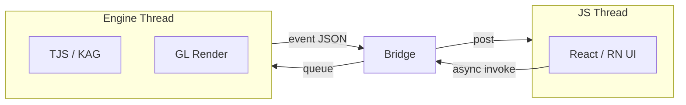

# 桥接层与 C ABI

[← 索引](README.md)

---

## 1. 设计目标

| 目标 | 做法 |
|------|------|
| **单契约** | Electron N-API 与 RN JNI 只绑定 `bridge/include/krkr/engine.h` |
| **窄接口** | 外壳 UI 所需能力；不暴露 TJS / ncbind |
| **JSON 载荷** | 复杂结构用 JSON 字符串，避免 C 侧结构体频繁变更 |
| **线程安全** | 引擎 API 在引擎线程；回调切到 JS 可消费线程 |

与 Rust 插件层关系：Rust 模块继续走 `bridge/include/krkr/*.h` + `docs/rust/ffi.md`；**engine.h 由 C++ 核心实现**，Rust 不替代引擎入口。

---

## 2. C ABI 草案

```c
// bridge/include/krkr/engine.h
#pragma once
#include "krkr/common.h"

#ifdef __cplusplus
extern "C" {
#endif

typedef enum KrkrEngineError {
    KRKR_OK = 0,
    KRKR_ERR_INVALID_ARG = 1,
    KRKR_ERR_NOT_INITIALIZED = 2,
    KRKR_ERR_ALREADY_RUNNING = 3,
    KRKR_ERR_IO = 4,
    KRKR_ERR_ENGINE = 5,
} KrkrEngineError;

/** 引擎事件：log | progress | error | game-exited | … */
typedef void (*KrkrEngineEventFn)(const char *event_json, void *userdata);

/**
 * 初始化引擎（不含启动游戏）。
 * @param data_dir UTF-8 可写数据目录
 */
KRKR_API KrkrEngineError krkr_engine_init(const char *data_dir);

KRKR_API void krkr_engine_destroy(void);

KRKR_API KrkrEngineError krkr_engine_set_event_callback(
    KrkrEngineEventFn callback, void *userdata);

/** 启动指定 xp3 / 目录；阻塞直到加载完成或失败 */
KRKR_API KrkrEngineError krkr_engine_launch(const char *xp3_path);

KRKR_API KrkrEngineError krkr_engine_stop(void);
KRKR_API KrkrEngineError krkr_engine_pause(void);
KRKR_API KrkrEngineError krkr_engine_resume(void);

/** 扫描目录，结果 JSON 数组写入 out_buf；返回 KRKR_OK 或缓冲区不足 */
KRKR_API KrkrEngineError krkr_engine_scan_directory(
    const char *dir_path, char *out_buf, size_t out_buf_size);

KRKR_API KrkrEngineError krkr_engine_get_preferences(
    char *out_buf, size_t out_buf_size);

KRKR_API KrkrEngineError krkr_engine_set_preferences(const char *json_patch);

/** 绑定 GL 视口（Mobile / 嵌入 Desktop 时） */
KRKR_API KrkrEngineError krkr_engine_attach_viewport(void *native_window_handle);

KRKR_API void krkr_engine_detach_viewport(void);

#ifdef __cplusplus
}
#endif
```

> **评审说明：** 函数集为草案，落地时与 `GlobalConfigManager`、`MainFileSelectorForm` 等现有能力逐项对齐。

---

## 3. 事件 JSON 格式

```json
{ "type": "log", "level": "info", "message": "..." }
{ "type": "progress", "phase": "scan", "current": 3, "total": 10 }
{ "type": "error", "code": "ENGINE", "message": "..." }
{ "type": "game-exited", "code": 0 }
```

JS 侧 `EngineBridge.onEvent` 解析为 discriminated union。

---

## 4. Desktop 桥接

### 4.1 Preload 暴露

```typescript
// apps/desktop/electron/preload.ts
import { contextBridge, ipcRenderer } from 'electron';

contextBridge.exposeInMainWorld('krkr', {
  invoke: (method: string, params?: unknown) =>
    ipcRenderer.invoke('krkr:engine', { method, params }),
  onEvent: (cb: (e: unknown) => void) => {
    const listener = (_: unknown, payload: unknown) => cb(payload);
    ipcRenderer.on('krkr:event', listener);
    return () => ipcRenderer.removeListener('krkr:event', listener);
  },
});
```

### 4.2 Main 进程路由

```text
ipcMain.handle('krkr:engine', …)
  → KrkrEngineService (TypeScript 薄层)
    → 方案 A: krkr_engine_* via N-API addon
    → 方案 B: krkr2-engine 子进程 stdin/stdout JSON-RPC
```

**方案 B 示例消息：**

```json
{ "id": "1", "method": "launch", "params": { "xp3Path": "/games/foo.xp3" } }
{ "id": "1", "result": { "ok": true } }
```

| 方案 | 优点 | 缺点 |
|------|------|------|
| N-API 同进程 | 低延迟、共享内存 | 引擎崩溃拖垮 Electron；需 electron-rebuild |
| 子进程 | 崩溃隔离；与 Android 模型接近 | IPC 开销；双窗口协调 |

**P1 建议：** 子进程或暂留 Cocos 窗口；P2 再评估 N-API。

---

## 5. Mobile 桥接

### 5.1 Turbo Module 骨架

```typescript
// apps/mobile/src/specs/NativeKrkrEngine.ts
import type { TurboModule } from 'react-native';
import { TurboModuleRegistry } from 'react-native';

export interface Spec extends TurboModule {
  init(dataDir: string): Promise<void>;
  launchGame(xp3Path: string): Promise<void>;
  stopGame(): Promise<void>;
  getPreferences(): Promise<string>; // JSON
  setPreferences(jsonPatch: string): Promise<void>;
  addListener(eventName: string): void;
  removeListeners(count: number): void;
}

export default TurboModuleRegistry.getEnforcing<Spec>('KrkrEngine');
```

### 5.2 Android JNI

```text
KrkrEngineModule.kt
  → krkr_engine_launch(path)
  → libkrkr2engine.so

KrkrGameViewManager.kt
  → GLSurfaceView + Renderer
  → krkr_engine_attach_viewport(ANativeWindow*)
```

线程约定：

- JNI 调用 → 引擎主线程（与现 `TVPMainThreadID` 一致）  
- 事件回调 → RN `DeviceEventManagerModule.RCTDeviceEventEmitter`

---

## 6. 线程模型



| 操作 | 线程 |
|------|------|
| `launch` / `stop` | 引擎线程 |
| `getPreferences` | 引擎线程或只读缓存 |
| UI 更新 | JS 线程 |
| GL swap | 引擎 / GL 线程 |

---

## 7. 错误处理

```typescript
// packages/shared/src/types/EngineError.ts
export class EngineError extends Error {
  constructor(
    public readonly code: KrkrEngineErrorCode,
    message: string,
  ) {
    super(message);
  }
}
```

Native 返回非 `KRKR_OK` 时，Bridge 实现抛出 `EngineError`；UI 统一 Toast / Dialog。

---

## 8. 内存与字符串

| 规则 | 说明 |
|------|------|
| 入参字符串 | UTF-8，`const char*` 调用期间有效 |
| 大块输出 | 调用方分配 buffer；或后续增加 `krkr_engine_free()` + 堆分配 |
| 路径 | 引擎内转平台路径（沿用 `TVPGetDefaultFileDir` 等） |

与 `docs/rust/ffi.md` 一致：**谁分配谁释放**，在 `engine.h` 注释中写清。

---

## 9. 测试

| 层级 | 方式 |
|------|------|
| C ABI | `tests/engine_bridge_test`（Catch2，无 UI） |
| JS Bridge | mock `EngineBridge` 单测 UI |
| 集成 | Desktop spectron/playwright；Mobile Detox（可选） |
