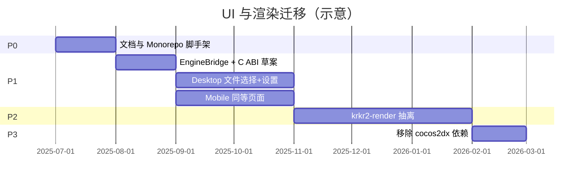

# 自 Cocos2d-x 渐进迁移

[← 索引](README.md)

---

## 1. 迁移范围

### 1.1 替换（外壳 UI）

| 现有模块 | 新归属 |
|----------|--------|
| `BaseForm` / `iTVPBaseForm` | `@krkr/ui-desktop` / `@krkr/ui-native` |
| `MainFileSelectorForm` | FileSelector 页 |
| `GlobalPreferenceForm` / `IndividualPreferenceForm` | Settings 页 |
| `GameMainMenu` / `InGameMenuForm` | GameMenu overlay |
| `MessageBox` | Dialog 组件 |
| `CsdUIFactory` / `CsdUIWidgets` | 删除（由 React 组件替代） |
| `ui/cocos-studio` 资源 | 删除（迁移完成后） |

### 1.2 暂留后替换（游戏视口）

| 现有模块 | 目标 |
|----------|------|
| `MainScene.cpp` | `krkr2-render` + 平台 GL 宿主 |
| `YUVSprite` | `YUVRenderer`（shader） |
| `TVPWindowLayer` | `ViewportCompositor` |
| `AppDelegate.cpp` | 平台 Application（非 Cocos Director） |

### 1.3 保留不动

- TJS / KAG / 插件 / 存档 / XP3 归档  
- Rust 插件迁移路径（`docs/rust/`）  
- `cpp/core/visual/RenderManager` 逻辑（实现迁到 krkr2-render，算法保留）

---

## 2. 阶段规划

### P0 — 准备（4～6 周）

- [ ] 评审并冻结本文档集  
- [ ] 初始化 `apps/`、`packages/`、pnpm workspace  
- [ ] 添加 `bridge/include/krkr/engine.h` 草案  
- [ ] CI：Node job + 现有 C++ job 并行  

**交付：** 空壳 Electron 窗口 + RN 欢迎页；`EngineBridge` mock 实现。

### P1 — 外壳 UI 迁移（2～3 月）

Cocos **仍负责 GL 渲染**；新 UI 与旧 UI 可开关并存。

| 步骤 | Desktop | Mobile |
|------|---------|--------|
| 1 | Electron 文件选择页 | RN FileSelectorScreen |
| 2 | 桥接 `scanDirectory` | 同上 |
| 3 | 设置页 ↔ ConfigManager | 同上 |
| 4 | `launchGame` → 现有引擎入口 | JNI launch |
| 5 | 隐藏外壳，显示 Cocos 全屏 | KrkrGameView 暂包装 Cocos Activity |

**回滚：** CMake flag `KRKR2_USE_COCOS_UI=ON` 保留旧 Form。

**验收：**

- 四端可浏览目录并启动游戏  
- 设置读写与现 `PreferenceForm` 行为一致  
- CJK 路径与文件名正常  

### P2 — 渲染抽离（2～4 月）

详见 [rendering.md](rendering.md)。

- [ ] 新建 `cpp/core/render/`（`krkr2-render`）  
- [ ] GLFW 窗口（Desktop）/ GLSurfaceView（Android）  
- [ ] 迁移 LayerBitmap → 纹理上传  
- [ ] 迁移 YUV → shader  
- [ ] Electron / RN 视口 attach 到 `krkr_engine_attach_viewport`  

**回滚：** 链接旧 Cocos 渲染 target。

### P3 — 移除 Cocos（1 月）

- [ ] `vcpkg.json` 移除 `cocos2dx`  
- [ ] 删除 `cpp/core/environ/cocos2d/`、`libcocos2dx`（Android）  
- [ ] 删除 `ui/cocos-studio`、`CsdUIFactory`  
- [ ] 更新 README / CI / 依赖文档  

---

## 3. 功能对照清单

| 功能 | 现实现 | P1 | P2 | P3 |
|------|--------|----|----|-----|
| XP3 文件选择 | MainFileSelectorForm | React | React | React |
| 拖拽打开 XP3 | Windows main | Electron | Electron | Electron |
| 全局设置 | GlobalPreferenceForm | React | React | React |
| 单游戏设置 | IndividualPreferenceForm | React | React | React |
| 游戏内菜单 | InGameMenuForm | RN Modal / Electron overlay | 同左 | 同左 |
| 视频播放 UI | SimpleMediaFilePlayer | 可选 Web 播放器 UI | Native 解码不变 | 同左 |
| GL 游戏画面 | MainScene | Cocos | krkr2-render | krkr2-render |
| 虚拟鼠标 | MainScene | Cocos | krkr2-render | krkr2-render |
| Debug 控制台 | ConsoleWindow | 可选 DevTools / 保留 C++ | 同左 | 同左 |

---

## 4. 数据与配置迁移

- 配置文件路径 **不变**（`GlobalConfigManager` / `IndividualConfigManager` 路径）  
- JS `Preferences` 类型与 C++ 字段一一映射，版本号写在 JSON schema  
- 无需用户手动迁移；首启新 UI 读取旧配置  

---

## 5. 风险与缓解

| 风险 | 缓解 |
|------|------|
| Electron 与 GL 窗口焦点/输入 | P1 用全屏 Cocos；P2 再做单窗口嵌入 |
| RN 与现有 Android 工程冲突 | 新建 `apps/mobile/android`，逐步替换 `platforms/android/app` |
| 双 UI 维护成本高 | P1 末关闭 Cocos UI 默认开关 |
| 渲染抽离引入图形回归 | 截图对比测试；保留 `tests/visual/` |
| CI 时间增长 | Turbo 缓存 + 分 job  artifact native lib |

---

## 6. 完成定义（Definition of Done）

- [ ] 所有 `cpp/core/environ/ui/*Form*` 无运行时引用  
- [ ] `find_package(cocos2dx)` 从 CMake 树消失  
- [ ] Android APK 不含 `libcocos2d`  
- [ ] Desktop 安装包可独立运行，不依赖外部 Cocos 资源  
- [ ] `docs/ui/` 与实现一致，开放问题已关闭或归档  
