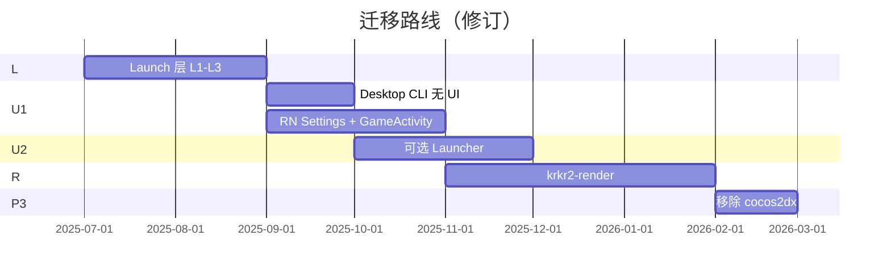

# 自 Cocos2d-x 渐进迁移

[← 索引](README.md)

---

## 1. 迁移范围

### 1.1 移除（Cocos 外壳 UI）

| 现有模块 | 新归属 |
|----------|--------|
| `MainFileSelectorForm` | Desktop：`--xp3` / Launcher；Mobile：RN Library |
| `GlobalPreferenceForm` / `IndividualPreferenceForm` | Launcher / RN Settings |
| `GameMainMenu` / `InGameMenuForm` | Native 轻 overlay 或 Settings |
| `MessageBox` | Native 或暂时保留至 P2 |
| `CsdUIFactory` / `ui/cocos-studio` | 删除 |
| `argv[1]` → `filePath` hack | [Launch 层](../launch/cli-parser.md) |

### 1.2 暂留后替换（游戏视口）

| 现有模块 | 目标 |
|----------|--------|
| `MainScene.cpp` | `krkr2-render` + GL 宿主 |
| `YUVSprite` | `YUVRenderer` |
| `AppDelegate.cpp` | 平台窗口循环（非 Cocos Director） |

### 1.3 新增

| 模块 | 说明 |
|------|------|
| `cpp/core/environ/launch/` | CliParser、Adapter、LaunchContext |
| `apps/launcher` | 可选 Desktop |
| `apps/mobile-settings` | RN Settings + Native GameActivity |

---

## 2. 阶段规划（修订）



### L — Launch 层（优先，见 [LAUNCH_LAYER.md](../LAUNCH_LAYER.md)）

- [ ] `LaunchOptions` + `CliParser` + `LaunchOptionsAdapter`
- [ ] 统一 `platforms/*/main.cpp`
- [ ] `launch.json` schema + `packages/shared`
- [ ] Android `LaunchOptionsFromIntent`

**交付：** `krkr2 --xp3 foo.xp3` 无文件选择 UI 可玩。

### U1 — 外壳迁移

| 步骤 | Desktop | Mobile |
|------|---------|--------|
| 1 | 去掉默认 `MainFileSelectorForm` 弹窗 | RN Settings 壳工程 |
| 2 | `--config` + 文件关联 | Library + Settings 屏 |
| 3 | — | GameActivity + GL（可暂包 Cocos） |
| 4 | GlobalConfig 仍 XML；Launcher 延后 | Intent → `apply()` |

**回滚：** `KRKR2_USE_COCOS_UI=ON`

### U2 — 可选 Launcher

- [ ] `apps/launcher`：写 JSON + spawn
- [ ] 游戏库扫描（RN 逻辑可复用到 shared）
- [ ] 不与引擎同包发布亦可

### R — 渲染抽离

见 [rendering.md](rendering.md)。与 UI 迁移 **可并行**（GameActivity 先仍用 Cocos GL）。

### P3 — 移除 Cocos

- [ ] 删 `cocos2dx` vcpkg、libcocos2dx、Cocos UI

---

## 3. 功能对照（修订）

| 功能 | 现实现 | 目标 |
|------|--------|------|
| XP3 启动 | MainFileSelectorForm | CLI / Launcher / RN → Game |
| Desktop 设置 | GlobalPreferenceForm | Launcher 或编辑 XML |
| Mobile 设置 | Cocos Form | RN Settings |
| 游戏内菜单 | InGameMenuForm | Native overlay |
| GL 画面 | MainScene | GameActivity / Desktop 窗口 |
| 引擎 `-debug` 等 | TVPGetCommandLine | `engineArgs` → Adapter |

---

## 4. 依赖关系

```text
L (Launch) ──► U1 (去 Cocos UI) ──► U2 (Launcher 可选)
                    │
                    └──► R (render) ──► P3
```

**不必** 等 Launcher 完成再交付 CLI 引擎。

---

## 5. 风险与缓解

| 风险 | 缓解 |
|------|------|
| Desktop 无 UI 影响新用户 | 发布 optional Launcher；README 写 CLI |
| RN + Native 双 Activity | 清晰模块边界；shared schema |
| 迁移期双 UI | `KRKR2_USE_COCOS_UI` 开关 |

---

## 6. 完成定义

- [ ] 默认构建不弹出 Cocos 文件选择
- [ ] Desktop 文档化 CLI + launch.json
- [ ] Android Settings → Game 路径打通
- [ ] `docs/ui/` 与 `docs/launch/` 一致
- [ ] Cocos UI 无运行时引用（P3）
