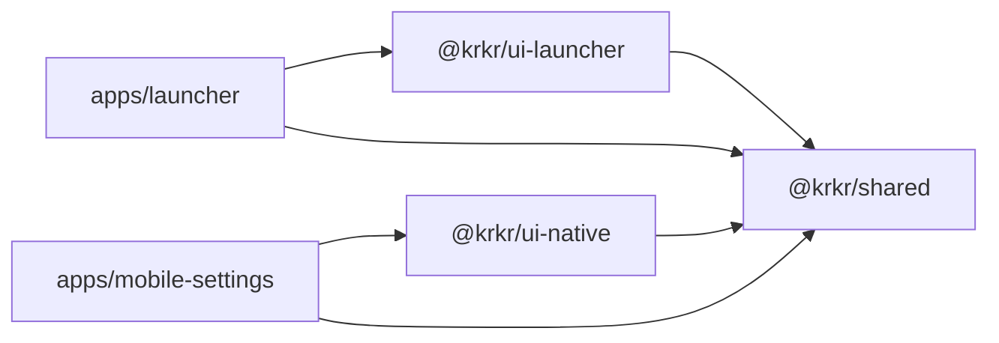

# 前端 Monorepo

[← 索引](README.md)

---

## 1. 范围说明（修订）

Monorepo **不再**包含「Desktop 版引擎外壳」。仅包含：

| App | 用途 | 必需 |
|-----|------|------|
| **`apps/launcher`** | Desktop 可选图形启动器（Electron + React） | 否 |
| **`apps/mobile-settings`** | Android Settings（React Native） | 是（Mobile） |
| **`packages/shared`** | launch schema、类型、i18n | 是 |

**引擎本体 `krkr2`** 仍在 `cpp/` + `platforms/`，**不**进 pnpm workspace 作为 Electron 壳。

---

## 2. 工具链

| 项 | 选型 | 说明 |
|----|------|------|
| 包管理 | **pnpm** workspaces | |
| 任务编排 | **Turborepo** | |
| Launcher | **electron-vite** | 仅 `apps/launcher` |
| Mobile | **React Native 0.76+** Bare | Settings Activity |
| 语言 | **TypeScript** strict | |
| 状态 | **Zustand** | `packages/shared` |
| Launcher UI | React + shadcn/ui + Tailwind | |
| Mobile UI | React Navigation + 同源 tokens | |
| 国际化 | **i18next** | |

---

## 3. 目录结构（规划）

```text
krkr2/
├── apps/
│   ├── launcher/                    # 可选 Desktop
│   │   ├── electron/
│   │   │   ├── main.ts              # spawn krkr2，不写 N-API
│   │   │   └── preload.ts
│   │   ├── renderer/                # 游戏库、设置表单
│   │   └── package.json
│   │
│   └── mobile-settings/             # Android Settings（非 Game）
│       ├── android/
│       │   ├── settings/            # RN Activity
│       │   └── game/                # Native GameActivity（C++，非 RN）
│       ├── src/
│       │   ├── screens/SettingsScreen.tsx
│       │   └── screens/LibraryScreen.tsx
│       └── package.json
│
├── packages/
│   ├── shared/
│   │   ├── src/
│   │   │   ├── launch/              # ★ 与 docs/launch/launch-config 同 schema
│   │   │   │   ├── LaunchProfile.ts
│   │   │   │   └── validate.ts
│   │   │   ├── types/Preferences.ts
│   │   │   ├── stores/
│   │   │   └── i18n/
│   │   └── package.json
│   │
│   ├── ui-tokens/
│   ├── ui-launcher/                 # 仅 Electron DOM 组件
│   └── ui-native/                   # 仅 RN 组件
│
├── cpp/core/environ/launch/         # CliParser, Adapter（C++）
├── platforms/                       # krkr2 引擎入口
└── pnpm-workspace.yaml
```

**删除相对初版：** `apps/desktop` 作为引擎 Electron 壳、`KrkrGameView.tsx` 在 RN 内嵌 GL。

---

## 4. Launcher 职责（Desktop）

```typescript
// packages/shared/src/launch/LaunchProfile.ts
export interface LaunchProfile {
  xp3Path: string;
  engineArgs?: string[];
  globalOverrides?: Record<string, unknown>;
}

// apps/launcher/electron/main.ts（示意）
import { spawn } from 'child_process';
import { writeLaunchProfile } from '@krkr/shared/launch';

async function launchGame(profile: LaunchProfile) {
  const configPath = await writeLaunchProfile(profile);
  spawn(krkr2ExePath(), ['--config', configPath], { detached: true, stdio: 'ignore' });
}
```

| Launcher 做 | Launcher 不做 |
|-------------|---------------|
| 扫描游戏库、编辑偏好 | 加载 `libkrkr2engine` |
| 写 `launch.json` | 嵌 GL / BrowserWindow 游戏 |
| `spawn krkr2` | 解析 `-debug` 语义（交给引擎） |

---

## 5. Mobile Settings 职责

```typescript
// apps/mobile-settings/src/native/LaunchGame.ts
import { NativeModules } from 'react-native';

export function startGame(profile: LaunchProfile) {
  NativeModules.KrkrLauncher.startGame(JSON.stringify(profile));
}
```

Native 侧解析 JSON → `LaunchOptions` → `LaunchOptionsAdapter::apply()` → 启动 **GameActivity**。

---

## 6. 包依赖关系



---

## 7. EngineBridge 修订

初版 `EngineBridge`（`launchGame` in-process）**仅适用于 GameActivity 内部 JNI**，不用于 Launcher。

| 消费者 | 接口 |
|--------|------|
| Desktop Launcher | **无** EngineBridge；仅 `spawn` + 文件 IO |
| RN Settings | `KrkrLauncher.startGame(json)` → Intent |
| GameActivity（可选） | `krkr_engine_*` 或直调 C++ `apply()` |

详见 [bridge.md](bridge.md)。

---

## 8. CI

```text
job build-engine          # 现有 CMake / vcpkg
job build-launcher        # pnpm --filter launcher
job build-mobile-settings # Gradle + RN bundle
```

Launcher 与引擎 **分 artifact 发布**。

---

## 9. 版本与发布

| 产物 | 命名 |
|------|------|
| 引擎 | `krkr2-{ver}-{platform}` |
| Launcher（可选） | `krkr2-launcher-{ver}-{platform}` |
| Android | `krkr2-{ver}.apk`（含 Settings + Game native） |

引擎 `version-string` 与 `@krkr/shared` 的 `APP_VERSION` 对齐。
