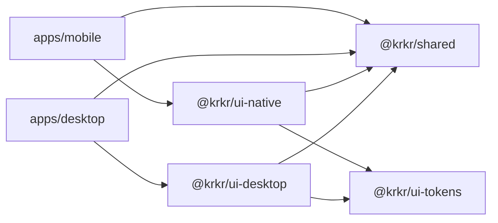

# 前端 Monorepo

[← 索引](README.md)

---

## 1. 工具链

| 项 | 选型 | 说明 |
|----|------|------|
| 包管理 | **pnpm** workspaces | 与 Node 生态一致，节省磁盘 |
| 任务编排 | **Turborepo** | 并行 build / test / lint |
| Desktop | **electron-vite** | Main + Preload + Renderer 一体 |
| Mobile | **React Native 0.76+** Bare | New Architecture + Hermes |
| 语言 | **TypeScript** strict | 全 packages 统一 |
| 状态 | **Zustand** | 放 `packages/shared` |
| Desktop UI | React 18 + **shadcn/ui** + Tailwind | |
| Mobile UI | **React Navigation** + 同源 design tokens | |
| 国际化 | **i18next** | 翻译文件放 `packages/shared/i18n` |

---

## 2. 目录结构（规划）

```text
krkr2/
├── apps/
│   ├── desktop/
│   │   ├── electron/
│   │   │   ├── main.ts              # Electron 主进程
│   │   │   ├── preload.ts           # contextBridge
│   │   │   └── engine/              # N-API 或 IPC client
│   │   ├── renderer/                # Vite + React 入口
│   │   │   ├── index.html
│   │   │   └── src/
│   │   ├── electron.vite.config.ts
│   │   └── package.json
│   │
│   └── mobile/
│       ├── android/                 # RN 工程（可逐步替换 platforms/android/app）
│       ├── ios/                     # 可选
│       ├── src/
│       │   ├── App.tsx
│       │   ├── navigation/
│       │   └── native/KrkrGameView.tsx
│       ├── metro.config.js
│       └── package.json
│
├── packages/
│   ├── shared/
│   │   ├── src/
│   │   │   ├── types/               # GameEntry, Preferences, EngineError
│   │   │   ├── stores/              # usePreferencesStore, …
│   │   │   ├── hooks/               # useGameLibrary, …
│   │   │   ├── i18n/
│   │   │   └── bridge/
│   │   │       ├── EngineBridge.ts  # 接口定义
│   │   │       └── events.ts        # 引擎事件类型
│   │   └── package.json             # name: @krkr/shared
│   │
│   ├── ui-tokens/                   # 颜色、间距、字号
│   │   └── src/tokens.ts
│   │
│   ├── ui-desktop/                  # 仅 DOM 页面与组件
│   │   └── src/pages/SettingsPage.tsx
│   │
│   └── ui-native/                   # 仅 RN 屏幕与组件
│       └── src/screens/SettingsScreen.tsx
│
├── bridge/include/krkr/             # C ABI（见 bridge.md）
├── cpp/                             # 现有 C++ 引擎
├── rust/                            # 现有 Rust 插件
├── pnpm-workspace.yaml
├── turbo.json
└── package.json                     # 根 scripts
```

---

## 3. 包依赖关系



**规则：**

- `@krkr/shared` **不得**依赖 `react-dom` 或 `react-native`
- UI 包不得跨引：`ui-desktop` ↔ `ui-native` 禁止
- 引擎类型以 `shared` 为唯一来源

---

## 4. EngineBridge 接口（JS 侧契约）

```typescript
// packages/shared/src/bridge/EngineBridge.ts

export interface GameEntry {
  id: string;
  title: string;
  xp3Path: string;
  thumbnailPath?: string;
}

export interface Preferences {
  locale: string;
  fullscreen: boolean;
  // … 与 GlobalConfigManager / IndividualConfigManager 对齐
}

export interface EngineBridge {
  init(dataDir: string): Promise<void>;
  destroy(): Promise<void>;

  launchGame(xp3Path: string): Promise<void>;
  stopGame(): Promise<void>;
  pauseGame(): Promise<void>;
  resumeGame(): Promise<void>;

  scanDirectory(path: string): Promise<GameEntry[]>;
  getPreferences(): Promise<Preferences>;
  setPreferences(patch: Partial<Preferences>): Promise<void>;

  /** 订阅引擎事件：log / error / progress / game-exited */
  onEvent(callback: (event: EngineEvent) => void): () => void;
}
```

各端提供 factory：

- `apps/desktop/electron/engineBridge.ts` → preload IPC / N-API  
- `apps/mobile/src/engineBridge.native.ts` → Turbo Module  

UI 层 **只** 依赖 `EngineBridge`，不感知底层实现。

---

## 5. 代码复用策略

| 复用 | 不复用 |
|------|--------|
| 类型、常量、校验（zod） | JSX / 组件 markup |
| Zustand stores 与 selectors | 导航（React Router vs React Navigation） |
| i18n 键与翻译 | 样式（Tailwind vs StyleSheet） |
| 业务 hooks（`useGameLibrary`） | 平台 API（文件、权限） |

**UI 复用率预期：** 逻辑 ~65%，视觉 ~35%（两套薄 UI + 统一 tokens）。

---

## 6. 根脚本（示例）

```json
{
  "scripts": {
    "dev:desktop": "turbo dev --filter=@krkr/desktop",
    "dev:mobile": "turbo dev --filter=@krkr/mobile",
    "build": "turbo build",
    "lint": "turbo lint",
    "typecheck": "turbo typecheck"
  }
}
```

---

## 7. 与 C++ 构建集成

### 7.1 Desktop

1. CMake / vcpkg 构建 `libkrkr2engine`（现有流程扩展）  
2. `electron-builder` 将 `.dll/.so/.dylib` 打入 `resources/`  
3. `electron-rebuild` 针对 N-API addon（若使用）

### 7.2 Mobile

1. CMake 构建 `libkrkr2engine.so`（现有 `platforms/android` 流程）  
2. RN `android/app/src/main/jniLibs/` 或 CMake `externalNativeBuild` 引用  
3. Turbo Module Gradle 模块依赖 native lib

### 7.3 CI 阶段（建议）

```text
job build-engine (matrix: windows, linux, macos, android)
job build-ui (needs: build-engine for native artifacts)
  - pnpm install
  - turbo build
  - electron-builder / gradle assembleRelease
```

---

## 8. 环境要求

| 平台 | 额外依赖 |
|------|----------|
| Desktop 开发 | Node 20+、pnpm 9+ |
| Mobile 开发 | JDK 17、Android SDK 33、NDK 28（与现 README 一致） |
| Desktop 用户 | Windows 10+；Linux 常见桌面依赖；macOS 11+ |
| Mobile 用户 | Android 8+（minSdk 以 `gradle.properties` 为准） |

---

## 9. 版本与发布

| 产物 | 命名 | 渠道 |
|------|------|------|
| Windows | `krkr2-{version}-x64-setup.exe` | GitHub Releases |
| Linux | `krkr2-{version}-x64.AppImage` 或 tar.gz | 同上 |
| macOS | `krkr2-{version}-arm64.dmg` | 同上 |
| Android | `krkr2-{version}-{abi}.apk` | 同上 |

外壳 UI 版本与引擎 `version-string`（`vcpkg.json`）对齐，在 `packages/shared` 读取单一 `APP_VERSION` 常量。
