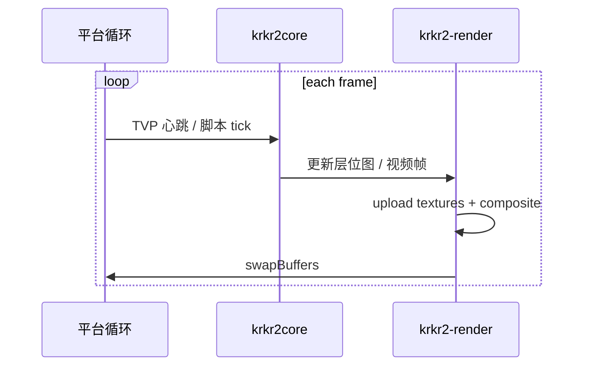

# 游戏视口渲染（krkr2-render）

[← 索引](README.md)

---

## 1. 目标

将游戏画面渲染从 **Cocos2d-x** 抽离为独立库 **`krkr2-render`**，供：

- **Desktop**：`krkr2` 进程内 GLFW / 平台全屏窗口（无 Electron 嵌 GL）
- **Mobile**：`GameActivity` 内 `GLSurfaceView`
- （过渡期）现有 Cocos `MainScene` 可调用同一 compositor

**不改变** KAG 层输出的位图语义，只替换「如何把位图送到屏幕」。  
外壳 UI（Launcher / RN Settings）**不**参与渲染，见 [architecture.md](architecture.md)。

---

## 2. 现状依赖（Cocos）

```text
cpp/core/environ/cocos2d/
├── MainScene.cpp        # 层序、输入、窗口切换
├── YUVSprite.cpp        # 视频 YUV → 纹理
├── AppDelegate.cpp      # GL 上下文、分辨率
└── CustomFileUtils.cpp

cpp/core/visual/
├── RenderManager.cpp    # LayerBitmap 内存与纹理格式
└── LayerBitmapImpl.cpp
```

Cocos 提供的能力及替代：

| Cocos 能力 | krkr2-render 替代 |
|------------|-------------------|
| `Director` / `GLView` | GLFW（Desktop）/ EGL（Android） |
| `Texture2D` | OpenGL 纹理对象封装 `KrkrTexture` |
| `Sprite` / `Node` 树 | `Compositor` 层列表（z-order） |
| `YUVSprite` | `YUVRenderer` + fragment shader |
| 输入事件 | 平台层注入（GLFW callbacks / Android touch → 现有 TVP 输入链） |
| 设计分辨率 | `ViewportPolicy`（等同 `ResolutionPolicy::SHOW_ALL`） |

---

## 3. 模块划分

```text
cpp/core/render/
├── CMakeLists.txt
├── KrkrRenderContext.h      # GL 上下文生命周期
├── KrkrTexture.h              # 纹理上传 / 格式
├── KrkrCompositor.h           # 多层合成
├── KrkrYUVRenderer.h          # ffmpeg 帧 → GPU
├── KrkrViewportPolicy.h       #  letterbox / exact fit
└── platform/
    ├── GLFWRenderWindow.cpp   # Win / Linux / macOS
    └── EGLRenderSurface.cpp   # Android
```

**链接：** `krkr2-render` PUBLIC 链 `krkr2core` 中 visual 相关接口；**不** 链 `cocos2dx`。

---

## 4. 与 engine.h 集成

```c
// 绑定原生窗口句柄
KrkrEngineError krkr_engine_attach_viewport(void *native_window_handle);

// Desktop: HWND (Win) / NSView* (macOS) / X11 Window (Linux)
// Android: ANativeWindow* from GLSurfaceView
```

引擎在 `attach` 后：

1. 创建 / 绑定 GL context  
2. 每帧 `Compositor::draw()`  
3. swap buffers  

`detach` 在 `krkr_engine_stop` 或视口销毁时调用。

---

## 5. 帧循环



Desktop **`krkr2` 单进程窗口：**

- GLFW 主循环在引擎进程内  
- 与可选 Launcher **无 GL 共享**；Launcher 仅 `spawn`，见 [UI 架构](architecture.md)

---

## 6. 视频（YUV）

沿用 `cpp/core/movie/` 解码输出，替换 `YUVSprite`：

```glsl
// YUV420P → RGB
uniform sampler2D yPlane;
uniform sampler2D uPlane;
uniform sampler2D vPlane;
```

测试基准：现有 `movie` 模块支持的游戏内视频。

---

## 7. DPI 与分辨率

| 平台 | 策略 |
|------|------|
| Desktop | GLFW `contentScale`；引擎全屏窗口自管 DPI |
| Android | 与现 `EXACT_FIT` / 横屏逻辑对齐 |
| macOS Retina | framebuffer scale |

配置项继续读 `IndividualConfigManager`。

---

## 8. 迁移步骤（渲染专用）

1. **只读抽离：** `KrkrTexture` 包装现有 `RenderManager` 上传路径，Cocos 仍 display  
2. **双跑对比：** 同一帧 Cocos 与 krkr2-render 各画一遍，截图 diff（Debug）  
3. **切换显示：** GameActivity / Desktop `krkr2` 窗口只连 krkr2-render  
4. **删除 Cocos 渲染代码**  

---

## 9. 依赖

| 库 | 用途 | 现状 |
|----|------|------|
| OpenGL / GLES | 图形 API | 已有 |
| GLFW | Desktop 窗口 | `vcpkg.json` 已有 glfw3 |
| ffmpeg | 视频帧 | 已有 |
| glm | 矩阵 | 已有 |

无需引入 bgfx/wgpu（除非后续主动选型）；首版 OpenGL 3.x / GLES 3.0 足够。

---

## 10. 开放问题

| # | 问题 |
|---|------|
| 1 | Linux Wayland vs X11 全屏/窗口策略 |
| 2 | Android 多窗口 / 画中画 是否支持 |
| 3 | `DebugViewLayerForm` 是否保留为 native overlay |
